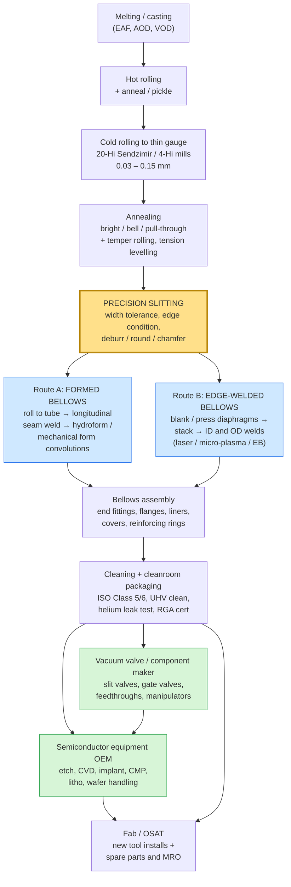

# 01 — Technical Primer: Bellows, Bellows Tube, and Precision Slit Material

Purpose: give everyone at the monthly meeting the same technical baseline, and make precise what "bellows tube (precision slit material)" actually means, because the phrase covers two quite different manufacturing routes with different customers.

---

## 1. What a metal bellows is

A metal bellows is a thin-walled, flexible, hermetically sealed metal component with a concertina or accordion profile. It performs one or more of four jobs:

1. **Seals while moving.** It lets a shaft, stage or lifter move inside a sealed chamber without any sliding seal, so there is no rubbing, no particle generation and no leak path. This is why the semiconductor industry uses them so heavily.
2. **Absorbs movement.** Thermal expansion, vibration, and installation misalignment in piping.
3. **Acts as a calibrated spring.** A bellows has a defined spring rate, so it can be used as a force or pressure element in actuators, valves and instruments.
4. **Compensates volume.** Accumulators, reservoirs, dampers.

The reason a bellows is preferred over an elastomeric seal in semiconductor and vacuum service is that it is **all-metal**: it survives corrosive process gases, temperature extremes, and ultra-high vacuum, and it does not outgas or shed particles the way rubber does. Witzenmann's own high-purity brochure describes edge-welded bellows as being used for "decoupling, feedthroughs, sealing, shielding, volume compensation and actuators in the UHV with the highest cleanliness requirements" **[P]** ([Witzenmann, edge welded bellows for high purity applications](https://media.witzenmann.com/mediapool/documents/brochures/edge-welded-bellows-for-high-purity-applications.pdf)).

### The term "bellows tube"

"Bellows tube" is not a distinct product category so much as a description of how a bellows is made. In the **formed / convoluted** route, the starting point is a *tube*, and the convolutions are formed into that tube. So a "bellows tube" is the tubular preform, and by extension the finished convoluted bellows made from it. This matters commercially: **the formed route consumes strip that is rolled and slit to a controlled width, then seam-welded into a tube.** The edge-welded route does not — it consumes stamped diaphragms. When the brief says "bellows tube (precision slit material)", it is pointing at the **formed/convoluted route**, which is the more accessible entry point.

---

## 2. Types of bellows

### 2.1 Formed / convoluted bellows (hydroformed or mechanically formed)

**How it is made.** Coil or sheet stock is precision sheared to size, rolled into a cylinder, and joined with an automatic **longitudinal seam weld** (TIG/GTAW or plasma). The tube is cleaned and inspected — a poor seam weld causes splitting during forming. The tube is then convoluted, either by **hydroforming** (internal fluid pressure, typically combined with axial compression, expanding the tube against a die) or by **mechanical die forming** (rollers/expanding mandrel). For multi-ply bellows, two or more tubes are telescoped together before forming. **[P]** ([Triad Bellows, how metal bellows are made](https://triadbellows.com/how-metal-bellows-are-made); [Comflex, manufacturing process of metal expansion joints](https://www.metalhosemachine.com/purchase-guide/manufacturing-process-of-metal-expansion-joints/))

Hydroforming proceeds in two stages: a constrained low-expansion stage to position the forming templates, then a stage where internal pressure is held stable while axial force compresses and expands the tube into the die. Pressure control is critical — too high bursts the blank, too low produces an incompletely formed convolution **[C]** ([manufacturing quality control of U-shaped multilayer bellows](https://www.pipelinedubai.com/manufacturing-quality-control-of-u-shaped-multilayer-metal-bellows-expansion-joint.html)).

**Characteristics.** Seamless convolution profile with no circumferential welds in the flexing area, so high structural integrity and pressure capability. Lower cost per unit than edge-welded. Lower stroke-to-length ratio and higher spring rate. Single-ply versions have low spring rates and are used in vacuum; multi-ply versions are pressure-resistant and flexible, used for example as valve shaft seals up to 400 bar **[P]** ([Witzenmann India brochure](https://media.witzenmann.com/mediapool/documents/brochures/witzenmann-india.pdf)).

**This is the route that consumes precision slit strip.**

### 2.2 Edge-welded (diaphragm / membrane / nesting-ripple) bellows

**How it is made.** Thin metal foil is stamped or hydraulically pressed into individual ring-shaped diaphragms. The diaphragms are then stacked and welded alternately at the **inner diameter** and the **outer diameter** using laser, micro-plasma, TIG or electron-beam welding, building up a flexible column. End plates or flanges are added. **[P]** ([MW Components, edge welding technology](https://www.mwcomponents.com/process/edge-welding-technology); [KSM, edge welded metal bellows](https://www.ksmusa.com/edge-welded-metal-bellows))

**Characteristics.** This is the high-performance option and the one that dominates semiconductor motion applications:

- Very high stroke-to-installed-length ratio — some configurations accommodate strokes approaching 100% of their own length.
- Very low and precisely controllable spring rate, and low lateral stiffness.
- Because the diaphragms are welded rather than plastically formed over a long draw, material ductility is much less of a constraint, so a far wider range of alloys can be used — Technetics notes it can produce them "in a nearly endless variety of materials, unlimited by material ductility" **[P]** ([Technetics, edge-welded metal bellows](https://technetics.com/technetics-products/metal-bellows/)).
- Labour- and capital-intensive, and requires cleanroom assembly for semiconductor grade.

Typical published capability envelopes:

| Manufacturer | Size range | Diaphragm thickness | Source |
| --- | --- | --- | --- |
| KSM (Korea) | 9.5 mm ID to 950 mm OD, round and non-round | not published | **[P]** [ksmusa.com](https://www.ksmusa.com/edge-welded-metal-bellows) |
| Technetics / BELFAB | 1/4" to 18" OD | from 0.0015" (≈0.038 mm) | **[P]** [technetics.com](https://technetics.com/products/belfab-edge-welded-metal-bellows/) |
| Witzenmann HYDRA | 6 mm to 300 mm diameter | not published | **[P]** [witzenmann.com](https://www.witzenmann.com/en/products/metal-bellows/edge-welded-bellows/) |
| Metal-Flex (US) | 0.200" ID to 14.000" OD | not published | **[P]** [metalflexbellows.com](https://www.metalflexbellows.com/) |
| Valqua (Japan) | 3–1,000 mm ID (up to 2,000 mm square) | **0.03–1.0 mm** | **[P]** [valqua.com](https://www.valqua.com/product_classification/bellows/) |
| Bhastrik (India) | 12 mm ID to 175 mm OD | 0.127–0.30 mm | **[U]** [tradeindia listing](https://www.tradeindia.com/products/edge-welded-bellows-614236.html) |

### 2.3 Electroformed / electrodeposited bellows

Grown by electrodeposition of metal onto a mandrel which is then dissolved away. Produces extremely thin walls and very low spring rates in very small sizes, used in miniature instrumentation. Niche; not relevant to this business case beyond completeness.

### 2.4 Elastomeric, fabric and polymer bellows

Rubber, PTFE, silicone and coated-fabric bellows — used as machine-tool way covers, dust boots, and low-temperature low-pressure ducting. Much of the Indian "bellows" supplier long tail sits here. Not substitutable for vacuum or semiconductor service. Relevant only because it inflates apparent competitor counts in directory searches.

### 2.5 Comparison

| Attribute | Formed / convoluted | Edge-welded | Elastomeric |
| --- | --- | --- | --- |
| Stroke per unit length | Low–moderate | **Very high** | Moderate |
| Spring rate | Higher, less precise | **Low, precisely controllable** | N/A |
| Pressure capability | **High** (multi-ply to 400 bar) | Moderate; good external pressure at solid height | Low |
| UHV / semiconductor suitability | Good for static/piping, limited for motion | **Industry standard for motion** | Unsuitable |
| Material range | Limited by ductility | **Very wide, incl. PH and Ni alloys** | N/A |
| Unit cost | **Lower** | Higher | Lowest |
| Feedstock | **Precision slit strip → seam-welded tube** | Foil / thin strip → stamped diaphragms | Sheet rubber / fabric |
| Capital intensity | Moderate | **High** (stamping dies, precision welding cells, cleanroom) | Low |

---

## 3. What "precision slit material" actually is

Slitting is a shearing operation that reduces a wide master coil into multiple narrower coils. "Precision" slitting means the resulting strip is controlled on far more than width alone:

- **Width tolerance.** Commonly ±0.05 mm or tighter on precision lines, against ±1–3 mm for mill edge.
- **Thickness tolerance.** On precision cold-rolled strip, down to the order of ±0.002–0.03 mm depending on gauge.
- **Edge condition.** Slit edge, deburred, rounded/coined, or chamfered. Burr height is specified — one bellows-strip supplier quotes burr as a maximum of 10% of thickness, and burr *direction* is also specifiable **[U/P]** ([ss-strips.com bellows strip listing](https://www.ss-strips.com/sale-36582674-flexible-ss316l-cold-rolled-precision-stainless-steel-strip-for-vacuum-bellows-0-11-79mm.html); [yesstainless.com burr control](https://yesstainless.com/products/stainless-steel-precision-strip/)).
- **Flatness, camber and coil set.** Critical because the strip must roll into a truly round tube.
- **Surface finish and cleanliness.** 2B, BA/2R, 2R bright annealed for vacuum service.
- **Temper / hardness.** Annealed through full hard / spring temper.

### Why this matters specifically for bellows

For the **formed bellows tube** route, the slit strip width sets the circumference of the tube, and therefore the diameter of the finished bellows. Width variation becomes a gap or overlap at the longitudinal seam weld, and a bad seam weld splits during hydroforming. Edge burrs create weld defects and stress-concentration sites. So **width tolerance, edge quality and flatness translate directly into seam weld yield and bellows fatigue life.** That is the technical reason a bellows maker pays a premium for genuinely precision-slit material rather than commodity slit coil.

A European service centre that explicitly serves this industry states it supplies "materials for the manufacture of Metallic Bellows and Expansion Joints, offering superior surface finish and consistency", stocking nickel alloys, stainless steels and titanium from **0.05 mm** thickness, slit in-house to customer width **[P]** ([Hempel Special Metals, precision slit strip](https://www.hempel-metals.com/en/products/precision-slit-strip)).

For the **edge-welded** route, width tolerance matters less because diaphragms are blanked from a wider strip. What matters instead is thickness uniformity, flatness, surface cleanliness, grain structure for fatigue life, and alloy availability.

---

## 4. The value chain

**Where the parties sit today.** Jindal Stainless occupies boxes A through E. Iwatani occupies box E (via Suzhou and Zhongshan) plus distribution across the whole chain. The value-add — and the margin — concentrates in boxes F through I, which is where neither party currently operates in India.

---

## 5. Materials and grades

| Grade | Type | Why it is used in bellows | Notes for this project |
| --- | --- | --- | --- |
| **AM350 / AISI 633 / UNS S35000** | Semi-austenitic precipitation hardening (Cr-Ni-Mo) | Austenitic and formable when annealed, then heat-treated to high strength. Excellent yield strength and **cyclic fatigue strength**, so long life under repeated stroke. Mo gives corrosion resistance; absence of Al and Ti gives good weldability | **The reference grade for semiconductor slit-valve bellows.** VAT specifies AM350 for the bellows in its 04.2 transfer valve, with 316L end pieces **[P]** ([VAT](https://www.vatgroup.com/series/high-vacuum-transfer-valve-with-l-vat)). Japan's TOKKIN markets TOKKIN 350 explicitly for "bellows, diaphragms, actuation valves… which require long life under cyclic stress" **[P]** ([TOKKIN 350](https://www.tokkin.com/search/stainless-steels/precipitation-hardening/tokkin350/)). **Not listed in Jindal's published grade tables** |
| **SUS 631 / 17-7PH** | Semi-austenitic PH | Similar role to AM350; high strength after ageing | Iwatani lists 631 among its ultrathin stainless grades **[P]**. Not in Jindal's published grade tables |
| **304 / 304L** | Austenitic | General purpose, formable, weldable, low cost | In Jindal's range (J-304, J-304L) **[P]** |
| **316 / 316L** | Austenitic + Mo | Better corrosion resistance; standard for vacuum hardware and bellows end pieces | In Jindal's range (J-316, J-316L) **[P]** |
| **321 / 347** | Stabilised austenitic | Resists sensitisation at weld zones — relevant for seam-welded bellows | In Jindal's range (J-321, J-347) **[P]** |
| **301 / 301L / 301LN** | Austenitic, strong work hardening | Spring temper applications | In Jindal's range; Iwatani also lists 301 spring stainless **[P]** |
| **Inconel 600 / 625 / 718** | Ni-base | High temperature, aggressive chemistry | Not a Jindal product; would be sourced separately |
| **Hastelloy C-276** | Ni-Mo-Cr | Halogen plasma chemistries | Not a Jindal product |
| **Titanium** | — | Light, non-magnetic, biocompatible | Iwatani handles titanium **[P]** |

Valqua's published welded-bellows material list — SUS 304, 304L, 316, 316L, 321, 347, **AM-350**, Inconel, Hastelloy, titanium, Monel — is a good proxy for the qualified material set a serious bellows maker expects a supplier to cover **[P]** ([Valqua](https://www.valqua.com/product_classification/bellows/)).

> **Key gap, carried into the strategy section.** Jindal's published portfolio covers austenitic, ferritic, martensitic and duplex families, and its Specialty Products Division is built around **martensitic razor-blade steel**. The precipitation-hardening semi-austenitic grades that define semiconductor bellows — AM350 and 631 — do not appear in its published grade tables ([Jindal Stainless product brochure](https://www.jindalstainless.com/product-brochure/)). Whether Jindal can or will melt and roll these is the single most important technical question to put to them.

---

## 6. Application industries

Ranked by relevance to this business case.

**1. Semiconductor and flat-panel manufacturing equipment — the target.**
Bellows form flexible penetrations into process chambers, becoming part of the pressure wall while permitting motion inside. Published application lists across suppliers converge on: slit valves, gate valves, wafer lift and pin lift, pedestal lift assemblies, load lock and chamber lift, wafer handlers and transfer robots, orientors, XYZ manipulators, motion feedthroughs, valve stem seals, torque couplings, flexible couplings, gas lines, beam lines, cassette elevators, crucible lifts, vibration dampers, and leak detectors **[P]** ([Hudson Technologies](https://www.hudson-technologies.com/applications/semiconductor-machinery-components); [MW Components](https://www.mwcomponents.com/process/edge-welding-technology); [Technetics](https://technetics.com/products/belfab-edge-welded-metal-bellows/); [KSM at SEMICON West 2026](https://expo.semi.org/west2026/Public/eBooth.aspx?BoothID=658784&FromPage=Exhibitors.aspx&IndexInList=310&ListByBooth=true&Nav=False&ParentBoothID=)).
KSM maps its bellows to specific process steps: crystal growing, ion implant, etch, CVD, MBE, CMP, lithography, inspection and display **[P]**.

**2. Vacuum equipment and scientific instruments.** Accelerators, nuclear fusion research, analytical instruments, thin-film deposition. Irie Koken lists semiconductors, liquid crystal, vacuum equipment, accelerators, nuclear fusion and railways **[P]** ([Irie Koken](https://www.ikc.co.jp/en/about.html)).

**3. Aerospace and defence.** Fuel system interconnects, hydraulic lines, environmental control, reservoirs, cold plate assemblies, engine seals, gas turbine components.

**4. Automotive.** Exhaust decouplers are the single largest unit-volume bellows application. Witzenmann India alone has produced more than 10 million decouplers for the Indian market **[C]** ([Autocar Professional](https://www.autocarpro.in/news-national/witzenmann-india-expands-chennai-plant-with-new-manufacturing-line-40918)). Also EGR, transmission coolers, and increasingly e-mobility thermal management.

**5. Oil, gas and energy.** Downhole tools, subsea, actuators, feedthroughs, and measurement-while-drilling instruments.

**6. Power, process and heavy industry.** Expansion joints for thermal and nuclear power, refineries, cement, steel, chemicals. This is where most Indian capacity sits today.

**7. Medical.** Infusion pumps, implantable drug delivery, surgical instruments, cardiovascular devices.

---

## 7. Two facts that shape the commercial model

**Bellows in semiconductor valves are a designed-in consumable.** SMC's XGT and XGTP slit valves are rated for a 3 million cycle service life and are explicitly designed for "easy replacement of bellows" — the customer replaces the bellows **[P]** ([SMC XGT](https://www.smcusa.com/products/xgt-high-vacuum-slit-valve~166339); [SMC XGTP](https://www.smcusa.com/products/xgtp-parallel-seal-slit-valve-for-high-vacuum~177109)). VAT's 04.2 transfer valve is specified at ≥3 million cycles until first service **[P]** ([VAT](https://www.vatgroup.com/series/high-vacuum-transfer-valve-with-l-vat)). Irie Koken quotes welded bellows life of "10,000 to 10 million cycles… reducing the frequency of parts replacement" **[P]** ([Irie Koken semiconductor field](https://www.ikc.co.jp/en/field/semiconductor.html)).

This means the addressable demand has two distinct components — **new tool build** and **installed-base replacement** — and the replacement stream is recurring, higher-margin, and geographically tied to *fabs* rather than to tool factories. That distinction is the hinge of the whole strategy, and it is developed in [`05-strategy-and-roadmap.md`](05-strategy-and-roadmap.md).

**Qualification, not price, is the gate.** Semiconductor-grade bellows require cleanroom assembly (KSM operates its bellows welding and assembly in an ISO Class 6 / Class 1000 cleanroom with final inspection, cleaning and packaging in ISO Class 5 / Class 100 **[P]**), helium leak testing to very low leak rates, and in some cases residual gas analysis certification **[P]** ([Witzenmann high-purity brochure](https://media.witzenmann.com/mediapool/documents/brochures/edge-welded-bellows-for-high-purity-applications.pdf)). A new entrant does not win this business on material cost.
