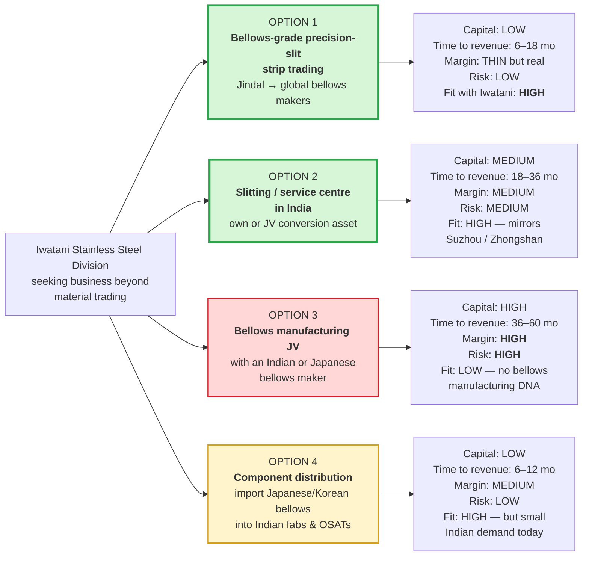

# 05 — Strategy, Positioning and Consulting Roadmap

This is the core deliverable. It states where Iwatani and Jindal actually stand, gives a verdict on the hypothesis, lays out the options, recommends a path, and provides the stage-gated roadmap with decision criteria and a monthly meeting operating rhythm.

---

## 1. Where Iwatani stands

### Verified capabilities relevant to this business

| Capability | Evidence | Grade |
| --- | --- | --- |
| **Stated ambition to be Japan's No.1 stainless trading company by handling volume** | Iwatani's own stainless page | **[P]** [link](https://www.iwatani.co.jp/eng/business/material/metals/products/stainless/) |
| **Ultrathin stainless foil down to 8 µm**, in grades 301, 304, 430 and **631** | Same page, "Ultrathin stainless steel" | **[P]** |
| **Precision slitting operations already running** — Suzhou Iwatani Metal Products and Zhongshan Iwatani, slitting precision stainless and non-ferrous for rechargeable batteries, LCD, OLED, smartphones, connectors, office equipment | Same page, "Precision Slitting Sites (China)" | **[P]** |
| **Stainless for springs** (301, 304, **631**, finished to specified hardness) and **stainless for gaskets** ("finer crystalline structure to maintain high spring performance and fatigue characteristics") | Same page | **[P]** |
| **Highly functional stainless steel foil** and **non-magnetic stainless steel foil** as named product lines; non-magnetic SS foil used in folding smartphones | Corporate brochure 2024; FY2026 Investors' Guide | **[P]** [brochure](https://www.iwatani.co.jp/eng/common_v3/pdf/company_profile_2024.pdf), [investors' guide](https://www.iwatani.co.jp/eng/ir/pdf/about_iwatani.pdf) |
| **Metals is ~30% of the Resources & Advanced Materials segment**; that segment ¥288.7 bn net sales FY2025; group consolidated net sales ¥908.5 bn FY2025 | FY2026 Investors' Guide | **[P]** |
| **Integrated procurement-to-processing model already proven outside Japan** (Thailand, China), selling processed metal products to air-conditioner, appliance and auto-parts makers; Thai plant expanded 2023; precision pressing and insert moulding plant added in Thailand 2025; a leading Japanese stainless processor added to the group in 2024 | FY2026 Investors' Guide | **[P]** |
| Domestic processing network — Kyushu Stainless Kako Center, Sanei Stainless Steel Center, Nose Kozai, Taihei Kozai | Metals network page | **[P]** |

### The constraint

**Iwatani India Pvt. Ltd. is a small trading office, not an operating platform.** Incorporated 23 May 2011, registered at Room No. 411 (also cited as 612–614), Time Tower, M.G. Road, Gurgaon 122002, CIN U74140HR2011FTC043032, status active, business described as import/export and sale of materials-business products, with turnover majority from trade. LinkedIn indicates approximately **4 employees**. **[P]/[U]** ([Iwatani resources & advanced materials network](https://www.iwatani.co.jp/eng/business/material/resources-advanced/network/); [Tracxn company record](https://tracxn.com/d/legal-entities/india/iwatani-india-private-limited/__SRHU77kZv2mcH0ntizpdcaWny219MGnS_KzFhqoQ_Vk); [LinkedIn](https://in.linkedin.com/company/iwatani))

Any India-based execution requires building organisational capacity that does not currently exist. This is the most under-appreciated risk in the whole plan and it should be named explicitly in the first monthly meeting.

### The strategic read on Iwatani

The single most useful observation: **Iwatani has already built exactly this business once, in China.** Suzhou and Zhongshan take precision stainless and non-ferrous material and precision-slit it for demanding electronics applications — batteries, OLED, connectors. The proposed India business is structurally the same play, with a different upstream mill (Jindal instead of Japanese/Chinese mills) and a different downstream application (bellows instead of batteries). **That is a repeatable playbook, not a leap.** It is the strongest argument for internal support.

---

## 2. Where Jindal Stainless stands

| Dimension | Position | Grade |
| --- | --- | --- |
| Scale | India's largest stainless producer; 16 facilities in India, Spain, Indonesia; network in 12 countries; Hisar 0.8 Mtpa, Jajpur 2.2 Mtpa | **[P]** [AR FY24](https://www.jindalstainless.com/annualreport/2023-2024/corporate-overview/manufacturing-strengths) |
| Thin-gauge rolling | **Razor blade strip to 0.076 mm**; blade steel line capable of **0.07 mm**; four 20-Hi Sendzimir mills plus 4-Hi mills in SPD | **[P]** [brochure](https://www.jindalstainless.com/product-brochure/), [press release](https://www.jindalstainless.com/press-releases/jindal-stainless-hisar-limited-commissions-phase-i-of-brownfield-expansion-at-specialty-products-division/) |
| Precision slitting | **Dedicated precision slitters in SPD**; five slitting lines in the cold rolling complex; width capability to 650 mm post-expansion | **[P]** |
| Precision strip capacity | **84,000 tpa** (brochure); expansion path 22,000 → 48,000 → 60,000 tpa documented with ~₹450 cr brownfield capex | **[P]** |
| Finishing | Bell / bright / pull-through annealing, strip grinding, skin pass, tension leveller; BA/2R finishes available | **[P]** |
| Grade coverage | Austenitic Cr-Ni (301/301L/301LN, 304 family, 316 family incl. 316L/316LN/316Ti, 317, 321, 347, 904L), austenitic Cr-Mn, martensitic (410–431, blade steels), ferritic, duplex. States "grades other than these can also be manufactured… by mutual agreement" | **[P]** |
| **Gap: PH grades** | **AM350 / AISI 633 / S35000 and 631 / 17-7PH do not appear in the published grade tables** | **[P]** |
| Downstream vehicle | Published plan for a **~300 acre Stainless Steel Industrial Park** adjacent to the Odisha plant, SEZ + non-SEZ, with a large service centre, support for downstream units, and long-term stainless supply "at concessional rates" plus land, power, water | **[P]** [brochure](https://www.jindalstainless.com/product-brochure/) — *status and date need confirmation* |

### Gap analysis: what would have to be true for Jindal to supply bellows-grade strip

| Requirement | Jindal today | Gap size | How to close |
| --- | --- | --- | --- |
| Roll to 0.05–0.15 mm | **Already does 0.07 mm** | **None** | — |
| Precision slit to tight width with controlled edge | **Already has precision slitters** | **Small** — need burr height/direction spec and possibly deburr/round/chamfer capability at these gauges | Trial order + spec definition |
| Austenitic 304L/316L/321/347 bellows strip | **In portfolio** | **Small** — need bellows-specific property control | Spec + trial |
| **AM350 / 631 PH grades** | **Not published** | **Large** — new melt chemistry, N control (0.07–0.13%), heat-treat route, possibly ESR/VAR-class cleanliness | Feasibility study with Jindal metallurgy; may require alloy development programme |
| Fatigue-controlled fine grain structure | Has the capability concept (blade steel is fatigue-critical) | **Medium** | Joint development; Iwatani brings the spec from its gasket-stainless know-how |
| Surface cleanliness / BA-2R for vacuum | Has BA and 2R | **Small–medium** | Cleanliness protocol definition |
| Lot traceability to semiconductor standards | Unknown | **Medium** | Quality system audit |
| Customer approval by a bellows maker | None known | **Large — this is the real gate** | 12–24 month qualification cycle, driven by the customer's schedule not yours |

> **The honest conclusion.** Jindal is *dimensionally* ready and *metallurgically* unproven. The austenitic bellows-strip opportunity (304L/316L/321/347 for formed bellows and general welded bellows) is a **near-term, low-technical-risk** play. The AM350 opportunity — the one that unlocks semiconductor slit-valve bellows — is a **genuine alloy development programme** with a multi-year horizon and no guarantee Jindal will fund it. **These two must be separated in the plan and not sold internally as one thing.**

---

## 3. Verdict on the hypothesis

| Element of the hypothesis | Verdict | Reasoning |
| --- | --- | --- |
| Bellows for semiconductor equipment is an attractive adjacent market | **Supported** | Edge-welded is the premium, faster-growing sub-segment; SEMI shows WFE at US$143.9 bn in 2026 heading to ~US$200 bn by 2028; bellows are a designed-in consumable with recurring replacement demand |
| Precision-slit stainless is the right entry wedge for a stainless trading house | **Supported** | It is adjacent to Iwatani's proven Suzhou/Zhongshan model, uses the Jindal relationship, and requires no new manufacturing entity to start |
| Few Indian companies can produce high-quality precision slit stainless | **Not accurate as stated** | Jindal Stainless SPD slits precision strip at 0.076 mm; IUP Jindal slits 0.03–1.5 mm to 3.5 mm width with deburred/round/chamfered edges and explicitly serves flexible and capillary tubes. The gap is **grade and qualification**, not slitting |
| Make in India / ISM favours local semiconductor materials and equipment | **Strongly supported, and stronger than when written** | Semicon 2.0 (15 Jul 2026, ₹1,27,500 cr) has a dedicated equipment/materials/chemicals/gases pillar with a flat incentive **up to 30% of project cost** |
| **India is the right place to sell semiconductor bellows** | **Not supported near term** | Bellows are bought by tool builders, not fabs. India is getting fabs and OSATs, not WFE OEMs. Indian demand is spares/MRO scale plus emerging contract-manufacturing demand (KASFAB) — real, but small |

**Net:** the product thesis is sound; the geography of demand is misidentified. Fix that and the opportunity becomes actionable.

---

## 4. Strategic options

**Why Option 3 is not the starting point.** Semiconductor bellows manufacturing requires stamping die sets, precision laser or micro-plasma welding cells, ISO Class 5/6 cleanrooms, automated cleaning lines, helium leak and RGA test capability, metallurgical labs, and — critically — a 12–24 month customer qualification cycle before first revenue. KSM has spent 40+ years building that position and operates the world's largest cleanroom dedicated to the task. Iwatani has no bellows manufacturing DNA. Entering here first would be betting the programme on the hardest possible variant.

**Why Option 4 is attractive but insufficient.** It is fast, cheap and builds Indian customer relationships, which is genuinely valuable intelligence-gathering. But Indian bellows demand today is spares-scale. It is a door-opener, not a business.

---

## 5. Recommendation: a two-track plan

> **Track A — earn now, from the global supply chain.** Qualify Jindal as a bellows-grade precision-slit strip source and sell it to the bellows and vacuum-valve makers who already exist, primarily in Korea, Japan, Taiwan and Europe. Start with austenitic grades where Jindal is already capable. Iwatani's role is what it is already good at: specification translation, quality assurance, qualification management and logistics between an Indian mill and demanding Japanese and Korean customers.
>
> **Track B — build the option in India.** Use Option 4 (component distribution into Indian fabs, OSATs and vacuum-equipment makers) to establish presence and learn actual Indian demand, while running a feasibility study on Option 2 (a slitting/service centre, potentially in Jindal's Odisha industrial park, potentially subsidised under Semicon 2.0 pillar 2). Only escalate to Option 3 if Track A qualification succeeds *and* Indian demand materialises *and* a manufacturing partner is secured.

### Why this sequencing is right

1. **It sells into demand that already exists** rather than demand that has to be created.
2. **It uses Iwatani's proven playbook** — the Suzhou/Zhongshan precision slitting model, and the Thailand integrated procurement-to-processing model.
3. **It de-risks the Jindal ask.** Asking Jindal to qualify austenitic bellows strip is a modest, fundable request. Asking them to develop AM350 is not a first conversation.
4. **It monetises the geopolitical tailwind.** Semiconductor supply chains are actively seeking non-China second sources. A qualified Indian mill fronted by a Japanese trading house is a differentiated proposition to a Korean or Japanese bellows maker.
5. **It keeps the India upside alive** without betting on it, and positions for the 30% Semicon 2.0 incentive if and when guidelines confirm eligibility.
6. **It respects the Witzenmann clock.** Witzenmann's new Oragadam site completes construction mid-2027 with relocation through 2028. If Iwatani intends to be relevant in Indian bellows, the window for establishing position is roughly the next 18–24 months.

---

## 6. Consulting roadmap — stage-gated

```mermaid
flowchart TD
    subgraph P0["PHASE 0 — Validate  (Months 0–3)"]
        A1["Technical baseline<br/>internal alignment on<br/>bellows types & routes"]
        A2["Voice-of-customer:<br/>SMC, VAT, Irie Koken,<br/>Mirapro, Valqua, EKK, KSM<br/><i>get real volumes & specs</i>"]
        A3["Jindal capability audit<br/>SPD site visit, ask the<br/>AM350 / 631 question directly"]
        A4["Semicon 2.0 pillar-2<br/>guideline review<br/>+ eligibility test"]
        A5["India demand scan:<br/>KASFAB, Fourvac, HHV, APT,<br/>Witzenmann India"]
    end

    G1{{"GATE 1<br/>Is there a named customer<br/>willing to trial a<br/>Jindal-sourced strip?"}}

    subgraph P1["PHASE 1 — Qualify  (Months 3–12)"]
        B1["Write the bellows-strip<br/>specification<br/>gauge, width, edge/burr,<br/>flatness, temper, cleanliness"]
        B2["Jindal trial coils<br/>austenitic first:<br/>304L / 316L / 321 / 347"]
        B3["Third-party testing:<br/>fatigue, formability,<br/>seam-weldability, cleanliness"]
        B4["Customer sample<br/>submission + PPAP-equivalent"]
        B5["Parallel: AM350 / 631<br/>feasibility study<br/>with Jindal metallurgy"]
    end

    G2{{"GATE 2<br/>Did trial material pass<br/>customer qualification?"}}

    subgraph P2["PHASE 2 — Commercialise Track A  (Months 12–24)"]
        C1["First commercial orders<br/>bellows-grade slit strip"]
        C2["Widen to 2nd and 3rd<br/>customers, incl. India<br/>(Flexpert, Metallic Bellows,<br/>Witzenmann India)"]
        C3["Decide slitting location:<br/>Jindal in-house vs Iwatani<br/>service centre vs Suzhou"]
        C4["Track B: start component<br/>distribution into Indian<br/>fabs / OSATs / UHV makers"]
    end

    G3{{"GATE 3<br/>Is Track A profitable AND<br/>is Indian demand real?"}}

    subgraph P3["PHASE 3 — Localise  (Months 24–48)"]
        D1["Slitting / service centre<br/>in India<br/>— Odisha park or<br/>Gujarat / Chennai cluster"]
        D2["Apply for Semicon 2.0<br/>pillar-2 incentive<br/>(up to 30% of capex)"]
        D3["Select bellows<br/>manufacturing partner<br/>— JV or technical licence"]
    end

    G4{{"GATE 4<br/>Commit to bellows<br/>manufacturing?"}}

    subgraph P4["PHASE 4 — Manufacture  (Months 48+)"]
        E1["Formed / convoluted bellows<br/>first — lower barrier"]
        E2["Cleanroom + leak test +<br/>UHV clean infrastructure"]
        E3["Edge-welded semiconductor<br/>bellows — only with a<br/>technology partner"]
    end

    A1 --> A2 --> A3 --> A4 --> A5 --> G1
    G1 -->|Yes| P1
    G1 -->|No| X1["STOP / REFRAME<br/>revert to trading;<br/>revisit in 12 months"]
    B1 --> B2 --> B3 --> B4
    B1 --> B5
    B4 --> G2
    G2 -->|Yes| P2
    G2 -->|No| X2["Diagnose: material,<br/>spec or mill capability?<br/>Re-trial or stop"]
    C1 --> C2 --> C3 --> C4 --> G3
    G3 -->|Yes| P3
    G3 -->|Track A only| X3["Run as a profitable<br/>trading business.<br/>This is an acceptable<br/>outcome — not a failure"]
    D1 --> D2 --> D3 --> G4
    G4 -->|Yes| P4
    G4 -->|No| X4["Stay as material +<br/>distribution player"]

    style G1 fill:#fff4cc,stroke:#d4a017,stroke-width:2px
    style G2 fill:#fff4cc,stroke:#d4a017,stroke-width:2px
    style G3 fill:#fff4cc,stroke:#d4a017,stroke-width:2px
    style G4 fill:#fff4cc,stroke:#d4a017,stroke-width:2px
    style X1 fill:#ffd7d7,stroke:#cf222e
    style X2 fill:#ffd7d7,stroke:#cf222e
    style X3 fill:#d7f5d7,stroke:#2da44e
    style X4 fill:#fff4cc,stroke:#d4a017
    style P0 fill:#eef4ff
    style P1 fill:#eef4ff
    style P2 fill:#eef4ff
    style P3 fill:#eef4ff
    style P4 fill:#eef4ff
```

Note the design of the exits. **"Run as a profitable trading business" is drawn as a success outcome, not a failure.** A stage-gated plan that only permits escalation is not a plan, it is a commitment. The point of Gate 3 is to make it socially acceptable inside Iwatani to stop at Track A.

### Gate criteria

| Gate | Pass requires |
| --- | --- |
| **Gate 1** | At least one named bellows or valve manufacturer confirms willingness to trial Jindal-sourced strip, with a written specification obtained; Jindal confirms willingness to run trial coils; Semicon 2.0 eligibility clarified as at least plausible |
| **Gate 2** | Trial material passes the customer's incoming inspection and process trial: seam weld or diaphragm forming yield acceptable, fatigue life meeting spec, no cleanliness rejections |
| **Gate 3** | Track A gross margin positive after all qualification cost; at least two repeat customers; documented Indian demand of a scale that justifies a local asset |
| **Gate 4** | A manufacturing partner secured with proven bellows technology; Semicon 2.0 or state incentive confirmed in writing; anchor customer with volume commitment |

---

## 7. KPIs to report at each monthly meeting

| Category | KPI | Baseline (Jul 2026) |
| --- | --- | --- |
| Demand discovery | Voice-of-customer conversations completed | 0 |
| | Written bellows-strip specifications obtained | 0 |
| | Quantified volume estimate (t/yr or pcs/yr) from a customer | none |
| Supply readiness | Jindal SPD audit completed | No |
| | Trial coils produced | 0 |
| | Grades qualified | 0 |
| | AM350 / 631 feasibility answer from Jindal | Unknown |
| Policy | Semicon 2.0 pillar-2 guidelines reviewed | Not published as at Jul 2026 |
| | Eligibility opinion obtained | No |
| India presence | Indian prospects contacted (KASFAB, Fourvac, HHV, APT, Witzenmann India, Metallic Bellows, Flexpert, Bhastrik) | 0 of 8 |
| | Site visits completed | 0 |
| Competitive | Witzenmann India Oragadam progress | Groundbreaking Feb 2026; build to mid-2027 |
| Commercial | Quotations issued / orders received / revenue | 0 |

---

## 8. Risk register

| # | Risk | Likelihood | Impact | Mitigation |
| --- | --- | --- | --- | --- |
| 1 | **Indian semiconductor bellows demand never materialises at scale** because tool building stays offshore | **High** | High | Track A is deliberately independent of Indian demand. Do not let Track B carry the business case |
| 2 | **Jindal declines to develop PH grades** (AM350/631) | Medium–High | High | Sequence austenitic first; treat AM350 as upside; identify an alternative mill if needed |
| 3 | **Qualification cycle longer than expected** (12–24 months is normal, can be longer) | High | Medium | Budget for it explicitly; run multiple customers in parallel; do not promise near-term revenue internally |
| 4 | **Witzenmann localises semiconductor bellows in India first** | Medium | Medium | Convert them from competitor to Track A customer — they buy strip too |
| 5 | **Iwatani India lacks execution capacity** (4-person trading office) | **High** | High | Name this early. Either resource India properly or run Track A out of Japan/China and keep India light |
| 6 | Chinese precision-strip mills undercut on price | High | Medium | Compete on qualification, traceability and non-China sourcing, not price |
| 7 | Semicon 2.0 guidelines exclude materials converters, or disbursement is slow | Medium | Medium | Do not make the incentive load-bearing for the Phase 3 business case |
| 8 | Market sizing proves much smaller than vendor reports imply | **High** | Medium | Already assumed. Use bottom-up VOC numbers, not vendor reports |
| 9 | Jindal chooses to go direct to bellows makers, disintermediating Iwatani | Medium | High | Add value Jindal cannot: specification translation, Japanese/Korean customer access, quality assurance, qualification project management |
| 10 | Confusing Jindal Stainless with IUP Jindal Metals & Alloys in partner conversations | Medium | Medium | Brief the team: different companies, different O.P. Jindal group branches |

---

## 9. Monthly meeting operating rhythm

Suggested standing agenda, 60 minutes:

1. **KPI dashboard** — 10 min. Section 7 table, deltas only.
2. **Gate status** — 5 min. Which gate are we working, what is outstanding.
3. **New evidence** — 15 min. What did we learn this month that changes a conclusion in this pack? Update the relevant file and note the change.
4. **Decisions needed** — 15 min.
5. **Risk review** — 5 min. Any risk moving up in likelihood or impact.
6. **Actions and owners** — 10 min.

**Discipline that makes this work:** every month, one conclusion in this pack must be either **confirmed with new evidence** or **revised**. A document that never changes is a document nobody is testing.

### Immediate next actions (before the first monthly meeting)

| # | Action | Why it is first |
| --- | --- | --- |
| 1 | Put the **AM350 / 631 question** to Jindal Stainless directly | Single highest-information question in the plan. Answer reshapes everything downstream |
| 2 | Request a **written bellows-strip specification** from one Japanese bellows maker (Irie Koken, Mirapro or Valqua are the most approachable) | Converts this from desk research into a real spec you can quote against |
| 3 | Obtain **Semicon 2.0 pillar-2 scheme guidelines** and a legal eligibility opinion | Determines whether Phase 3 has a 30% subsidy or not |
| 4 | Contact **KASFAB Tools** (Bengaluru) | Most likely near-term Indian buyer of semiconductor-grade mechanical components |
| 5 | Site-visit **Bhastrik Mechanical Labs** (Chennai) | The only Indian edge-welded claim found; verify or eliminate it |
| 6 | Confirm status of **Jindal's Odisha Stainless Steel Industrial Park** | Pre-existing vehicle for Phase 3, if still live |
| 7 | Research **Indian import duty and anti-dumping position on thin-gauge stainless flats** | Gap in this study; determines Track A vs Track B economics |
| 8 | Brief the team on the **Jindal Stainless vs IUP Jindal** distinction | Avoids an embarrassing error in a partner meeting |
