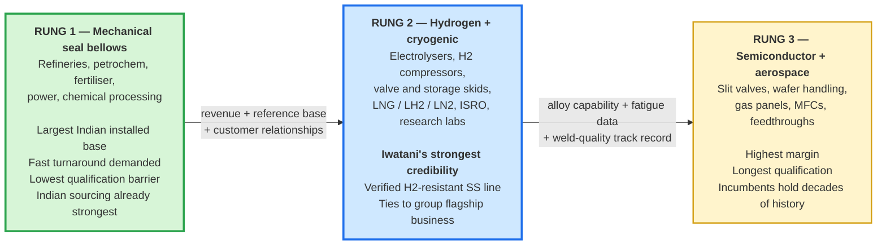

# 07 — Reconciliation of the Second Research Pass

This file merges the second body of research into the pack. It does three things: records where the two passes **agree** (high confidence), flags where they **conflict or contain errors** (fix before external use), and captures what is **genuinely new** — including two findings that change conclusions elsewhere in this pack.

---

## 1. Where both research passes independently agree

These conclusions were reached twice from different source sets, so treat them as high confidence.

| Conclusion | Status |
| --- | --- |
| Edge-welded diaphragm bellows are the semiconductor-relevant type; hydroformed/convoluted dominates heavy industrial expansion joints | **Confirmed** |
| **No Indian bellows manufacturer performs its own precision coil slitting** — they all buy strip and add value at forming/welding | **Confirmed twice.** This is the single most load-bearing finding for the hypothesis: Iwatani would sell *to* these firms, not compete with them |
| India's bellows and critical vacuum-component layer is import-dependent | **Confirmed** |
| Indian precision slitters exist but publish tolerances in the ±0.1 mm-and-looser band for general strip; none advertise sub-0.1 mm gauge at ±0.02–0.03 mm | **Confirmed** |
| Jindal has an existing "Precision Strips" product category to build on, but its tolerance/grade band is oriented to automotive, consumer durables and razor blades, not semiconductor bellows | **Confirmed** |
| Iwatani's precision slitting sits in China (Suzhou, Zhongshan) and Thailand, with **no India node** — this gap is the crux | **Confirmed** |
| Commercial market-research estimates for metal bellows diverge widely by provider and must be presented as a range | **Confirmed** |
| The Iwatani–Jindal Japan trading arrangement is **not publicly documented** and must be treated as given internal context, not a sourced claim | **Confirmed independently by both passes** |
| India's fab/OSAT buildout is real and funded, so the demand-side timing argument holds | **Confirmed** |

---

## 2. Errors and inconsistencies to correct before any external use

### 2.1 The North American semiconductor bellows figure is not credible

The second pass cites Verified Market Reports at **US$1.2 bn for the North American semiconductor bellows market in 2024**. This cannot be right, and it is contradicted by figures in the same document:

- Market Data Forecast: **global** metal bellows, **all end-uses**, **US$2.39 bn** (2024)
- Strategic Market Research: **global**, all end-uses, **US$2.12 bn** (2024)

A single region's single end-use segment cannot be **50–57% of the entire global market across all industries**. Either the Verified Market Reports scope includes far more than bellows, or the number is wrong. **Do not use it.** If a semiconductor-bellows number is needed, derive it bottom-up from customer conversations as set out in `02-market-sizing.md` §3.

### 2.2 The end-use share percentages sum to more than 100%

The second pass reports, from Market Growth Reports, that ~**48%** of US metal bellows demand is tied to semiconductor and electronics, "alongside about **56%** from aerospace and defense." That totals **104%**. Two segments cannot both hold those shares of the same denominator. Either they are overlapping definitions, different denominators, or a misreading. **Flag or drop.**

### 2.3 The precision-slitting value argument is overstated for edge-welded bellows

This is the most important technical correction, because the hypothesis rests on it.

The second pass argues that slitting precision — width consistency, edge burr, camber — "determines whether the stamped leaf welds cleanly and survives cyclic flexing." That is **only partly right, and the part that is right applies to the other manufacturing route.**

| Route | What the slit strip's *width* controls | What actually governs quality |
| --- | --- | --- |
| **Hydroformed / convoluted bellows tube** | Width **is** the tube circumference. Width variation becomes a gap or overlap at the longitudinal seam weld, and a bad seam weld splits during forming | **Width tolerance, edge burr and camber are first-order.** The slitting argument is strongest here |
| **Edge-welded diaphragm bellows** | Diaphragms are **blanked** from a wider strip, so the strip's width tolerance is largely absorbed by the blanking die | **Thickness uniformity, flatness, surface cleanliness, grain structure for fatigue life, and alloy availability** are first-order. Width tolerance is second-order |

**Why this matters commercially.** If Iwatani walks into an edge-welded bellows maker and leads with "we offer tighter slit-width tolerance," the engineer may reasonably shrug — width is not their yield driver. The pitch that lands with an edge-welded maker is **thickness consistency, flatness, cleanliness, fatigue-controlled fine grain, and availability of AM350 in thin gauge**. The slit-width pitch lands with hydroformed/convoluted makers and tube producers.

This does not weaken the hypothesis. It sharpens the pitch, and it means Iwatani should prepare **two different value propositions** for two different customer types.

### 2.4 "Semiconductor-grade bellows fall almost entirely in edge-welded"

True for **motion** applications (slit valves, wafer handling, feedthroughs, manipulators), which are the majority of the value. But formed bellows do appear in semiconductor tools — Irie Koken sells formed bellows for use "between turbomolecular pumps and chambers for vibration absorption, positioning, and vacuum exhaust piping" ([Irie Koken](https://www.ikc.co.jp/en/field/semiconductor.html)), and Witzenmann notes single-ply corrugated bellows have small spring rates and are "employed particularly in vacuum technology" ([Witzenmann India brochure](https://media.witzenmann.com/mediapool/documents/brochures/witzenmann-india.pdf)). Soften "almost entirely" to "predominantly, for motion applications."

### 2.5 Iwatani's own definition of precision stainless — two figures in circulation

The second pass cites Iwatani defining precision stainless as HV530+ strength and ultrathin stainless at **15–20 µm**. This pack's reading of Iwatani's stainless product page gives ultrathin foil **down to 8 µm** and separately lists high-strength stainless cold-worked to **HV530 or more** as a distinct line ([Iwatani stainless](https://www.iwatani.co.jp/eng/business/material/metals/products/stainless/)). These are probably different pages describing overlapping product families rather than a contradiction. **Use "down to 8 µm" as the capability ceiling and HV530+ as a separate high-strength line, and confirm internally.**

### 2.6 The IndexBox data point argues the *opposite* of how it is being used

The second pass presents IndexBox's India vacuum transfer valve estimate as strong confirmation of the opportunity: domestic output **1,500–3,000 units/year**, being **15–25% of demand**, with critical components including bellows imported from Switzerland, Germany and Japan.

The import-dependence half genuinely supports the thesis. But run the arithmetic on the volume half:

```
Domestic output 1,500–3,000 units = 15–25% of demand
⇒ Total Indian vacuum transfer valve demand ≈ 6,000–20,000 units/year
⇒ Bellows content: roughly one to two bellows per valve
⇒ Indian bellows demand from this application: order of 10,000–40,000 pieces/year
⇒ Material content per bellows: grams to tens of grams of thin strip
⇒ Implied precision-strip tonnage: single-digit tonnes per year
```

Against Jindal's **84,000 tpa** precision strip capacity, that is a rounding error. Even at Well Tech's published price points (₹7,900–11,000 per bellows), the entire Indian vacuum-transfer-valve bellows market is on the order of **₹8–44 crore (roughly US$1–5 million) at the finished-bellows level**, and the *material* slice of that is a small fraction again.

**This is the strongest available quantification of why India cannot be the anchor market for this business**, and it comes from the second pass's own best data point. It reinforces rather than contradicts the two-track recommendation in `05-strategy-and-roadmap.md`: sell bellows-grade strip into the *global* supply chain for revenue, and treat India as an option.

*Caveat: IndexBox is a data vendor of variable reliability and this specific estimate has not been independently corroborated. Treat the arithmetic as an order-of-magnitude sanity check, not a precise market size.*

---

## 3. Genuinely new and important: two Indian manufacturers that change a conclusion

The second pass surfaced two companies the first pass missed, and **verification of one of them requires revising a conclusion in `04-competitive-benchmarking.md`.**

### 3.1 Well Tech Metal Bellows (I) Pvt Ltd — Vasai, Maharashtra

Founded as Well Tech Engineers in **2013**. Edge-welded metal bellows (EWMB) is the core product line, not a sideline.

| Attribute | Detail |
| --- | --- |
| Materials | **SS316/316L, AM350, Inconel 718/625, Hastelloy C-276, Alloy 20, Titanium** |
| **Diaphragm thickness** | **0.05 mm to 0.2 mm** |
| Testing | **Helium leak tested** |
| Product lines | UHV bellows for vacuum chambers; **edge-welded bellows for high-purity gas delivery systems**; **for gas regulators and control panels**; **for mass flow controllers and flow meters**; mechanical seal assemblies (rotary, single cartridge); pump bellows; ANFD bellows |
| Manufacturing | States a "fully equipped in-house manufacturing facility… complete control over the production process from start to finish" |
| Indicative pricing | ₹7,900/pc for a 16 mm mechanical seal bellows; ₹11,000/pc for a UHV chamber bellows |
| Positioning | Explicitly anti-China in its own marketing: "far more better quality than China, no quantity restrictions as well, immediate delivery" |
| Sources | **[U]** [IndiaMART company page](https://www.indiamart.com/welltechmetal-bellowsi/), [mechanical seal bellows listing](https://www.indiamart.com/proddetail/edge-welded-metal-bellows-for-mechanical-seal-assemblies-2859074851312.html), [UHV bellows listing](https://www.indiamart.com/proddetail/edge-welded-metal-bellows-for-vacuum-chambers-uhv-systems-2859074772533.html), [LinkedIn](https://linkedin.com/in/well-tech-metal-bellows-i-pvt-ltd-well-tech-32818625b) |

> **This revises a conclusion.** `04-competitive-benchmarking.md` stated that no Indian company evidenced sub-0.1 mm diaphragm capability with AM350, helium leak testing and semiconductor-adjacent applications. **Well Tech claims exactly that combination**: 0.05–0.2 mm, AM350, helium leak tested, and bellows specifically for high-purity gas delivery, gas panels and mass flow controllers — which *are* semiconductor gas-delivery components.
>
> **And this makes Track A stronger, not weaker.** If Indian firms are already building edge-welded bellows in AM350 at 0.05–0.2 mm, then **they are already buying that foil from somewhere — almost certainly imported.** That is a named, identifiable, currently-served demand for precisely the material Iwatani would supply. Well Tech moves to the top of the customer-discovery list.
>
> **Verification caveat:** all of this comes from IndiaMART listings and LinkedIn, not from a company website or audited source. It is **[U]** grade. Claims of this significance need a site visit and a capability audit before being relied upon. A 2013-founded company with IndiaMART as its primary web presence is likely small; published capability and demonstrated semiconductor-qualified capability are different things.

### 3.2 Fluidyne Engineers India Pvt Ltd — Mysuru, Karnataka

| Attribute | Detail |
| --- | --- |
| Established | **1984** per fluidyneengineers.com; **1986** per fluidyneengineersindia.com — *unresolved discrepancy, worth clarifying* |
| Products | Metal bellows, expansion joints (EJMA), **edge welded bellows**, metal diaphragms and capsules, precision machined components, CNC pipe bending |
| Specific items | **4-inch Ultra High Vacuum Bellow**; edge-welded bellow seals at 16, 18, 24, 28 mm; **SS diaphragms for instrumentation at 0.05 mm and 0.10 mm thickness** |
| Diaphragm leaf stock | 0.1–0.5 mm (per second pass); company site confirms 0.05 mm and 0.10 mm diaphragms |
| Aerospace | **100+ aerospace-grade components delivered** — sensor housings, interface legs, detector enclosures |
| Approvals / references | AS9100D positioning; **EIL, DGQA, IRCLASS, PDIL, HAL, BHEL, NPCIL** |
| Claim | Second pass reports Fluidyne claims to be the only Indian firm to have developed **non-circular racetrack cross-section bellows for UHV** — racetrack geometry is exactly the slit-valve form factor |
| Sources | **[P]** [fluidyneengineers.com](https://fluidyneengineers.com/), [diaphragms & edge welded bellows](https://fluidyneengineers.com/Diaphragm_Seals_Capsules.php), [product list](https://www.fluidyneengineersindia.com/our-products.html), [diaphragm page](https://www.fluidyneengineersindia.com/diaphragm.html) |

**Assessment.** Fluidyne is the most credible Indian UHV bellows candidate found across both research passes: 40 years old, aerospace and nuclear approvals, diaphragms at 0.05 mm, an explicit UHV bellows product, and racetrack geometry capability. If the racetrack claim holds, it is directly relevant to slit valves. **Fluidyne and Well Tech together displace Bhastrik as the priority customer-discovery targets.**

### 3.3 Revised Indian manufacturer ranking

| Rank | Company | Why | Best role for Iwatani |
| --- | --- | --- | --- |
| **1** | **Well Tech Metal Bellows**, Vasai | 0.05–0.2 mm, AM350, He leak test, high-purity gas / MFC / gas-panel bellows, EWMB is core business | **Anchor Track A customer** — already consuming the target material |
| **2** | **Fluidyne Engineers India**, Mysuru | 40 yrs, aerospace + nuclear approvals, 0.05 mm diaphragms, UHV bellows, racetrack geometry claim | **Anchor Track A customer + design-in partner** |
| 3 | Bhastrik Mechanical Labs, Chennai | AM350, nesting ripple, micro-plasma, but 0.127 mm floor and no semiconductor claim | Secondary customer |
| 4 | Metallic Bellows (India), Chennai | AS9100, EJMA, UHV listed, but ~17 staff and project-oriented | Quality-system reference; secondary |
| 5 | Witzenmann India | Global edge-welded and semiconductor credentials; new 90,000 m² Oragadam site | **Both customer and principal competitive threat** |
| 6 | Flexpert Bellows, Belgaum | Multi-ply hydroformed 2–20 plies; blue-chip references | **Best fit for the slit-width value proposition** (formed route) |
| 7 | MB Metallic Bellows; Vallabh; Flexoweld / Real Bellows; IndiaMART long tail | Large-bore or generalist | Low priority |

---

## 4. Genuinely new and important: the segment-level purchasing logic

The second pass contributes an analysis of *why* buyers choose Indian versus imported welded bellows, segment by segment. This is the most commercially useful new material, because it identifies a better beachhead than semiconductors. Reproduced and assessed below.

| Segment | Why buy Indian | Why imports persist | Iwatani read |
| --- | --- | --- | --- |
| **Semiconductor vacuum systems** | Custom design matters more than unit cost; local suppliers iterate faster with engineering teams; imported EWMB lead times 12–30 weeks; local sourcing cuts freight, duty, inventory and FX exposure; rising localisation requirements | For the most demanding applications (EUV, advanced wafer processing, UHV ultra-high cycle count) OEMs still specify Servometer, Senior Aerospace or Japanese specialists on the strength of decades of qualification history | **Premium but slowest. Third in the ladder** |
| **Hydrogen service** | Hydrogen is difficult — very small molecular size, leakage, **embrittlement risk**, stringent weld quality. Local makers work in SS316L, Inconel, Hastelloy and special alloys; electrolysers, compressors, valve skids and storage skids often need **non-standard geometry**; government localisation goals | Very high-pressure compressors and safety-certified systems still favour suppliers with decades of hydrogen-specific qualification data | **Highest strategic fit — see §5** |
| **Cryogenic** (LNG, LH₂, LN₂, space programmes, research labs) | Cryogenic bellows need multiple design iterations, so engineering support lowers development cost; domestic space and research ecosystem (ISRO, research labs, industrial gas companies) values local technical support; faster redesign cycles | — | **Strong near-term fit, adjacent to hydrogen** |
| **Aerospace and space** | Security and strategic sourcing preference; **ITAR/export-control friction** on some advanced technologies from the US; close engineering collaboration since aerospace bellows are custom-designed rather than catalogue | Flight-critical and long-life hardware still favours global suppliers with decades of flight heritage, extensive qualification databases and proven reliability records | Moderate; Fluidyne already positioned here |
| **Mechanical seal bellows** | **"This is actually the segment where Indian sourcing is strongest."** Commodity-to-engineered product, not highly proprietary; Indian makers can match performance at substantially lower cost; **large domestic installed base** — refineries, petrochemicals, fertiliser plants, power plants, chemical processing; **fast turnaround** because a refinery shutdown can cost millions per day, so waiting months for imports is unacceptable; strong local manufacturing ecosystem already supplying seal makers | — | **The beachhead. First in the ladder** |

Overall assessment from the second pass, which this pack endorses: for mechanical seals, industrial vacuum, research equipment, cryogenic systems and many hydrogen projects, Indian manufacturers are increasingly chosen because **faster delivery, engineering flexibility and 20–50% lower total ownership cost** outweigh the advantages of importing. For the highest-end semiconductor, aerospace-flight and ultra-critical hydrogen applications, imports still dominate where buyers value decades of qualification, global references and proven reliability over cost. **The market is therefore not a pure replacement of imports but a gradual shift toward local sourcing as Indian suppliers build technical credibility.**

*Note: the 12–30 week import lead time and 20–50% cost advantage figures are the second pass's own assessment and are not independently sourced here. They are consistent in direction with the 16–20 week aerospace bellows lead times reported in `02-market-sizing.md`, but both should be verified in customer discovery.*

---

## 5. The insight that emerges from combining both passes: hydrogen

Neither pass alone surfaced this, but together they do, and it may be the most important strategic finding in the whole study.

**The second pass identifies hydrogen service as a segment where Indian buyers are actively procuring bellows locally**, driven by embrittlement risk, stringent weld quality requirements, non-standard geometries for electrolysers, compressors and storage skids, and government localisation goals.

**This pack independently verified that Iwatani's stainless product line already includes**, on its own product page ([Iwatani stainless](https://www.iwatani.co.jp/eng/business/material/metals/products/stainless/)):

- **"Hydrogen-resistant stainless steel — Maintains durability even at extremely low temperatures and high pressures"**
- **"Hydrogen-Refueling Station Materials"** as a named Metals Department product line

And Iwatani is not a marginal player in hydrogen — it is the group's flagship business, with liquid hydrogen production at Yamaguchi Liquid Hydrogen and Hydro Edge, and Japan's first commercial hydrogen station ([FY2026 Investors' Guide](https://www.iwatani.co.jp/eng/ir/pdf/about_iwatani.pdf)).

### Why this matters more than it first appears

1. **It solves the internal-narrative problem.** A "new business" proposal from the Stainless Steel Division that plugs into the group's flagship hydrogen story is far easier to fund than one that depends on an unproven Indian semiconductor components market.
2. **The material spec overlaps heavily with bellows requirements.** Hydrogen service demands SS316L, Inconel and Hastelloy in thin gauge with stringent weld quality and fatigue resistance — the same property set as bellows diaphragms. One material development programme can serve both.
3. **Qualification barriers are lower than semiconductor.** No ISO Class 5 cleanroom, no RGA certification, no 12–24 month OEM qualification against decades of incumbent history.
4. **It is where Iwatani has genuine, defensible credibility.** In semiconductor bellows material, Iwatani is a challenger to TOKKIN. In hydrogen materials, Iwatani is one of the most credible companies on earth.
5. **Cryogenic is directly adjacent** — LNG, liquid hydrogen and liquid nitrogen bellows, plus ISRO and research-lab demand, all draw on the same alloys and the same Iwatani hydrogen and industrial-gas relationships.

**Recommendation: add hydrogen and cryogenic bellows material as a formal third leg of Track A**, and test it in Phase 0 alongside the semiconductor thread. It may well produce revenue first.

---

## 6. Revised entry ladder

The two passes together support replacing the single-segment semiconductor focus with a **three-rung ladder**, sequenced by qualification difficulty rather than by prize size.



Each rung earns the credibility needed for the next. Rung 1 funds the programme and builds relationships with the same Indian bellows makers — Well Tech, Fluidyne — who also serve rungs 2 and 3. Rung 2 develops the thin-gauge corrosion- and fatigue-critical alloy capability that rung 3 requires. Rung 3 remains the strategic prize, reached with a customer base and a data package rather than from a standing start.

---

## 7. Additions to the action list

Merged into `05-strategy-and-roadmap.md` §9. New or re-prioritised items only:

| # | Action | Rationale |
| --- | --- | --- |
| N1 | **Site-visit and audit Well Tech Metal Bellows (Vasai)** — verify the 0.05–0.2 mm / AM350 / helium-leak claims and, critically, **ask where they buy their foil today, at what price and lead time** | Highest-value single conversation available. If real, this is a named customer already buying the target material |
| N2 | **Site-visit Fluidyne Engineers India (Mysuru)** — verify the racetrack UHV claim, the 0.05 mm diaphragm capability, and current material sourcing | Most credible Indian UHV candidate |
| N3 | **Open the hydrogen thread internally** — connect the Stainless Steel Division's proposal to the group's hydrogen business and the existing hydrogen-resistant stainless and hydrogen-station materials lines | Likely the fastest path to internal approval and possibly to first revenue |
| N4 | **Prepare two distinct value propositions** — slit-width/edge/camber for hydroformed tube makers (Flexpert, Witzenmann India); thickness/flatness/cleanliness/grain/AM350-availability for edge-welded makers (Well Tech, Fluidyne, Bhastrik) | Prevents pitching the wrong benefit to the wrong customer |
| N5 | **Map Indian mechanical-seal makers** as rung-1 end demand — they are the customers of the bellows makers | Sizes the beachhead |
| N6 | **Verify the 12–30 week import lead time and 20–50% cost-advantage claims** in customer discovery | Both are central to the "why switch" argument and neither is independently sourced |
| N7 | **Drop the Verified Market Reports and Market Growth Reports figures** from any external material | Internally inconsistent; a credibility risk in a partner or board setting |

---

## 8. Net effect on the pack's conclusions

| Conclusion | Change |
| --- | --- |
| Product thesis is sound; geography of demand was misidentified | **Unchanged and reinforced** — the IndexBox arithmetic in §2.6 now quantifies how small Indian semiconductor bellows demand is |
| Two-track strategy: global strip supply now, India as an option | **Unchanged**, but Track A is now **three-legged** (semiconductor, hydrogen/cryogenic, mechanical seal) and India enters earlier via rung 1 |
| No Indian firm evidences semiconductor-grade sub-0.1 mm edge-welded capability | **Revised.** Well Tech claims 0.05–0.2 mm in AM350 with helium leak testing and gas-delivery/MFC applications; Fluidyne claims 0.05 mm diaphragms and UHV racetrack bellows. Both **[U]**-grade and needing audit — but if verified, Indian demand for the target material already exists and is being met by imports |
| No Indian bellows maker slits its own strip | **Unchanged, confirmed twice.** The core commercial logic holds |
| Jindal is dimensionally ready, metallurgically unproven on AM350/631 | **Unchanged.** Now more urgent: Well Tech and Fluidyne are already using AM350, so the grade question is live commercial demand, not a hypothetical |
| Entry sequencing | **Revised** — three-rung ladder replaces single semiconductor focus. Mechanical seal bellows first, hydrogen/cryogenic second, semiconductor third |
| Witzenmann is the competitive clock | **Unchanged** |
