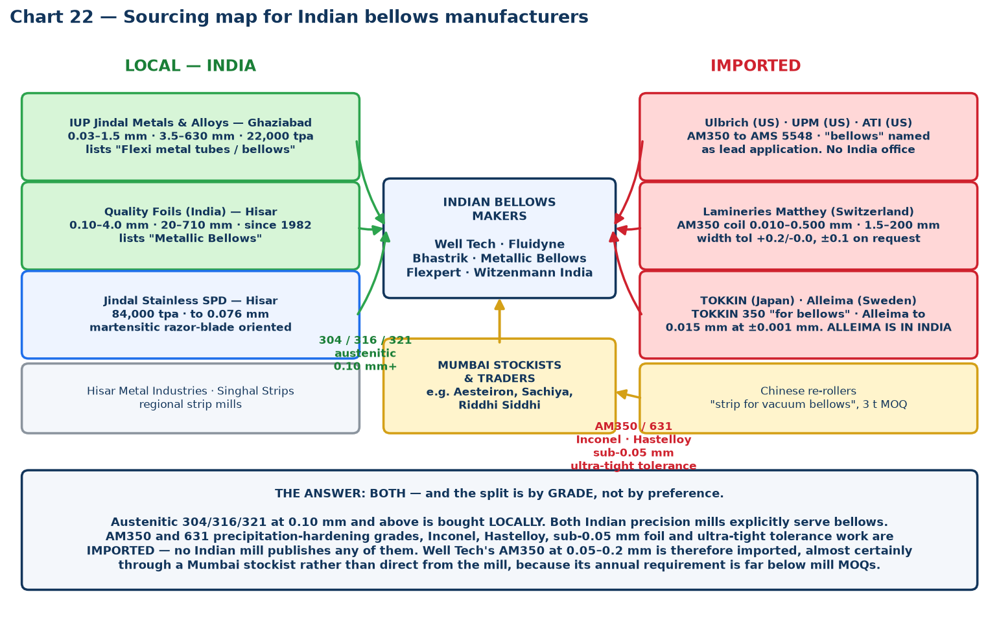
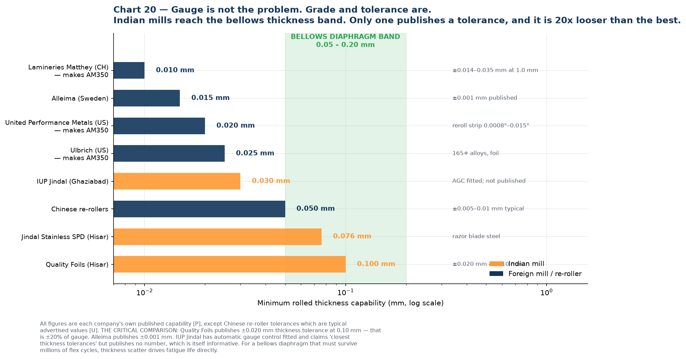
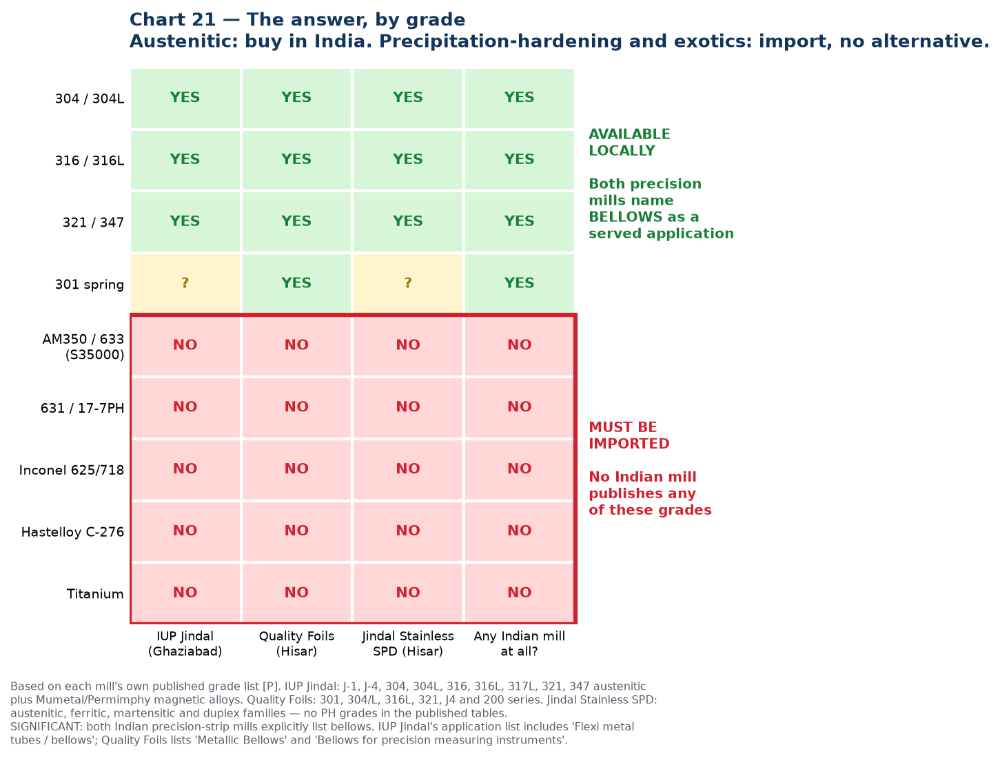

# 08 — Where Indian Bellows Makers Source Their Precision Strip

**The question:** where do Well Tech, Fluidyne, Bhastrik and Metallic Bellows actually buy the thin precision stainless they stamp and weld — locally, or imported?

## THE ANSWER: both, and the split is by grade, not by preference

| What they buy | Source | Why |
| --- | --- | --- |
| **Austenitic 304 / 304L / 316 / 316L / 321 / 347, 0.10 mm and thicker** | **LOCAL** | Two Indian precision-strip mills cover these grades in this gauge band, and **both explicitly name bellows as a served application** |
| **AM350 / AISI 633, 631 / 17-7PH, Inconel, Hastelloy, titanium** | **IMPORTED — no alternative** | **No Indian mill publishes any of these grades.** Not one |
| **Sub-0.05 mm foil** | **IMPORTED** | Indian minimum is 0.03 mm (IUP Jindal) but effectively 0.10 mm for most work; global mills go to 0.010–0.015 mm |
| **Ultra-tight tolerance work (±0.005 mm and below)** | **IMPORTED** | The only published Indian tolerance at 0.10 mm is ±0.020 mm; Alleima publishes ±0.001 mm |

**So when Well Tech advertises edge-welded bellows in AM350 at 0.05–0.2 mm, that material is imported.** Almost certainly through a Mumbai stockist rather than direct from the mill, because a company of that size needs tens or low hundreds of kilograms of a given specification per year against mill minimums measured in tonnes.

### The two Indian mills that genuinely serve bellows

This is the most concrete finding in this file, and it was not obvious before.

**IUP Jindal Metals & Alloys Ltd** (Ghaziabad, Jindal SAW group — *not* Jindal Stainless):
- Thickness **0.03–1.5 mm**, width **3.5–630 mm**, capacity **22,000 tpa**
- Grades: J-1, J-4, 304, 304L, 316, 316L, 317L, 321, 347 austenitic, plus Mumetal / Permimphy / Supermimphy magnetic alloys
- Three Sendzimir mills with I2S **automatic gauge control**, two bright annealing lines, three Brodeur slitting lines with shimless tooling and computerised setting, **edge rounding machine**, tension leveller
- Edge conditions: mill, slit, deburred, deburred + round, deburred + chamfered
- **Its published application list includes "Flexi metal tubes / bellows"** ([brochure](https://jindalmetal.com/images/iup-brochure.pdf), [product page](https://jindalmetal.com/product-range/stainless-steel-manufacturers-in-india-2/cold-rolled-precision-stainless-steel-strips), [facilities](https://www.indiamart.com/iup-jindal-metals/infrastructure-and-facilities.html)) **[P]**

**Quality Foils (India) Ltd** (Hisar, Haryana, cold rolling since 1982):
- Thickness **0.10–4.00 mm**, width **20–710 mm**; slit edge from **5.0 mm**
- Grades: 301, 304/L, 316L, 321, J4 and 200 series, in 2H / 2R / 2B finishes
- ISO 9001 (TÜV SÜD); marketing offices Delhi, Mumbai, plus European representation
- **Published thickness tolerance at 0.10 mm: ±0.020 mm**
- **Its product listing explicitly includes "Metallic Bellows", "Bellows, metal, for instruments" and "Bellows for precision measuring instruments"** ([about](https://www.qualitygroup.in/qualityfoils/about-us/), [products](https://www.qualitygroup.in/qualityfoils/products/), [Kompass listing](https://www.kompass.com/z/ww/c/quality-foils-india-private-limited/in756895/)) **[P]**

> **This changes the framing of the opportunity.** The gap is not that India lacks precision slitting — two mills do it and both already sell into bellows. The gap is **grade coverage and tolerance class.** Which means Iwatani's pitch to an Indian bellows maker is not "we can slit precisely" — they can already buy that locally. It is **"we can supply AM350 and 631 in thin gauge, at tight tolerance, in small lots, with traceability."** That is a materially different and much more defensible proposition.

### Gauge is not the constraint — grade and tolerance are

Indian mills reach into the bellows diaphragm band on thickness. Where they fall short is tolerance class and alloy range. Quality Foils' **±0.020 mm at 0.10 mm gauge is ±20% of thickness**; Alleima publishes **±0.001 mm**. For a diaphragm that must survive millions of flex cycles, thickness scatter drives fatigue life directly, so that gap matters more than the headline gauge number.

IUP Jindal has AGC fitted and claims "closest thickness tolerances" but publishes no figure — which is itself informative. **Getting IUP Jindal's actual tolerance table is a Gate 1 action**, because it determines whether Iwatani is competing against them or complementing them.

### Grade availability, mill by mill

Every Indian mill covers the austenitic grades. **Not one publishes AM350, 631, Inconel, Hastelloy or titanium strip.** That red block is the import-dependent zone, and it is precisely where semiconductor, aerospace and high-cycle bellows material sits.

---

## Why none of them will simply tell you

Material source is competitive information for a bellows maker — it is the difference between winning and losing a qualification, and a supplier who knows your source can be approached directly. Expect no public disclosure from any of the four.

But it is determinable, from three directions: **grade logic** (what cannot be bought in India must be imported), **customs records** (Indian import data is shipment-level and commercially available), and **direct questioning** (structured procurement conversations). The rest of this file covers all three, plus the one competitor finding that matters most.

---

## 1. Grade logic: what they *must* import versus what they *can* buy locally

Split the bill of materials into three tiers. The tier determines the answer.

### Tier 1 — Precipitation-hardening grades in thin gauge (AM350, 631/17-7PH), 0.05–0.2 mm
**Verdict: 100% imported. There is no Indian source.**

AM350 does not appear in the published grade tables of any Indian mill, including Jindal Stainless. Well Tech lists AM350 at 0.05–0.2 mm and Fluidyne works at 0.05 mm; Bhastrik lists AM350 at 0.127–0.30 mm. **All of that material crosses a border.**

Likely sources, in rough order of probability:

| Supplier | Country | Evidence | Grade |
| --- | --- | --- | --- |
| **Ulbrich Stainless Steels & Special Metals** | US | Lists **AM 350 (UNS S35000)** in strip, coil, foil and wire to AMS 5548 / ASTM A693 / Type 633, with **"Bellows"** named as the first application. Describes itself as a re-roller and distributor of 100+ alloys of precision strip and foil | **[P]** [Ulbrich AM 350](https://www.ulbrich.com/alloys/am-350-stainless-steel-uns-s35000/) |
| **United Performance Metals (UPM)** | US | **AM 350 precision reroll strip, 0.0008"–0.015" (0.02–0.38 mm)**, with **bellows** named under aerospace applications | **[P]** [UPM AM 350](https://www.upmet.com/products/stainless-steel/am-350r) |
| **TOKKIN (Tokushu Kinzoku Excel)** | Japan | Markets **TOKKIN 350** and states directly: "We manufacture TOKKIN 350 and various other metals **for bellows**" | **[P]** [TOKKIN 350](https://www.tokkin.com/search/stainless-steels/precipitation-hardening/tokkin350/) |
| **Alleima** | Sweden | Precision strip to **0.015 mm at ±0.001 mm tolerance**; spring strip programme explicitly includes **precipitation hardening steels and nickel alloys**; cites **"thermostat expansion bellows"** as an application. **Has an Indian company — see §3** | **[P]** [Alleima precision strip brochure](https://www.alleima.com/siteassets/documents/strip/precision_strip_steel_brochure_fin.pdf), [strip steel](https://www.alleima.com/en/products/strip-steel/) |
| **ATI** | US | AM 350 / AM 350-MIL to ASTM A693, ASME SA-693, AMS 5548 | **[P]** [ATI](https://www.atimaterials.com/Products/am-350) |
| **Hempel Special Metals** | UK/Europe | Service centre explicitly supplying **metallic bellows and expansion joint manufacturers**; nickel alloys, stainless and titanium from 0.05 mm, precision slit in-house | **[P]** [Hempel](https://www.hempel-metals.com/en/products/precision-slit-strip) |
| **Lamineries Matthey** (Notz Metall AG) | Switzerland | Publishes AM350 (D347) **strip in coils at 0.010–0.500 mm thickness × 1.5–200.0 mm width**, thickness tolerance classes down to ±0.014 mm at 1.0 mm, width tolerance +0.2/−0.0 standard or **±0.1 mm on request**. One of the few mills publishing an AM350 dimensional envelope this precisely | **[P]** [Matthey AM350 data sheet](https://www.matthey.ch/fileadmin/user_upload/downloads/fichetechnique/EN/Inox-AM350_v25E.pdf) |
| **Aperam Alloys Imphy / voestalpine Precision Strip / Waelzholz** | France / Sweden / Germany | European precision strip houses covering special alloys in thin gauge | Plausible, not confirmed |
| **Aesteiron and other Mumbai stockists** | India (importers) | List AM350 / UNS S35000 in **strip, coil and foil**, with quoted "UNS S35000 price in Mumbai". **Not mills — importers.** Confirms an existing trader channel into India for this grade | **[U]** [aesteiron.com](https://www.aesteiron.com/alloym350.html) |
| Chinese re-rollers | China | Openly market **"precision stainless steel strip for vacuum bellows"** at e.g. 0.11 × 79 mm 316L, 3 t MOQ, 20–30 day lead time | **[U]** [ss-strips.com](https://www.ss-strips.com/sale-36582674-flexible-ss316l-cold-rolled-precision-stainless-steel-strip-for-vacuum-bellows-0-11-79mm.html) |

**Read this carefully:** Ulbrich, UPM and TOKKIN all name *bellows* as the lead application for AM350 precision strip. These are not general suppliers who happen to stock the grade — they are the bellows-strip trade. If an Indian bellows maker is running AM350, one of this group is almost certainly upstream, directly or through a stockist.

### Tier 2 — Austenitic grades in thin gauge (304L, 316L, 321, 347), 0.05–0.3 mm
**Verdict: mixed. Domestic capability exists, but imports persist — and the reason why is the important part.**

Indian domestic sources, concentrated in a single cluster:

| Mill | Location | Capability | Grade |
| --- | --- | --- | --- |
| **IUP Jindal Metals & Alloys** | Ghaziabad (Jindal SAW group) | **0.03–1.5 mm**, width **3.5–630 mm**, **22,000 tpa**; mill/slit/**deburred/round/chamfered** edges plus a dedicated edge-rounding machine; grades J-1, J-4, 304, 304L, 316, 316L, 317L, 321, 347 plus Mumetal/Permimphy magnetic alloys; three Sendzimir mills with I2S AGC; three Brodeur slitting lines with shimless tooling. **Application list explicitly includes "Flexi metal tubes / bellows"** | **[P]** [brochure](https://jindalmetal.com/images/iup-brochure.pdf), [facilities](https://www.indiamart.com/iup-jindal-metals/infrastructure-and-facilities.html) |
| **Quality Foils (India) Ltd** | **Hisar, Haryana** | Cold rolling since **1982**; thickness **0.10–4.00 mm**, width **20–710 mm**, slit edge from 5.0 mm; grades 301, 304/L, 316L, 321, J4, 200 series in 2H/2R/2B; **published thickness tolerance ±0.020 mm at 0.10 mm**; ISO 9001 (TÜV SÜD); BIS IS 6911 licence. **Product listing explicitly includes "Metallic Bellows" and "Bellows for precision measuring instruments"**. Group also makes stainless flexible hose and tube | **[P]** [about](https://www.qualitygroup.in/qualityfoils/about-us/), [products](https://www.qualitygroup.in/qualityfoils/products/), [Kompass](https://www.kompass.com/z/ww/c/quality-foils-india-private-limited/in756895/) |
| **Jindal Stainless — Hisar SPD** | **Hisar, Haryana** | 84,000 tpa precision strip, dedicated precision slitters, to 0.076 mm, up to 650 mm width — but **martensitic razor-blade oriented** | **[P]** [brochure](https://www.jindalstainless.com/product-brochure/) |
| **Hisar Metal Industries Ltd** | **Hisar, Haryana** | Thin stainless steel strip | **[U]** [directory](https://www.grotal.com/Delhi/Precision-Stainless-Steel-Strip-Manufacturers-C44/) |
| **Singhal Strips Ltd** | **Hisar, Haryana** | Cold rolled stainless strip and coil | **[U]** same |
| Stelco Ltd, Regal Steel, various Mumbai/Ahmedabad processors | — | General cold-rolled strip | **[U]** |

> **Geographic insight worth noting: Hisar, Haryana is India's precision strip cluster.** Jindal Stainless SPD, Quality Foils, Hisar Metal Industries and Singhal Strips are all there. If Iwatani ever contemplates an Indian slitting node, Hisar has the ecosystem — though it is far from the Chennai and Vasai bellows makers and from the Gujarat semiconductor cluster.

Note who is *not* on this list despite being large Indian steel names: **Mukand** and **Sunflag** are long-product and alloy-bar producers (bars, wire rod, bright bars), not cold-rolled precision strip. Do not put them on a sourcing map.

### Tier 3 — Thicker plies for expansion joints and multi-ply hydroformed bellows, 0.3 mm and up
**Verdict: predominantly domestic.** Jindal Stainless, Quality Foils, IUP Jindal, plus importers and stockists. This is a commodity conversation and not where the opportunity is.

---

## 2. The evidence that imports persist even where India can supply

Two findings from Indian customs records make this concrete, and one of them is a warning.

**Precision foil is actively imported from Japan at a large premium.** Sample Indian import records under HS 72202090 show `s.s.foil cold rolled grade=400 series, thickness 0.08 mm × width 74.5 mm, coil type`, landed from **Japan at US$7.96–8.82/kg**. In the same dataset, commodity cold-rolled 304/304L coil from China clears at roughly **US$1.87–2.39/kg** ([Seair HS 7220 sample](https://www.seair.co.in/import-data-hs-code-7220.aspx), [Seair HS 7219 sample](https://www.seair.co.in/cold-rolled-stainless-steel-coil-import-data/hs-code-7219.aspx)) **[U — commercial data vendor sample]**.

That is a **3.4–3.8× price premium for thin precision foil over commodity coil.** That gap is the margin pool this entire business case is aiming at, and it is visible in actual customs entries rather than inferred.

**The warning:** Indian razor-blade makers still import ultra-thin strip despite Jindal producing it domestically. The same records show **Gillette India** and **Vidyut Metallics** importing cold-rolled stainless strip at **0.100 mm × 22.20 mm** from the **UK and USA** ([Voleba importer sample](https://india-importers.voleba.com/products/india/cold-rolled-stainless-steel-importer-data.html)) **[U]**.

Razor blade steel is Jindal Hisar's flagship product — they roll to 0.076 mm and supply "leading Indian and International razor blade manufacturers." Yet major Indian blade producers still import 0.1 mm strip from Europe and America. **Whatever is causing that — grade, consistency, approval history, or customer specification lock-in — is exactly the same barrier Jindal would face in bellows strip.** This deserves a direct question to Jindal, because it is the closest available analogue to the challenge ahead. *(Caveat: these sample records are old, and the situation may have changed. Verify against current data.)*

---

## 3. The most important finding: Alleima is already in India

**Alleima India Private Limited**, Pune (Aundh), CIN U29308PN2019PTC182454, incorporated 23 February 2019, **formerly Sandvik Materials Technology India Pvt Ltd**, **~125 employees**, authorised capital ₹50 crore ([company record](https://www.thecompanycheck.com/company/alleima-india-private-limited/U29308PN2019PTC182454) **[U]**; [Alleima entity list](https://www.alleima.com/en/about-this-site/data-privacy-portal/list-of-alleima-entities/) **[P]**).

It has a dedicated **Vice President & Regional Sales Director, Strip Division, India Region**, whose published remit is "Sales & Marketing of Precision Strip Division of Alleima, Region India — Precision Strip in Carbon Steel, Stainless Steel and Special Alloy Steel." The listed India segments are **compressor valves, razor blades, springs, printing doctor blades, knives, scalpels, shock absorbers** ([LinkedIn](https://linkedin.com/in/shailesh-sardesai-6635514) **[U]**).

Why this matters more than anything else in this file:

1. **Alleima is the global benchmark Jindal would be measured against.** Strip to **0.015 mm at ±0.001 mm tolerance**, full metallurgy control from melt to final strip, spring strip programme including precipitation-hardening steels and nickel alloys, and "thermostat expansion bellows" cited in its own brochure.
2. **They already have 125 people and a strip sales director in India.** This is not a distributor arrangement — it is an operating subsidiary with a named senior owner of precision strip revenue. Any Iwatani/Jindal offer will be benchmarked against theirs, by customers who already have an Alleima relationship.
3. **But bellows is not on their published India segment list.** Compressor valves, razor blades, springs, doctor blades, knives, scalpels, shock absorbers — no bellows. That is either an untapped gap or simply an incomplete list. **Worth establishing which, because it determines whether Iwatani is entering an occupied position or an open one.**
4. **Alleima's Indian segments overlap heavily with Jindal Hisar's.** Razor blades and springs are both companies' territory. They are already competing in India, in the same building materials, for the same customers. Jindal's sales team will already know Alleima well — a useful internal source of competitive intelligence that costs nothing to tap.

Alleima also runs a formal distributor programme and states it is "expanding in selected markets and looking for new distribution partners," with no Indian distributor currently listed ([distributors page](https://www.alleima.com/en/products/strip-steel/distributors/) **[P]**). That is a strategic curiosity worth noting: it is a route Iwatani could in principle occupy rather than fight, though it would be a different business from the Jindal thesis.

---

## 4. How to confirm it properly: Indian customs data

This is the actionable method. Indian import records are shipment-level and include importer name, HS code, product description with grade and dimensions, quantity, unit price, country of origin, and port. For a question like this, it is decisive.

### HS codes to pull

| Code | Covers | Relevance |
| --- | --- | --- |
| **7220** | Flat-rolled stainless, **width < 600 mm** | **The primary target.** Bellows strip is narrow by definition |
| **722020** | Not further worked than cold-rolled, width < 600 mm | Core sub-heading |
| **72202090 / 72202021 / 72202029** | Cold-rolled strip sub-classifications, incl. chromium type | Where the real entries sit |
| **72209090** | Other flat-rolled stainless < 600 mm | Foil and specialty entries appear here |
| **7219** | Flat-rolled stainless, **width ≥ 600 mm** | Only if a bellows maker buys wide coil and has it slit by a third party |

### Providers

| Provider | Notes |
| --- | --- |
| **Seair Exim Solutions** (seair.co.in) | Publishes free sample rows including grade, dimensions, unit price, origin. Good for a first look |
| **Volza / Voleba** | Importer directories and shipment counts; some free preview |
| **Zauba, ImportGenius, Export Genius, Cybex, Infodrive** | Comparable commercial services |
| **DGCI&S** (Ministry of Commerce) | Official aggregate statistics — reliable for volume and value trends, but **no importer names** |

A single-product, single-year commercial data pull is typically a few hundred to a couple of thousand US dollars. **Against the cost of this programme, buy the data.** It is the cheapest high-quality intelligence available here.

### What to search for

Query by **importer name** for each target: `Well Tech Metal Bellows`, `Fluidyne Engineers`, `Bhastrik Mechanical`, `Metallic Bellows India`, `Flexpert Bellows`, `Witzenmann India`.

Then query by **product description keyword** to catch entries filed under a trader or stockist rather than the bellows maker directly: `AM350`, `AM 350`, `S35000`, `633`, `17-7PH`, `631`, `precision strip`, `stainless foil`, `bellows`, `diaphragm`, plus dimensional strings such as `0.05 mm`, `0.08 mm`, `0.1 mm`, `0.127 mm`.

### What the data will and will not tell you

**Will:** the origin country, the mill or trader named on the entry, grade and dimensions, unit price, volume and shipment frequency, and therefore the annual tonnage and the price Iwatani must beat.

**Will not:** whether the exporter is the mill or an intermediary; whether material arrives through a domestic stockist who imported it separately; or anything about a bellows maker buying domestically. **Roughly a third of the picture will need direct conversation to complete.** Expect to triangulate.

---

## 5. What to ask the bellows makers directly

Nobody answers "who is your supplier?" But procurement people will discuss constraints, because constraints are complaints. Ask about pain, not names.

| Question | What it reveals |
| --- | --- |
| "What gauge and grade do you struggle most to source?" | Where the shortage is — the wedge |
| "What is your typical lead time on AM350 foil, and how far ahead do you have to commit?" | Whether the 12–30 week import lead time is real, and how much working capital it locks up |
| "What minimum order quantity are you forced to accept?" | **The strongest likely wedge.** A 3-tonne MOQ against a customer needing 200 kg is a real, expensive problem, and it is one a trading house solves better than a mill |
| "Do you buy direct from the mill or through a stockist?" | Whether there is an intermediary margin for Iwatani to displace or occupy |
| "Have you ever had a batch rejected, and for what?" | Burr, camber, thickness variation or cleanliness — tells you which property to specify against |
| "Which of your customers specify the material source, and which leave it to you?" | Whether they can even switch. Specification lock-in may make some volume unwinnable |
| "Would you qualify a second source, and what would it take?" | Whether a real opening exists, and the cost of entry |
| "Do you buy in strip width or blank width?" | **Sorts them into the two value propositions.** Strip width means the slit-width pitch lands; blank width means pitch thickness, flatness, cleanliness and grain instead |

The MOQ question deserves emphasis. Chinese mills advertise 3-tonne minimums on bellows strip. Ulbrich and Alleima are re-rollers who can go smaller but price accordingly. **An Indian bellows maker building 0.05 mm AM350 bellows may need only tens or low hundreds of kilograms of a given specification per year.** Breaking bulk, holding stock and giving Indian customers small-lot access to mill-quality material is a classic trading-house function — and it is a business Iwatani can start *immediately*, sourcing from existing suppliers, without waiting for Jindal to develop anything.

---

## 6. Best current assessment

Stated with confidence levels, since none of this is yet confirmed by data purchase or direct conversation.

| Question | Assessment | Confidence |
| --- | --- | --- |
| Where does AM350 and PH-grade thin foil come from? | **Imported — confirmed, no Indian mill publishes these grades.** Named candidate sources: Ulbrich, United Performance Metals and ATI (US); **Lamineries Matthey (Switzerland)**, which publishes AM350 strip in coils at 0.010–0.500 mm × 1.5–200 mm with width tolerance +0.2/−0.0 or ±0.1 mm on request; TOKKIN (Japan); Alleima (Sweden); Hempel (UK); plus Chinese re-rollers on price-driven work | **High** on "imported"; **Medium–High** on the candidate list |
| Where does austenitic 304L/316L/321 thin strip come from? | **Predominantly LOCAL — now confirmed.** IUP Jindal (0.03–1.5 mm, lists "Flexi metal tubes / bellows") and Quality Foils (0.10–4.0 mm, lists "Metallic Bellows"). Imports only where tolerance class or sub-0.10 mm gauge is beyond them | **High** |
| Do they buy direct from mills or through stockists? | **Largely through stockists and traders** for imported grades. Indian stockists openly list AM350 in strip and foil form — e.g. Aesteiron (Mumbai) quotes UNS S35000 strip prices, indicating a trader channel already exists | **Medium–High** |
| Is any of it bought from Jindal Stainless today? | **Probably not for thin bellows work.** Jindal SPD is martensitic razor-blade oriented; IUP Jindal (a different Jindal company) is the one actually selling into bellows | **Medium–High** |
| Who is the competitor to displace? | **On austenitic: IUP Jindal and Quality Foils — both Indian, both already serving bellows.** On PH grades and tight tolerance: Ulbrich, UPM, Matthey, TOKKIN and **Alleima, which has 125 people in Pune** | **High** |
| Is there an obvious commercial wedge? | **Yes, and it is now sharper: grade plus small-lot access, not slitting precision.** Nobody in India can supply AM350 or 631 thin strip. Nobody serves tens-of-kilograms lots of it. Both problems are trading-house problems, solvable with existing supply relationships | **Medium–High** |
| What is the price gap Iwatani would work within? | Commodity CR 304 coil lands in India around **US$1.87–2.39/kg**; 0.08 mm Japanese precision foil lands at **US$7.96–8.82/kg**; AM350 strip is quoted upward of **US$10/kg**. Roughly a **4–5x premium** for the precision and PH tiers | **Medium** |

---

## 7. Recommended sequence

0. **Call IUP Jindal and Quality Foils first.** They are Indian, they already sell strip into bellows, and they will discuss what they *cannot* supply far more readily than a bellows maker will discuss what it buys. Ask each for their thickness tolerance table and whether they have ever been asked for AM350 or 631. This is the cheapest and fastest way to confirm the whole picture, and it costs two phone calls.
1. **Buy one year of Indian import data** for HS 7220 and 7219, filtered by the six named bellows makers plus the grade and dimension keywords above. Low cost, decisive.
2. **Ask Jindal's sales team about Alleima India.** They compete already in razor blades and springs. This intelligence is free and immediately available.
3. **Ask Jindal why Gillette and Vidyut Metallics import 0.1 mm strip.** It is the closest analogue to the bellows-strip challenge and will surface the real barrier — grade, consistency, or approval history.
4. **Run the eight procurement questions** with Well Tech and Fluidyne, framed around constraints rather than suppliers.
5. **Establish whether Alleima serves bellows in India.** It determines whether Iwatani enters an occupied position or an open one.
6. **Test the MOQ/small-lot wedge as an immediate, Jindal-independent business.** If Indian bellows makers are struggling against 3-tonne minimums, Iwatani can serve that from existing supply relationships now — earning revenue and customer intimacy while the Jindal qualification runs in parallel.

Item 6 is the one to move on first. It is the only action in this entire pack that could generate revenue without anything new having to be developed, built or qualified.
