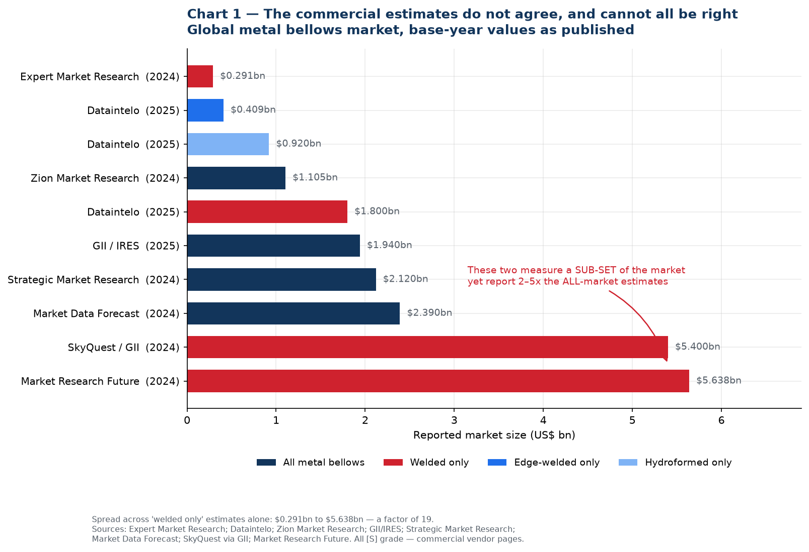
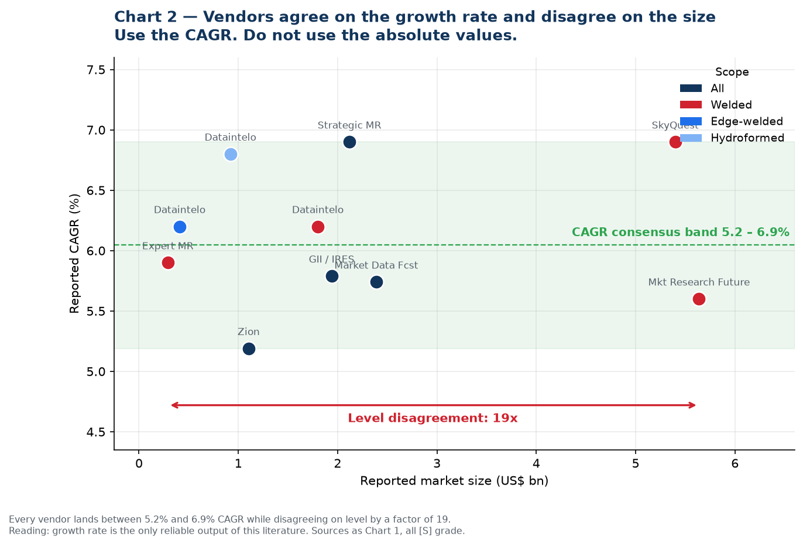
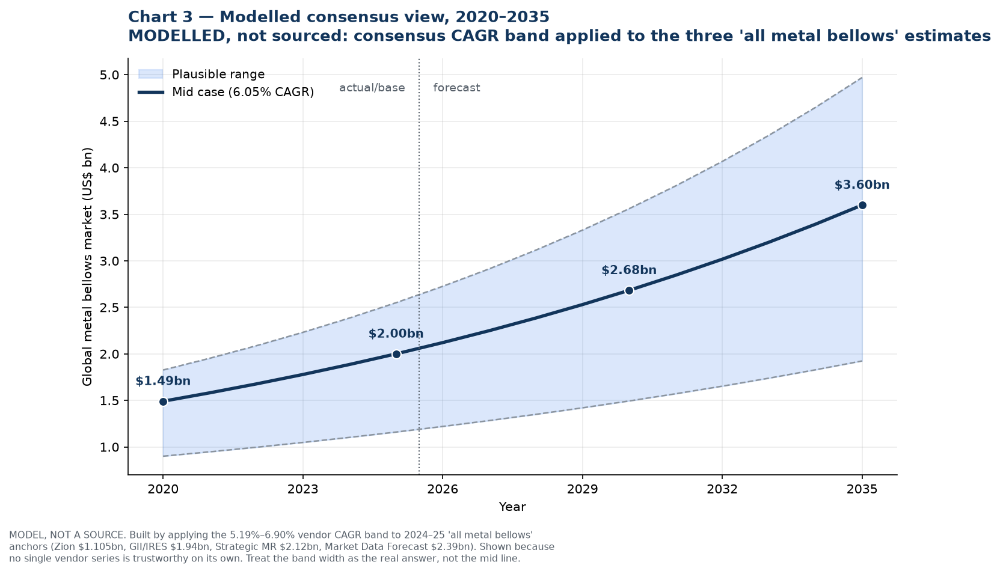
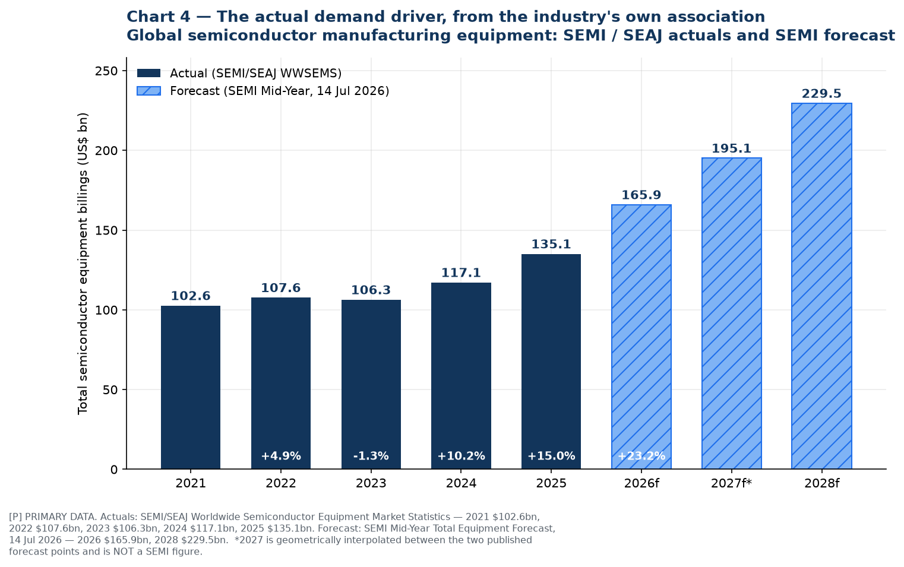
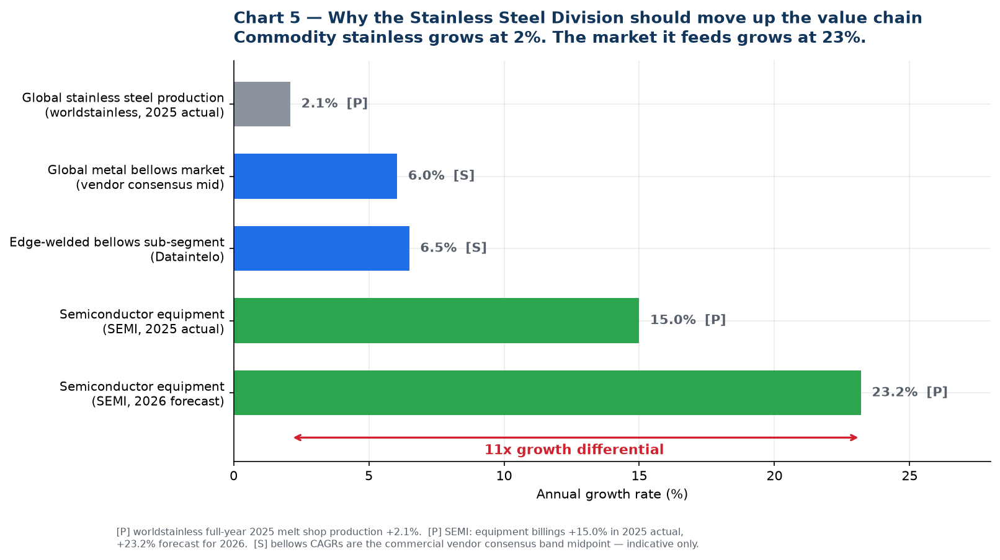
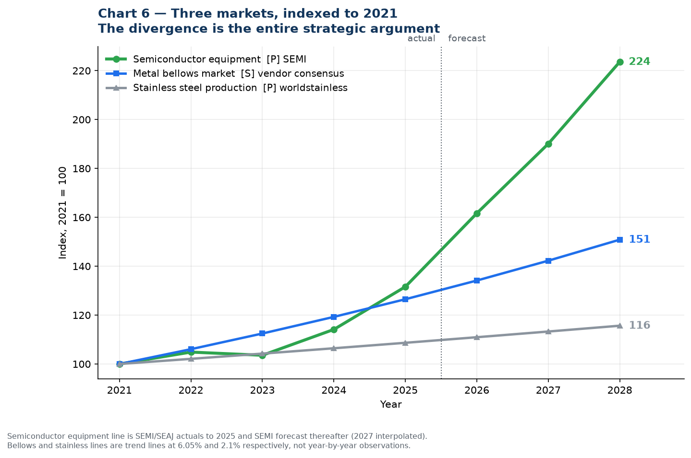
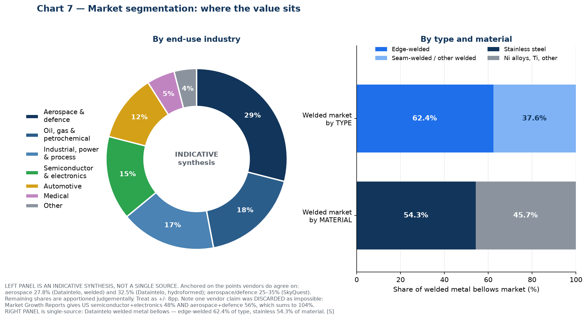
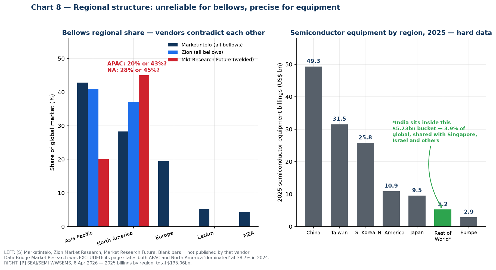
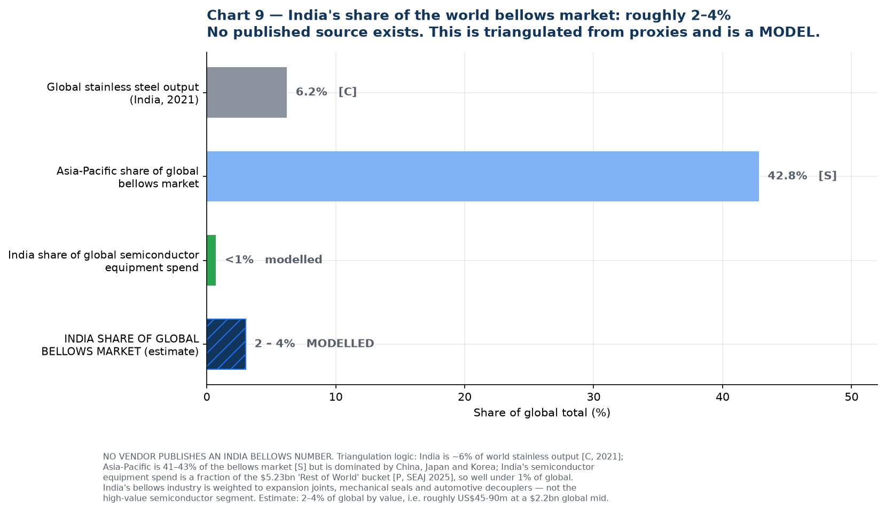
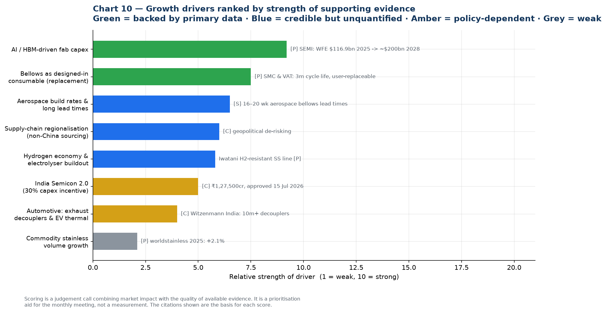

# 09 — Bellows Market Research: Size, History, Forecast, Segments, India

Complete market research pack with charts. Covers global market size, five-year history and forward projections, CAGR, India's share, growth drivers, and segmentation by industry, type and material.

---

## How to use this document

There is a problem with this market that you need to understand before quoting any figure from it, and it is not a small one.

**Ten commercial research vendors publish estimates for the global metal bellows market. Their base-year values span US$0.291 billion to US$5.638 billion — a factor of 19.** Several of the "welded bellows only" estimates are two to five times larger than other vendors' estimates for the *entire* metal bellows market including welded. Those cannot both be true.

This is common in small, fragmented, privately-held industrial component markets. There is no trade association publishing bellows shipment statistics the way SEMI does for semiconductor equipment or worldstainless does for steel, so vendors model it, and their scope definitions diverge.

**What this document does about it:**

1. Shows you the full spread rather than picking a convenient number (Charts 1 and 2).
2. Establishes what the literature *does* agree on — the growth rate — and uses that (Chart 3).
3. Anchors the analysis on **primary, measured data** wherever it exists: SEMI and SEAJ for semiconductor equipment, worldstainless for steel (Charts 4, 5, 6, 8).
4. Labels every modelled figure as modelled, on the chart itself, so an image lifted into a slide deck carries its own health warning.

**Practical rule for the monthly meeting:** quote SEMI and worldstainless figures freely — they are measured and attributable. Quote bellows market *growth rates* with a source name attached. Do not quote a bellows market *absolute value* to a partner, a board, or Jindal without stating the range and the reason for it. The credibility cost of being challenged on a number you cannot defend is much higher than the benefit of having a headline figure.

---

## 1. Global market size — the full spread

| Vendor | Scope claimed | Base year | Value (US$ bn) | Forecast | CAGR |
| --- | --- | --- | --- | --- | --- |
| [Expert Market Research](https://www.expertmarketresearch.com/reports/welded-metal-bellows-market) | Welded only | 2024 | **0.291** | 0.488 by 2034 | 5.9% |
| [Dataintelo](https://dataintelo.com/report/global-edge-welded-metal-bellow-market) | Edge-welded only | 2025 | **0.409** | 0.706 by 2034 | 6.2% |
| [Dataintelo](https://dataintelo.com/report/global-hydroformed-metal-bellows-market) | Hydroformed only | 2025 | **0.920** | 1.675 by 2034 | 6.8% |
| [Zion Market Research](https://www.zionmarketresearch.com/report/metal-bellows-market) | All metal bellows | 2024 | **1.105** | 1.749 by 2034 | 5.19% |
| [Dataintelo](https://dataintelo.com/report/global-welded-metal-bellow-market) | Welded only | 2025 | **1.800** | 3.100 by 2034 | 6.2% |
| [GII / IRES](https://www.giiresearch.com/report/ires1948584-metal-bellows-market-by-type-material.html) | All metal bellows | 2025 | **1.940** | 2.880 by 2032 | 5.79% |
| [Strategic Market Research](https://www.strategicmarketresearch.com/market-report/metal-bellows-market) | All metal bellows | 2024 | **2.120** | 3.170 by 2030 | 6.9% |
| [Market Data Forecast](https://www.marketdataforecast.com/market-reports/metal-bellows-market) | All metal bellows | 2024 | **2.390** | 3.950 by 2033 | 5.74%¹ |
| [SkyQuest via GII](https://www.giiresearch.com/report/sky1919136-welded-metal-bellows-market-size-share-growth.html) | Welded only | 2024 | **5.400** | 9.840 by 2033 | 6.9% |
| [Market Research Future](https://www.marketresearchfuture.com/reports/welded-metal-bellows-market-30687) | Welded only | 2024 | **5.638** | 10.420 by 2035 | 5.60%² |

¹ Derived from the published endpoints. ² MRFR publishes 5.60% for its separate all-bellows report. All rows are **[S]** grade — commercial vendor pages, indicative only.

### The one thing they agree on

Every single vendor lands between **5.19% and 6.90% CAGR** while disagreeing on the level by a factor of 19. That is the tell: **the growth rate is the only reliable output of this literature.** Use it, and derive your own level from customer conversations.

---

## 2. Five-year history and forward projection

No vendor publishes a defensible year-by-year historical series for this market. The table below is therefore **a model**, built by applying the consensus CAGR band to the four "all metal bellows" base-year anchors. It is presented so the monthly meeting can argue with the assumptions rather than a black box.

**Global metal bellows market — modelled, US$ bn**

| Year | Low (5.19%) | **Mid (6.05%)** | High (6.90%) | Status |
| --- | --- | --- | --- | --- |
| 2020 | 0.90 | **1.49** | 1.83 | history |
| 2021 | 0.95 | **1.58** | 1.95 | history |
| 2022 | 1.00 | **1.68** | 2.09 | history |
| 2023 | 1.05 | **1.78** | 2.23 | history |
| 2024 | 1.10 | **1.89** | 2.39 | base |
| **2025** | **1.16** | **2.00** | **2.55** | **base** |
| 2026 | 1.22 | **2.12** | 2.73 | forecast |
| 2027 | 1.28 | **2.25** | 2.91 | forecast |
| 2028 | 1.35 | **2.39** | 3.12 | forecast |
| 2029 | 1.42 | **2.53** | 3.33 | forecast |
| 2030 | 1.49 | **2.68** | 3.56 | forecast |
| 2033 | 1.74 | **3.20** | 4.35 | forecast |
| 2035 | 1.92 | **3.60** | 4.97 | forecast |

**Read the band, not the line.** The honest statement is: *the global metal bellows market is somewhere between US$1.2bn and US$2.6bn in 2025, and is growing at roughly 5–7% a year.* Anyone who states it more precisely than that is over-claiming.

**Sub-segments, on the same basis:**

| Segment | 2025 (US$ m) | 2034 (US$ m) | CAGR | Source |
| --- | --- | --- | --- | --- |
| Edge-welded bellows | 409 | 706 | 6.2% | Dataintelo **[S]** |
| Hydroformed bellows | 920 | 1,675 | 6.8% | Dataintelo **[S]** |
| Welded bellows (all) | 1,800 | 3,100 | 6.2% | Dataintelo **[S]** |
| — of which edge-welded | 62.4% share | — | 6.5% | Dataintelo **[S]** |

---

## 3. The real demand driver — primary data

This is what to build the business case on. Semiconductor equipment is measured monthly by the industry's own association from more than 95 reporting companies, and it is the single largest growth driver for edge-welded bellows.

**Global semiconductor manufacturing equipment billings — SEMI / SEAJ actuals, US$ bn [P]**

| Year | Billings | Change | Note |
| --- | --- | --- | --- |
| 2021 | 102.64 | — | |
| 2022 | 107.64 | +4.9% | record at the time |
| 2023 | 106.30 | −1.3% | memory inventory correction |
| 2024 | 117.14 | +10.2% | |
| **2025** | **135.06** | **+15.0%** | record; AI-driven |
| 2026f | 165.90 | +23.2% | SEMI Mid-Year Forecast, 14 Jul 2026 |
| 2027f | ~195 | — | *interpolated, not a SEMI figure* |
| 2028f | 229.50 | — | five consecutive years of growth |

Sources: [SEMI 2025 billings, 7 Apr 2026](https://www.semi.org/en/SEMI-Reports-Global-Semiconductor-Equipment-Billings-Reached-135-Billion-in-2025); [SEAJ WWSEMS, 8 Apr 2026](https://www.seaj.or.jp/english/statistics/4777967556197.pdf); [SEMI 2023 billings](https://www.semi.org/en/news-media-press-releases/semi-press-releases/global-semiconductor-equipment-billings-slip-to-%24106.3-billion-in-2023-semi-reports); [SEMI 2022 billings](https://www.prnewswire.com/in/news-releases/global-semiconductor-equipment-billings-reach-industry-record-107-6-billion-in-2022--semi-reports-301795207.html); [SEMI Mid-Year Forecast, 14 Jul 2026](https://www.semi.org/en/semi-press-release/global-semiconductor-equipment-sales-forecast-to-reach-a-record-229-billion-dollars-in-2028-semi-reports). All **[P]**.

Within the 2026 forecast: **wafer fab equipment US$143.9bn** (+23.1%, from a record US$116.9bn in 2025, heading to ~US$200bn by 2028), foundry and logic US$78.0bn (+18.9%), DRAM US$38.8bn (+39.0%), NAND US$13.9bn (+30.7%).

---

## 4. Growth in context — why this matters to a stainless trading division

This is the strongest single argument in the whole study, and both figures in it are primary data rather than vendor estimates:

- **Commodity stainless steel grew 2.1% in 2025** — global melt shop production 62.8 Mt → 64.2 Mt ([worldstainless](https://worldstainless.org/media/press-releases/stainless-steel-melt-shop-production-increases-by-2-1-in-2025/) **[P]**).
- **Semiconductor equipment grew 15.0% in 2025 and is forecast at +23.2% for 2026** ([SEMI](https://www.semi.org/en/SEMI-Reports-Global-Semiconductor-Equipment-Billings-Reached-135-Billion-in-2025) **[P]**).

An **11x growth differential** between the commodity the division trades today and the end market it feeds. Indexed to 2021, semiconductor equipment reaches 224 by 2028 while stainless production reaches 116.

---

## 5. Segmentation — where the value sits

### By end-use industry (indicative synthesis, ±8pp)

| Industry | Est. share | Bellows types used | Relevance to Iwatani |
| --- | --- | --- | --- |
| **Aerospace & defence** | ~29% | Edge-welded, hydroformed | Highest-value, longest qualification. Fluidyne already positioned |
| **Oil, gas & petrochemical** | ~18% | Expansion joints, **mechanical seal bellows** | **Rung 1 beachhead** — largest Indian installed base |
| **Industrial, power & process** | ~17% | Large-bore expansion joints, multi-ply | Where most Indian capacity sits today |
| **Semiconductor & electronics** | ~15% | **Edge-welded** — slit valves, wafer lift, feedthroughs, MFCs | Rung 3 — the strategic prize |
| **Automotive** | ~12% | Hydroformed decouplers, EGR | Largest unit volume; Witzenmann dominates in India |
| **Medical** | ~5% | Edge-welded miniature | Niche |
| **Other** (cryogenic, hydrogen, research, marine) | ~4% | All types | **Rung 2 — Iwatani's strongest credibility** |

Anchors this is built on: aerospace **27.8%** of the welded market (Dataintelo) and **32.5%** of the hydroformed market (Dataintelo); aerospace/defence **25–35%** (SkyQuest); industrial end-users **58.7%** of edge-welded (Dataintelo). Remaining shares apportioned judgementally.

> **One vendor claim was discarded as arithmetically impossible.** Market Growth Reports states that ~48% of US metal bellows demand is tied to semiconductor and electronics *and* ~56% to aerospace and defence. That sums to 104% of the same denominator. Do not use it.

### By type and material (single-source, Dataintelo welded market **[S]**)

- **Edge-welded: 62.4%** of the welded bellows market · Seam-welded and other: 37.6%
- **Stainless steel: 54.3%** of material value · Nickel alloys, titanium and others: 45.7%

Edge-welded is both the largest slice and the fastest-growing (6.5% vs 6.2% for welded overall), for the reason set out in `01-technical-primer.md`: it is the only construction that delivers high stroke, low spring rate and hermetic sealing in the space a semiconductor tool allows.

---

## 6. Regional structure

### Bellows by region — unreliable, and here is the proof

| Region | Marketintelo | Zion | Market Research Future |
| --- | --- | --- | --- |
| Asia Pacific | **42.8%** | **41%** | **20%** |
| North America | **28.3%** | **37%** | **45%** |
| Europe | 19.4% | not published | not published |
| Latin America | 5.2% | — | — |
| Middle East & Africa | 4.3% | — | — |

Asia Pacific is either a fifth or nearly half of the market depending on which vendor you read. **Data Bridge Market Research was excluded entirely**: its page states that Asia-Pacific "dominated the global metal bellows market of 38.7% in 2024" *and* that "North America dominated the Global Metal Bellows Market with the largest revenue share of 38.7% in 2024," and separately projects an implausible 24% APAC CAGR.

What survives: **Asia Pacific and North America are the top two regions**; APAC growth is driven by China, Japan, Korea and India; North America is anchored in aerospace, defence and semiconductor.

### Semiconductor equipment by region, 2025 — precise

| Region | US$ bn | Change y/y |
| --- | --- | --- |
| China | 49.31 | 0% (largest for 6th consecutive year) |
| Taiwan | 31.50 | **+90%** (passed Korea for the first time in three years) |
| South Korea | 25.75 | +26% |
| North America | 10.89 | −20% |
| Japan | 9.52 | +22% |
| **Rest of World** (incl. India) | **5.23** | +25% |
| Europe | 2.86 | −41% |
| **Total** | **135.06** | +15% |

Source: [SEAJ/SEMI WWSEMS, 8 April 2026](https://www.seaj.or.jp/english/statistics/4777967556197.pdf) **[P]**

**This table is the quantitative proof of the central strategic finding in this pack.** India is not a line item — it sits inside a US$5.23bn "Rest of World" bucket shared with Singapore, Israel and others, amounting to 3.9% of global equipment spend before India's own share is separated out. Meanwhile China, Taiwan and Korea together account for **US$106.6bn, or 79% of global equipment spending.**

**That is where semiconductor bellows are consumed.** Not in India.

---

## 7. India's share of the world market

**No research vendor publishes an India bellows market figure.** The estimate below is triangulated from proxies and is explicitly a model.

| Proxy | India's share | Grade | What it implies |
| --- | --- | --- | --- |
| Global stainless steel output | **6.2%** (2021) | **[C]** | Upper bound — India is a real stainless producer, 3rd largest, but Indonesia displaced it from 2nd in 2021 |
| Asia-Pacific share of global bellows | 41–43% for all APAC | **[S]** | India is a minority of APAC; China, Japan and Korea dominate |
| Global semiconductor equipment spend | **<1%** | modelled from **[P]** | Lower bound — India is inside the US$5.23bn RoW bucket |
| Global vehicle production | mid-single-digit | not verified here | Supports the automotive decoupler segment |
| **Estimated India share of global bellows market** | **2–4%** | **MODELLED** | ≈ **US$45–90m** at a US$2.2bn global midpoint |

**Why India indexes low despite being a large manufacturing economy:** its bellows industry is weighted toward expansion joints, mechanical seal bellows and automotive decouplers — the lower-value end — and has essentially no share of the high-value semiconductor edge-welded segment. India is roughly 6% of world stainless but well under 1% of semiconductor equipment, and the bellows market sits between those two poles, closer to the bottom.

**India's growth rate, however, is likely well above the global 6%**, because it is compounding from a small base against three simultaneous tailwinds: the Semicon 2.0 buildout, import substitution in mechanical seals and industrial bellows, and the hydrogen and cryogenic programmes. A 10–15% India CAGR against a 6% world CAGR is plausible — but on 2–4% of the base, which is precisely why `05-strategy-and-roadmap.md` recommends selling to the global supply chain first and treating India as an option.

---

## 8. Growth drivers

Ranked by strength of supporting evidence rather than by enthusiasm.

**Strongly evidenced (primary data)**

1. **AI and HBM-driven fab capex.** WFE from a record US$116.9bn in 2025 to US$143.9bn in 2026 and ~US$200bn by 2028; DRAM equipment +39.0% in 2026 on HBM demand. Bellows are consumed per-tool and per-motion-axis, and etch, CVD, implant and wafer-handling tools are the most bellows-dense — precisely the segments growing fastest. **[P] SEMI**
2. **Bellows are a designed-in consumable, not a one-time fitment.** SMC's XGT/XGTP slit valves are rated 3 million cycles with explicitly customer-replaceable bellows; VAT's 04.2 transfer valve is ≥3 million cycles to first service; Irie Koken quotes welded bellows life of 10,000 to 10 million cycles. This creates a recurring replacement stream that compounds behind the installed base. **[P]**

**Credible but not quantified here**

3. **Aerospace build rates and constrained supply.** Aerospace is the largest single end-use at roughly 29%, and one vendor reports aerospace-grade bellows lead times running 16–20 weeks — a capacity-constrained incumbent set is an entry window. *Verify directly.* **[S]**
4. **Supply-chain regionalisation.** Semiconductor supply chains are actively seeking non-China second sources. A qualified Indian mill fronted by a Japanese trading house is a differentiated proposition. **[C]**
5. **Hydrogen economy.** Electrolysers, compressors, valve and storage skids need bellows in SS316L, Inconel and Hastelloy with embrittlement resistance and stringent weld quality — and Iwatani's stainless line already carries hydrogen-resistant grades and hydrogen-refuelling-station materials. See `07-research-reconciliation.md` §5. **[P] on the Iwatani capability**

**Policy-dependent**

6. **India Semicon 2.0.** ₹1,27,500 crore approved 15 July 2026, with a dedicated pillar for semiconductor equipment, materials, chemicals and gases carrying a flat incentive **up to 30% of project cost**. Scheme guidelines were not yet published in detail at the time of writing. **[C]**

**Weak**

7. **Automotive.** Large unit volumes but low value per piece and a well-defended incumbent position — Witzenmann India alone has made 10 million-plus decouplers. **[C]**
8. **Commodity stainless volume.** +2.1% in 2025. Not a growth driver; it is the reason to move up the chain. **[P]**

### Restraints to put in the same discussion

- **Qualification cycles of 12–24 months** before first revenue in semiconductor, against incumbents holding decades of qualification history.
- **High manufacturing cost and capital intensity** for edge-welded — stamping dies, precision welding cells, ISO Class 5/6 cleanrooms, automated cleaning, helium leak and RGA testing.
- **Fragmentation and small absolute market size.** At a US$1.2–2.6bn global market across all industries and regions, this is a specialty niche, not a volume business. Size expectations should be set accordingly.
- **Competition from alternative flexible components** where the application does not strictly require an all-metal hermetic seal.

---

## 9. Summary of what to quote

| Claim | Quotable? | How to phrase it |
| --- | --- | --- |
| Semiconductor equipment US$135.1bn in 2025, +15%; US$165.9bn forecast 2026; US$229.5bn by 2028 | **Yes, freely** | Attribute to SEMI / SEAJ WWSEMS |
| WFE US$116.9bn 2025 → US$143.9bn 2026 → ~US$200bn 2028 | **Yes, freely** | Attribute to SEMI Mid-Year Forecast, 14 Jul 2026 |
| China + Taiwan + Korea = 79% of 2025 equipment spend | **Yes, freely** | Attribute to SEAJ, 8 Apr 2026 |
| Global stainless production 64.2 Mt in 2025, +2.1% | **Yes, freely** | Attribute to worldstainless |
| India is 2nd largest stainless consumer, 3rd largest producer | **Yes** | Note Indonesia displaced India from 2nd place in production in 2021 |
| Metal bellows market grows at 5–7% CAGR | **Yes, with caveat** | "Commercial estimates converge on 5–7% CAGR" |
| Edge-welded is ~62% of the welded market and the fastest-growing type | **Yes, with caveat** | Attribute to Dataintelo, single source |
| Global metal bellows market is US$X bn | **No — use a range** | "Estimates range from US$1.1bn to US$2.4bn for all metal bellows; vendor scope definitions differ materially" |
| India bellows market is US$X m | **No** | "No published estimate exists; our triangulation suggests 2–4% of global, roughly US$45–90m" |
| North American semiconductor bellows market US$1.2bn | **Never** | Exceeds half the global all-industry market per two other vendors. Internally inconsistent |
| US demand 48% semiconductor + 56% aerospace | **Never** | Sums to 104% |
| APAC bellows CAGR of 24% | **Never** | Implausible; from a page that also contradicts itself on regional shares |

---

## 10. Chart index and reproduction

All charts are generated from [`charts/make_charts.py`](charts/make_charts.py). Re-run with `python3 make_charts.py` to regenerate after updating any input. Every data point in the script traces to a source in this file or in [`06-source-register.md`](06-source-register.md).

| Chart | File | Purpose |
| --- | --- | --- |
| 1 | `01-vendor-disagreement.png` | Full spread of published estimates, coloured by claimed scope |
| 2 | `02-level-vs-cagr.png` | Vendors agree on growth, disagree on size |
| 3 | `03-consensus-band.png` | Modelled 2020–2035 band |
| 4 | `04-semi-equipment.png` | SEMI/SEAJ actuals 2021–2025 plus forecast to 2028 |
| 5 | `05-growth-ladder.png` | 11x growth differential, stainless vs semiconductor equipment |
| 6 | `06-indexed-growth.png` | Three markets indexed to 2021 |
| 7 | `07-segmentation.png` | End-use industry, type and material splits |
| 8 | `08-regional.png` | Bellows regional disagreement vs hard equipment data |
| 9 | `09-india-share.png` | India share triangulation |
| 10 | `10-growth-drivers.png` | Drivers ranked by evidence strength |

### New sources introduced in this file

| Source | URL | Grade |
| --- | --- | --- |
| SEMI — 2025 billings US$135.1bn (7 Apr 2026) | https://www.semi.org/en/SEMI-Reports-Global-Semiconductor-Equipment-Billings-Reached-135-Billion-in-2025 | **[P]** |
| SEAJ — WWSEMS 2025 by region (8 Apr 2026) | https://www.seaj.or.jp/english/statistics/4777967556197.pdf | **[P]** |
| SEMI — 2023 billings US$106.3bn | https://www.semi.org/en/news-media-press-releases/semi-press-releases/global-semiconductor-equipment-billings-slip-to-%24106.3-billion-in-2023-semi-reports | **[P]** |
| SEMI — 2022 billings US$107.6bn (and 2021 US$102.6bn) | https://www.prnewswire.com/in/news-releases/global-semiconductor-equipment-billings-reach-industry-record-107-6-billion-in-2022--semi-reports-301795207.html | **[P]** |
| SEMI — Historical WWSEMS 1991–2025 | https://www.semi.org/en/products-services/market-data/wwsems2020 | **[P]** |
| Zion Market Research — metal bellows | https://www.zionmarketresearch.com/report/metal-bellows-market | **[S]** |
| Marketintelo — metal bellows (regional shares) | https://marketintelo.com/report/metal-bellows-market | **[S]** |
| Market Research Future — welded metal bellows | https://www.marketresearchfuture.com/reports/welded-metal-bellows-market-30687 | **[S]** |
| SkyQuest via GII — welded metal bellows | https://www.giiresearch.com/report/sky1919136-welded-metal-bellows-market-size-share-growth.html | **[S]** |
| Market Data Forecast — metal bellows | https://www.marketdataforecast.com/market-reports/metal-bellows-market | **[S]** |
| Strategic Market Research — metal bellows | https://www.strategicmarketresearch.com/market-report/metal-bellows-market | **[S]** |
| Data Bridge Market Research — metal bellows | https://www.databridgemarketresearch.com/reports/global-metal-bellows-market | **[S] — EXCLUDED, self-contradictory** |
