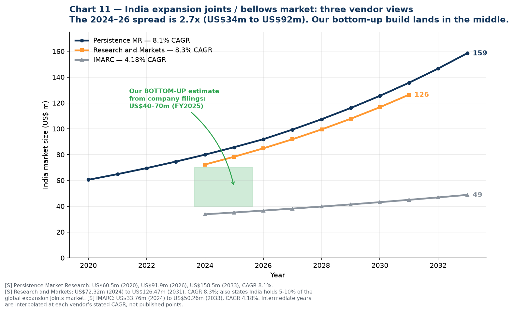
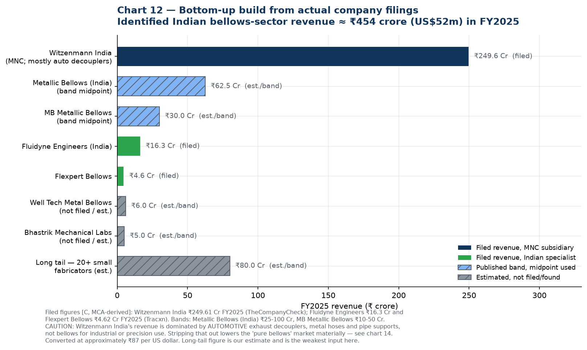
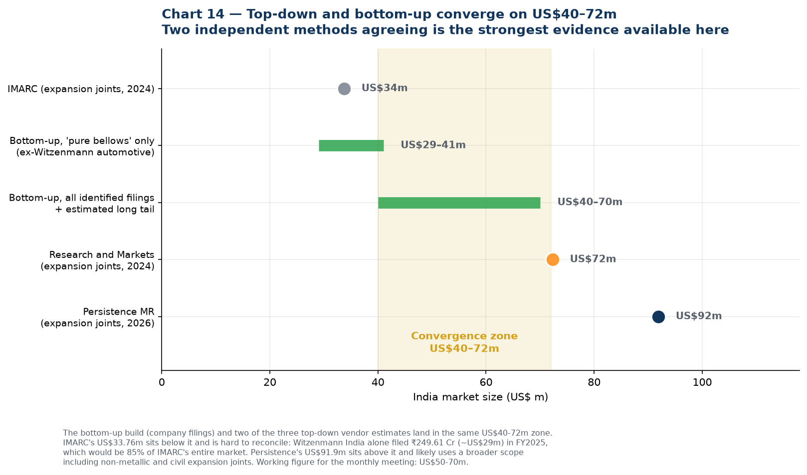
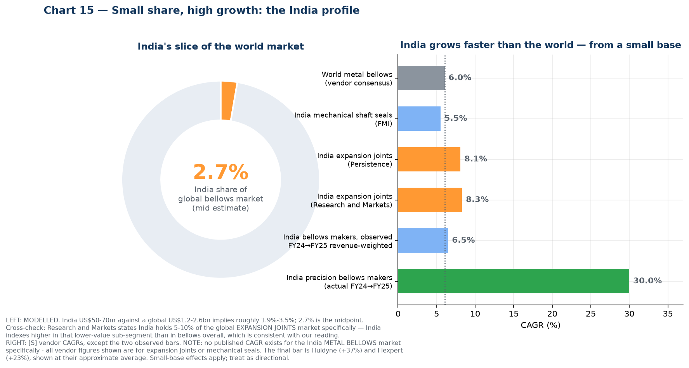
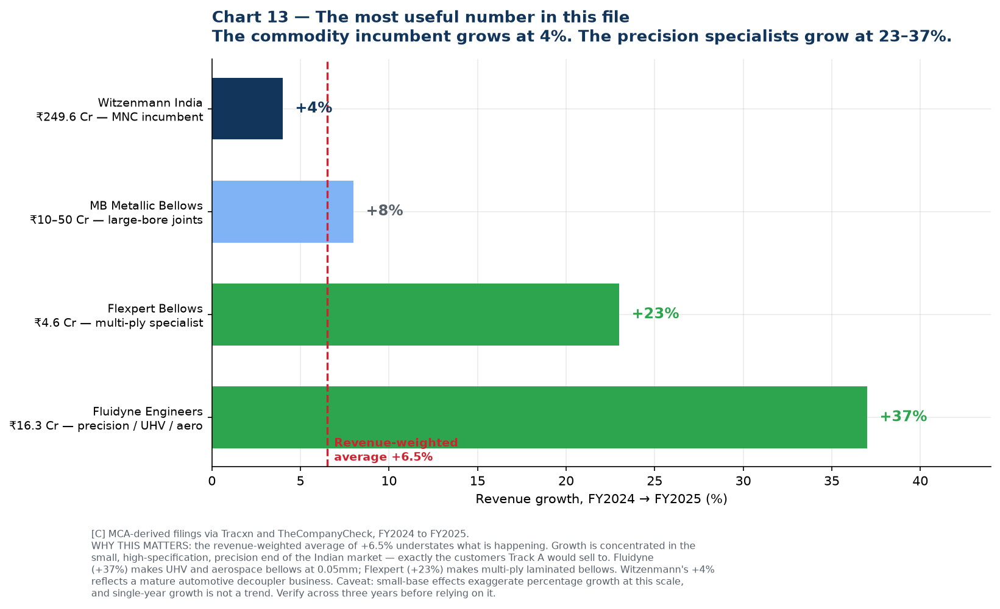
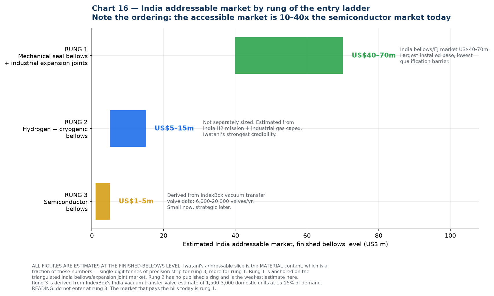

# 10 — India Market Data: Size, CAGR, and Share of World

The India-specific companion to [`09-market-research-bellows.md`](09-market-research-bellows.md).

**Headline answer up front:**

| Metric | Value | Basis |
| --- | --- | --- |
| **India bellows / expansion joint market, FY2025** | **US$50–70 m** (≈ ₹435–610 crore) | Top-down and bottom-up converge |
| **India share of global bellows market** | **~2.7%** (range 1.9–3.5%) | Modelled |
| **India share of global *expansion joints* market** | **1–5%** ⚠️ *corrected* | See [`11-share-reconciliation.md`](11-share-reconciliation.md) |
| **India CAGR — highest published estimates** | **8.1–8.3%** | Persistence, Research and Markets (expansion joints) |
| **India CAGR — conservative view** | **4.2–5.5%** | IMARC, Future Market Insights |
| **India CAGR — observed at precision specialists, FY24→FY25** | **+23% to +37%** | MCA-derived company filings |
| **World CAGR for comparison** | 5.2–6.9% | Vendor consensus |

> ⚠️ **Correction applied.** An earlier version of this file quoted Research and Markets' claim that "India holds 5–10% of the global expansion joints market." That figure does not survive cross-checking — it implies a global expansion joints market of only US$0.7–1.4bn, whereas four other vendors put it at US$3.7–7.2bn. The corrected range is **1–5%**. Full working in [`11-share-reconciliation.md`](11-share-reconciliation.md). The bellows share of ~2.7% and the absolute India market size of US$50–70m are unaffected, because neither was derived from that claim.

So: **India is roughly 2–3% of the world bellows market and growing meaningfully faster than it** — but the interesting number is not the market CAGR at all. It is that the small precision manufacturers are growing at 23–37% while the large commodity incumbent grows at 4%. That is where the opportunity actually is.

---

## 1. What exists, and what does not

Unlike the world market, India **does** have dedicated published research — but almost all of it is for **expansion joints**, not bellows specifically:

| Report | Scope | Available |
| --- | --- | --- |
| [6Wresearch — India Metal Bellows Market 2026–2032](https://www.6wresearch.com/industry-report/india-metal-bellows-market) | **Metal bellows, India** | The only India-specific bellows report found. **Market size and CAGR are entirely paywalled — no growth rate is disclosed on the public page.** Only import statistics are visible. See §10 for why we no longer rely on it |
| [Persistence Market Research — India Expansion Joints](https://www.persistencemarketresearch.com/market-research/india-expansion-joints-market.asp) | Expansion joints | Yes, with figures |
| [Research and Markets — India Expansion Joint Market](https://www.researchandmarkets.com/report/india-expansion-joint-market) | Expansion joints | Yes, with figures |
| [IMARC — India Expansion Joints](https://www.imarcgroup.com/india-expansion-joints-market) | Expansion joints | Yes, with figures |
| [IndexBox — Expansion Joints Market in India](https://www.indexbox.io/store/india-expansion-joints-market-analysis-forecast-size-trends-and-insights/) | Expansion joints, 2012–2035 | Qualitative only in the free preview |

**Important scope caveat.** Expansion joints and bellows overlap but are not the same thing. A metallic expansion joint contains a bellows as its flexing element, so expansion joint market data captures a large part of the industrial bellows market — but it excludes mechanical seal bellows, edge-welded precision bellows, instrument diaphragm bellows and automotive decouplers, while including non-metallic (rubber, fabric) and sometimes civil/structural joints. Treat these figures as a **proxy with known leakage in both directions**, not as a bellows market.

---

## 2. Top-down: the three vendor views



| Vendor | Base year | Value | Forecast | CAGR | Extra detail published |
| --- | --- | --- | --- | --- | --- |
| **Persistence Market Research** | 2026 | **US$91.9 m** (US$60.5 m in 2020) | US$158.5 m by 2033 | **8.1%** | West India 32% share; axial joints ~35%; metallic single expansion joints ~18%; incremental opportunity US$66.6 m |
| **Research and Markets** | 2024 | **US$72.32 m** | US$126.47 m by 2031 | **8.3%** | Claims "India currently holds 5%–10% share of the global expansion joints market" — ⚠️ **this claim fails cross-checking, see [`11`](11-share-reconciliation.md)** |
| **IMARC** | 2024 | **US$33.76 m** | US$50.26 m by 2033 | **4.18%** | Segments by product, material, application, end-use, and four Indian regions |

All **[S]** grade. The 2024–26 spread is **2.7x** — much narrower than the 19x spread in the world market data, but still too wide to quote a single number from.

### Growth history implied by Persistence

US$60.5 m (2020) → US$91.9 m (2026) is a **7.2% CAGR over the historical period**, accelerating to 8.1% forecast. That is the only published historical series for India found, and it is consistent in direction with the forward estimates.

---

## 3. Bottom-up: building it from actual company filings

This is the more defensible method, and to my knowledge it has not been done elsewhere. Indian companies file annual financials with the Ministry of Corporate Affairs, and those filings are surfaced by Tracxn, TheCompanyCheck, Tofler and InstaFinancials.



| Company | FY2025 revenue | Basis | Business mix |
| --- | --- | --- | --- |
| **Witzenmann (India) Pvt Ltd** | **₹249.61 Cr** (+4% YoY) | Filed, [TheCompanyCheck](https://www.thecompanycheck.com/company/witzenmann-india-private-limited/U28999TN1999PTC104811) | Mostly automotive exhaust decouplers, metal hoses, pipe supports; expansion joints secondary |
| **Metallic Bellows (India) Pvt Ltd** | ₹25–100 Cr band (mid ~₹62.5 Cr) | Published band | Aerospace, defence, nuclear bellows, valves, hoses; AS9100 |
| **MB Metallic Bellows Pvt Ltd** | ₹10–50 Cr band (+8% YoY) | [Tracxn](https://tracxn.com/d/legal-entities/india/mb-metallic-bellows-private-limited/__yrTiyN5IvsaH1ZVx4vlP26iQMhK6hZaqo6UqaHPmdjA); Tofler put FY2023 at ₹10–25 Cr; 74 employees | Large-bore expansion joints, 100 NB to 8 m dia |
| **Fluidyne Engineers (India) Pvt Ltd** | **₹16.3 Cr** (**+37% YoY**) | Filed, [Tracxn](https://tracxn.com/d/legal-entities/india/fluidyne-engineers-india-private-limited/__-740uqSELX06HuC8Ew6xbqHOdk9UCBc5Pw5lck-mGkQ) | Metal bellows, edge-welded, UHV, diaphragms 0.05 mm, aerospace machining |
| **Flexpert Bellows Pvt Ltd** | **₹4.62 Cr** (**+23% YoY**) | Filed, [Tracxn](https://tracxn.com/d/legal-entities/india/flexpert-bellows-private-limited/__NLWUgWQE5m1oXrIXX0yz_KtoHD1Di5z6CC9qRF_viSQ); IndiaMART self-declares ₹1.5–5 Cr, 26–50 staff — consistent | Multi-ply laminated expansion joints, exports to 40+ countries |
| Well Tech Metal Bellows (I) Pvt Ltd | not found; est. ~₹6 Cr | Estimate | Edge-welded, AM350, 0.05–0.2 mm, He leak tested |
| Bhastrik Mechanical Labs Pvt Ltd | not found; est. ~₹5 Cr | Estimate | Edge-welded, AM350, nesting ripple |
| Long tail: 20+ small fabricators | est. ~₹80 Cr | Estimate | Triveni, Scutes, India Flex, Vallabh, Flexoweld, regional shops |
| **Identified total** | **≈ ₹454 Cr ≈ US$52 m** | | |

**Two adjustments you must make to read this correctly:**

1. **Witzenmann India's ₹249.61 Cr is mostly not bellows.** Their India business is dominated by automotive exhaust decouplers — over 10 million units produced for the Indian market. If roughly 70% is automotive and hoses, their bellows and expansion joint revenue is closer to ₹75 Cr, which pulls the "pure bellows" market down to about **US$29–41 m**.
2. **Imports are not captured.** Company revenue measures Indian *production*, not Indian *consumption*. 6Wresearch reports India's metal bellows imports are dominated by China, Vietnam, Germany, South Korea and the USA, so consumption exceeds production.

### Reliability note on the data providers

Headline revenue figures from Tracxn and TheCompanyCheck appear consistent with each other and with companies' own self-declared IndiaMART turnover bands, so I treat them as reliable **[C]**. However, **Tracxn's detailed financial tables are unusable** — for MB Metallic Bellows they show revenue of "2183" with EBITDA of "2325", i.e. EBITDA exceeding revenue, and similar scrambling for Witzenmann. Those tables appear to be obfuscated or corrupted. Use only the headline revenue and growth figures.

---

## 4. Triangulation: the two methods converge



| Method | Result |
| --- | --- |
| IMARC, top-down | US$34 m |
| **Bottom-up, "pure bellows" only** | **US$29–41 m** |
| **Bottom-up, all identified filings + long tail** | **US$40–70 m** |
| Research and Markets, top-down | US$72 m |
| Persistence, top-down | US$92 m |
| **Convergence zone** | **US$40–72 m** |

Two independent methods landing in the same zone is the strongest evidence available for a market this opaque.

**Where the outliers come from.** IMARC's US$33.76 m is hard to reconcile: Witzenmann India alone filed ₹249.61 Cr (~US$29 m), which would be 85% of IMARC's entire market — implausible for one of several players. Persistence's US$91.9 m likely uses a broader scope including non-metallic and possibly civil expansion joints.

> **Working figure for the monthly meeting: India bellows and expansion joint market ≈ US$50–70 m (₹435–610 crore) in FY2025.** State it as a range and name the method.

---

## 5. India's share of the world



| Comparison | India | World | India share |
| --- | --- | --- | --- |
| Bellows market (value) | US$50–70 m | US$1.2–2.6 bn | **1.9% – 3.5%**, mid **~2.7%** |
| Expansion joints market | US$72 m | US$3.7 – 7.2 bn | **1.0% – 5.1%** ⚠️ *corrected — see [`11`](11-share-reconciliation.md)* |
| Stainless steel production | ~3.5 Mt | 64.2 Mt | ~6.2% (2021) |
| Semiconductor equipment spend | fraction of RoW | US$135.1 bn | **<1%** |

The pattern is consistent and diagnostic: **India's share rises as you move down the value chain and collapses as you move up it.** Roughly 6% of stainless production, ~3% of expansion joints, ~2.7% of bellows, under 1% of semiconductor equipment. The gradient is real, though shallower than the uncorrected figures suggested.

This is exactly why the recommended entry ladder in [`07-research-reconciliation.md`](07-research-reconciliation.md) starts at mechanical seals and industrial bellows rather than at semiconductors — you enter where India is strong, not where it is weakest.

### India CAGR versus world CAGR

| Series | CAGR | Source |
| --- | --- | --- |
| World metal bellows | 5.2 – 6.9% | Vendor consensus **[S]** |
| India mechanical shaft seals | **5.5%** | [Future Market Insights](https://www.futuremarketinsights.com/reports/mechanical-shaft-seal-market) **[S]** |
| India metal bellows | **no published figure exists** | 6Wresearch has a report but discloses no CAGR publicly — see §10 |
| India expansion joints | **8.1%** (2026–33) | Persistence **[S]** |
| India expansion joints | **8.3%** (2024–31) | Research and Markets **[S]** |
| India expansion joints | 4.18% (2025–33) | IMARC **[S]** |

**Reasonable conclusion: India grows at roughly 6–8% against a world rate of 6%** — a modest premium, not a dramatic one. The single most defensible figure is the **6.5% revenue-weighted growth actually observed in company filings** (section 6), because it is measured rather than modelled. Anyone promising India will grow at 20%+ is not supported by this data at the market level.

> **Note:** there is **no publicly available CAGR for the India metal bellows market specifically.** Every published India figure above is for expansion joints or mechanical seals. This is why the observed company-filing growth rate carries so much weight here.

---

## 6. The finding that actually matters



Forget the market CAGR for a moment and look at what the companies actually did between FY2024 and FY2025:

| Company | FY2025 revenue | Growth | What they make |
| --- | --- | --- | --- |
| Witzenmann India | ₹249.6 Cr | **+4%** | Automotive decouplers, hoses — mature, commodity |
| MB Metallic Bellows | ₹10–50 Cr | **+8%** | Large-bore expansion joints |
| Flexpert Bellows | ₹4.6 Cr | **+23%** | Multi-ply laminated bellows |
| Fluidyne Engineers | ₹16.3 Cr | **+37%** | Precision, UHV, aerospace, 0.05 mm diaphragms |
| **Revenue-weighted average** | | **+6.5%** | matches the vendor CAGR almost exactly |

The weighted average of +6.5% validates the vendor CAGR estimates — which is a useful cross-check in itself. But **the weighted average hides the story.** Growth is concentrated at the small, high-specification, precision end:

- **Fluidyne, +37%** — the company making UHV bellows, racetrack geometry and 0.05 mm diaphragms.
- **Flexpert, +23%** — multi-ply laminated bellows, exporting to 40+ countries.
- **Witzenmann, +4%** — the large automotive incumbent.

**These are precisely the Track A target customers**, and they are growing five to nine times faster than the market leader. A supplier who solves their material problem is attaching to the fastest-growing part of the Indian bellows industry.

**Caveats, stated plainly:** small-base effects exaggerate percentage growth at ₹5–16 crore scale, a single year is not a trend, and one large order can move a small company's revenue by 30%. **Pull three years of filings before relying on this.** But as a signal of where to aim, it is the most actionable number in this file.

---

## 7. Addressable market by rung of the entry ladder



| Rung | Segment | Est. India market (finished bellows) | Basis |
| --- | --- | --- | --- |
| **1** | Mechanical seal bellows + industrial expansion joints | **US$40–70 m** | Triangulated above |
| **2** | Hydrogen + cryogenic bellows | **US$5–15 m** | Estimated; no published sizing. **Weakest figure here** |
| **3** | Semiconductor bellows | **US$1–5 m** | Derived from IndexBox: 6,000–20,000 vacuum transfer valves/yr |

**The ordering is the point.** Rung 1 is roughly **10 to 40 times** rung 3 today. Entering at rung 3 means competing hardest for the smallest available prize.

**And note what Iwatani's actual addressable slice is.** These are finished-bellows numbers. Iwatani sells *material*, which is a fraction of finished value — single-digit tonnes of precision strip for rung 3, meaningfully more for rung 1. Sizing the material opportunity in India honestly:

```
India bellows market (finished)            US$50–70 m
Material content, say 15–25% of value      US$8–18 m
Precision/thin-gauge share of that         maybe 30–50%
= India precision strip opportunity        ≈ US$3–9 m per year
```

That is a real business for a trading division, but it is **not** a business that justifies building a plant on its own. Which is the same conclusion the rest of this pack reaches by other routes: **the India volume supports a trading and distribution position now; the manufacturing case has to be made on exports or on Semicon 2.0 incentives, not on Indian domestic demand.**

---

## 8. One more India-specific data point worth having

6Wresearch discloses India's **metal bellows import** dynamics on its public page without paywalling them:

- Import market dominated by **China, Vietnam, Germany, South Korea and the USA**
- **High Herfindahl-Hirschman Index** — a concentrated supplier base
- **Import CAGR of 20.72% from 2020 to 2024**
- **But a −50.82% collapse from 2023 to 2024**

Source: [6Wresearch India Metal Bellows Market](https://www.6wresearch.com/industry-report/india-metal-bellows-market) **[S]**

Two readings, and they point in opposite directions. The 20.72% import CAGR says Indian bellows demand has been growing fast and being met from abroad — supportive of the localisation thesis. The −50.82% single-year collapse says either a large one-off project ended, or domestic substitution happened abruptly, or the underlying data is thin enough that one shipment moves the series. **At the volumes involved, the third explanation is quite likely.** This is worth resolving with actual customs data, which is the method set out in [`08-supply-chain-sourcing.md`](08-supply-chain-sourcing.md) §4.

**These import figures are the only quantitative content 6Wresearch publishes on this market.** Everything else — market size, forecast, CAGR, segment splits — sits behind the paywall. See §10.

---

## 10. Correction and assessment of the 6Wresearch source

⚠️ **An earlier version of this file cited "~6.9% CAGR through 2036" for the India metal bellows market and attributed it to 6Wresearch. That attribution was wrong and the figure is withdrawn.**

The 6Wresearch public page for the India Metal Bellows Market contains **no market CAGR of any kind.** The only compound growth rate on the page is the **20.72% import CAGR (2020–2024)**, which describes import volumes, not the market. There was also a tell that should have been caught earlier: the withdrawn figure carried a **2036** horizon, while 6Wresearch's report is titled and scoped **2026–2032**. Those cannot be the same source.

### What the 6Wresearch page actually discloses

| Item | Detail |
| --- | --- |
| Report title | India Metal Bellows Market (2026–2032) |
| Product code | ETC7547635 |
| Published / updated | September 2024 / April 2026 |
| Length | 75 pages, 35 figures, 20 tables |
| Author | Dhaval Chaurasia |
| Pricing | **US$1,995** single user · US$2,400 department · US$3,120 site · US$3,795 global |
| Segmentation by type | Formed, Mechanically Formed, Hydroformed, Electroformed, **Edge Welded**, Others |
| Segmentation by end-use | **Semiconductor, Actuators, Beamlines, Connectors, Leak Detectors, Sensors, Wafer Handlers**, Others |
| Disclosed data | Top-5 importing countries, HHI concentration, import CAGR 20.72% (2020–24), −50.82% (2023–24) |
| Listed drivers | Automotive/aerospace/electronics demand; precision engineering adoption; favourable government policy for domestic manufacturing |
| Listed restraints | Fluctuating raw material prices; competition from global and local players compressing margins; **lack of skilled labour and expertise for specialised bellows manufacturing** |
| **Paywalled** | Market size 2025, forecast 2032, revenues and volumes 2022–2032, all type and end-use splits, company shares, price trends |

### Why I would not spend the US$1,995

Three signals suggest this is a programmatically generated report rather than primary research:

1. **The end-use taxonomy is not an India taxonomy.** Segmenting the *Indian* bellows market by "Semiconductor, Actuators, Beamlines, Connectors, Leak Detectors, Sensors, Wafer Handlers" is the standard *global semiconductor* bellows application list — it matches the published application lists of Technetics and KSM almost word for word. It bears no relation to what India actually consumes, which is expansion joints, mechanical seal bellows and automotive decouplers. India's semiconductor bellows market is on the order of US$1–5m (see §7); building the whole end-use segmentation around it indicates a template applied to a country name.
2. **The same publisher offers country-level bellows reports for Cuba, Cyprus, Croatia and Costa Rica**, and its "latest reports" list includes country-by-country studies of a rare metabolic disorder market for Fiji, Gabon and Eritrea. That publication pattern is only achievable by automation.
3. **The one thing they do disclose is trade data**, which is machine-ingestible from customs statistics — consistent with an automated pipeline.

**Recommendation:** treat the import statistics as usable-with-caution **[S]**, ignore the market sizing, and do not buy the report. **US$1,995 spent on actual Indian customs shipment records would produce far more decision-relevant information** — specifically, who is importing what grade, at what price, from whom. That method is set out in [`08-supply-chain-sourcing.md`](08-supply-chain-sourcing.md) §4.

### Net effect on this pack

| Conclusion | Effect |
| --- | --- |
| India market size US$50–70m | **Unchanged** — derived from company filings and three expansion-joint vendors, never from 6Wresearch |
| India share of global ~2.7% | **Unchanged** |
| India CAGR | **Range tightens and honesty improves.** Published India estimates are now 4.18% (IMARC), 5.5% (FMI, shaft seals), 8.1% (Persistence) and 8.3% (Research and Markets) — all for adjacent markets. **No published India *bellows* CAGR exists.** The 6.5% observed in company filings remains the best figure |
| Import CAGR 20.72% / −50.82% collapse | **Unchanged** — still the only 6Wresearch content used, still flagged as volatile |
| Entry ladder and strategy | **Unchanged** |

## 9. What to quote on India

| Claim | Quotable? | Phrasing |
| --- | --- | --- |
| India bellows/expansion joint market ≈ US$50–70 m | **Yes, with method** | "Triangulated from company filings and three vendor estimates" |
| India holds 5–10% of the global expansion joints market | **No — withdrawn** | Fails cross-checking; implies a global market 3–5x below four other vendors. Use "roughly 1–5%" and cite the denominator problem |
| India expansion joints growing at 8.1–8.3% | **Yes** | Attribute to Persistence / Research and Markets; note IMARC says 4.18% |
| India bellows CAGR ~6.9% | **No — withdrawn** | This figure was mis-attributed to 6Wresearch, whose public page contains no market CAGR. See §10 |
| India is ~2.7% of the global bellows market | **Yes, as an estimate** | "Our estimate; no published figure exists" |
| Witzenmann India ₹249.61 Cr FY2025, +4% | **Yes** | MCA-filed, via TheCompanyCheck |
| Fluidyne +37%, Flexpert +23% FY24→FY25 | **Yes, with caveat** | Note small-base effects and single-year limitation |
| India mechanical seals market US$5.4 bn | **Never** | Mobility Foresights figure exceeds the entire *global* mechanical seals market (US$3.8–7.4 bn per two other vendors). Not credible |
| Any single precise India bellows number | **No** | Always give the range and the method |

### Related

[`11-share-reconciliation.md`](11-share-reconciliation.md) explains why the expansion joints share and the bellows share differ, works through the denominator problem, and documents the correction above.

### New sources introduced in this file

| Source | URL | Grade |
| --- | --- | --- |
| 6Wresearch — India Metal Bellows Market | https://www.6wresearch.com/industry-report/india-metal-bellows-market | **[S]** |
| Persistence MR — India Expansion Joints | https://www.persistencemarketresearch.com/market-research/india-expansion-joints-market.asp | **[S]** |
| Research and Markets — India Expansion Joint Market | https://www.researchandmarkets.com/report/india-expansion-joint-market | **[S]** |
| IMARC — India Expansion Joints | https://www.imarcgroup.com/india-expansion-joints-market | **[S]** |
| IndexBox — Expansion Joints Market in India | https://www.indexbox.io/store/india-expansion-joints-market-analysis-forecast-size-trends-and-insights/ | **[S]** |
| Future Market Insights — Mechanical Shaft Seal Market (India 5.5%) | https://www.futuremarketinsights.com/reports/mechanical-shaft-seal-market | **[S]** |
| Persistence MR — global Mechanical Seals Market | https://www.persistencemarketresearch.com/market-research/mechanical-seals-market.asp | **[S]** |
| Coherent Market Insights — APAC Pump Mechanical Seals | https://www.coherentmarketinsights.com/market-insight/apac-pump-mechanical-seals-market-4964 | **[S]** |
| Mobility Foresights — India Mechanical Seals | https://mobilityforesights.com/product/india-mechanical-seals-market | **[S] — EXCLUDED, implausible** |
| TheCompanyCheck — Witzenmann India financials | https://www.thecompanycheck.com/company/witzenmann-india-private-limited/U28999TN1999PTC104811 | **[C]** |
| Tofler — Witzenmann India | https://www.tofler.in/witzenmann-india-private-limited/company/U28999TN1999PTC104811 | **[C]** |
| Tracxn — Fluidyne Engineers (India) | https://tracxn.com/d/legal-entities/india/fluidyne-engineers-india-private-limited/__-740uqSELX06HuC8Ew6xbqHOdk9UCBc5Pw5lck-mGkQ | **[C]** headline only |
| Tracxn — Flexpert Bellows | https://tracxn.com/d/legal-entities/india/flexpert-bellows-private-limited/__NLWUgWQE5m1oXrIXX0yz_KtoHD1Di5z6CC9qRF_viSQ | **[C]** headline only |
| Tracxn — MB Metallic Bellows | https://tracxn.com/d/legal-entities/india/mb-metallic-bellows-private-limited/__yrTiyN5IvsaH1ZVx4vlP26iQMhK6hZaqo6UqaHPmdjA | **[C]** headline only |
| Tofler — MB Metallic Bellows | https://www.tofler.in/mb-metallic-bellows-private-limited/company/U28112TN2009PTC074006 | **[C]** |
| InstaFinancials — MB Metallic Bellows | https://www.instafinancials.com/company/mb-metallic-bellows-private-limited-U28112TN2009PTC074006 | **[C]** |
| IndiaMART — Flexpert Bellows profile (turnover band) | https://www.indiamart.com/flexpert-bellows/aboutus.html | **[U]** |
| Flexpert Bellows company profile PDF (est. 1992, 40+ countries) | https://cdn6.f-cdn.com/files/download/208225906/Company%20Profile%207.5%20MB.pdf | **[P]** |
| Fluidyne — Industry Outlook interview (BARC, Navy, DRDO, titanium bellows) | https://www.theindustryoutlook.com/manufacturing/vendor/fluidyne-engineers-offering-qualitydriven-custom-built-precision-metal-bellows-cid-2238.html | **[C]** |

### Chart index

| Chart | File | Purpose |
| --- | --- | --- |
| 11 | `11-india-vendor-views.png` | Three vendor series with bottom-up overlay |
| 12 | `12-india-bottom-up.png` | Company-by-company filed revenue build |
| 13 | `13-india-company-growth.png` | Incumbent 4% vs specialists 23–37% |
| 14 | `14-india-triangulation.png` | Top-down and bottom-up convergence |
| 15 | `15-india-vs-world.png` | Share of world and CAGR comparison |
| 16 | `16-india-addressable.png` | Addressable market by entry-ladder rung |

Generated by [`charts/make_india_charts.py`](charts/make_india_charts.py).
