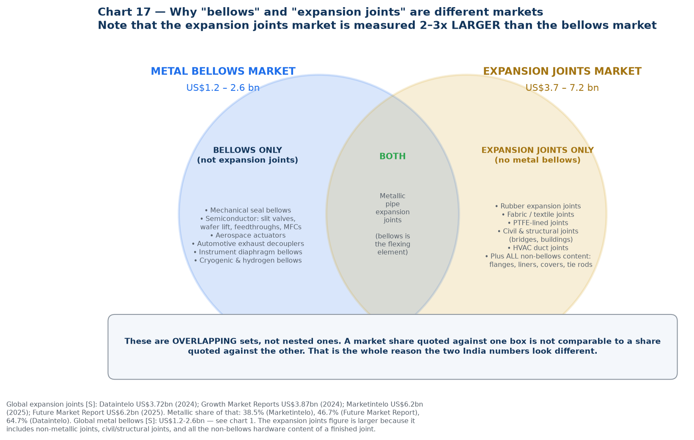
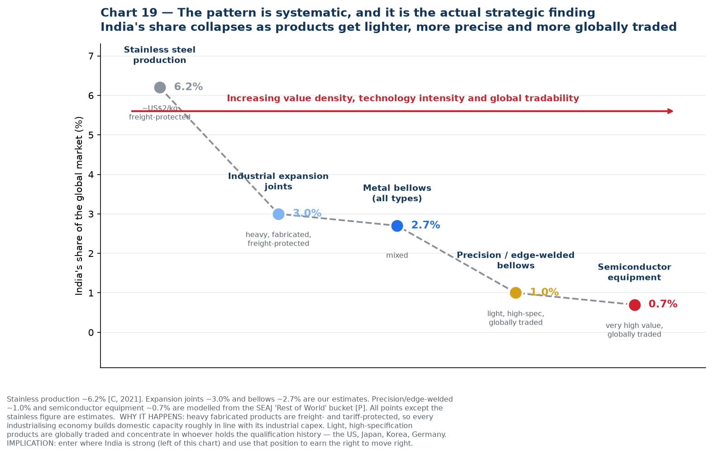
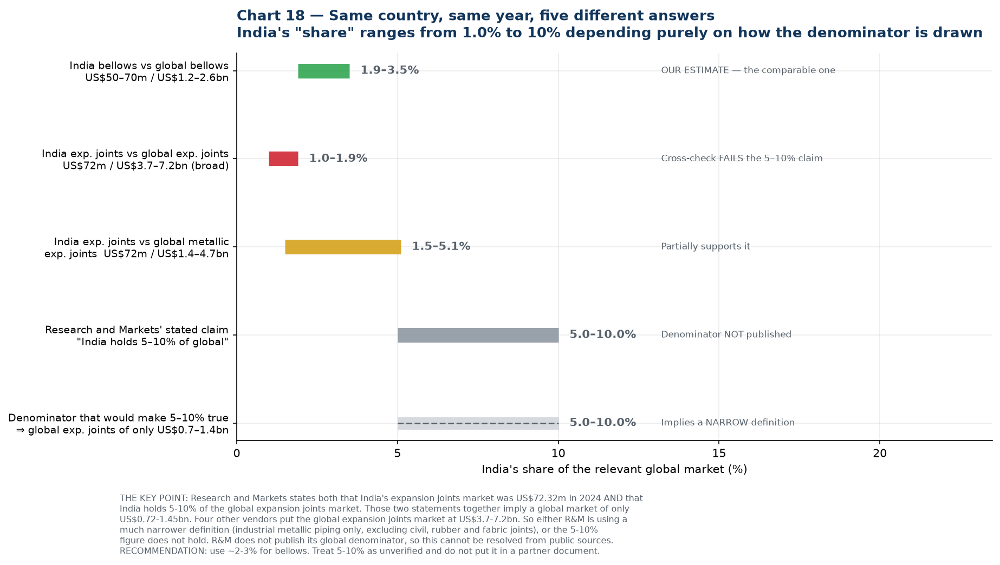

# 11 — Why India's "Expansion Joints" Share and "Bellows" Share Differ

**The question:** [`10-india-market-data.md`](10-india-market-data.md) reports India at **5–10%** of the global *expansion joints* market but only **~2.7%** of the global *bellows* market. Why the difference?

**Short answer:** three separate things are going on, and one of them is a correction to what I told you earlier.

1. **They are different markets.** Expansion joints and bellows overlap but neither contains the other, so a share against one is not comparable to a share against the other.
2. **There is a genuine structural effect.** India really does index higher in heavy, fabricated, freight-protected products than in light, precision, globally-traded ones. That part of the story is real and strategically important.
3. **But the specific 5–10% figure does not survive cross-checking.** I should not have quoted it without testing the denominator. Working it through, India's expansion joints share is more likely **1–5%**, and the honest position is that the 5–10% claim is unverifiable. Details in section 3.

---

## 1. They are different markets, and neither is a subset of the other

An **expansion joint** is a finished piping component. A **bellows** is the flexible convoluted element inside it. So they overlap in metallic pipe expansion joints — but each market contains large areas the other does not:

| Bellows but **not** expansion joints | Both | Expansion joints but **not** metal bellows |
| --- | --- | --- |
| Mechanical seal bellows | **Metallic pipe expansion joints** — the bellows is the flexing element | Rubber expansion joints |
| Semiconductor: slit valves, wafer lift, feedthroughs, mass flow controllers | | Fabric / textile joints (flue gas ducting) |
| Aerospace actuators, fuel systems | | PTFE-lined joints |
| Automotive exhaust decouplers | | Civil and structural joints (bridges, buildings) |
| Instrument diaphragm bellows | | HVAC duct joints |
| Cryogenic and hydrogen bellows | | **All the non-bellows content of a finished joint:** flanges, liners, covers, tie rods, engineering, hardware |

### The size relationship confirms this

| Market | Global size | Sources |
| --- | --- | --- |
| **Metal bellows** | **US$1.2 – 2.6 bn** | Four "all metal bellows" vendors, see [`09`](09-market-research-bellows.md) chart 1 |
| **Expansion joints** | **US$3.7 – 7.2 bn** | Dataintelo US$3.72bn (2024); Growth Market Reports US$3.87bn (2024); Marketintelo US$6.2bn (2025); Future Market Report US$6.2bn (2025) |
| — of which metallic | 38.5% – 64.7% | Marketintelo 38.5%; Future Market Report 46.7%; Dataintelo 64.7% |

The expansion joints market is measured **2–3x larger** than the bellows market. That only makes sense once you see that it includes rubber, fabric, PTFE and civil joints — plus all the hardware value around the bellows — while excluding the many bellows applications that are not piping joints at all.

**Practical consequence:** you cannot compare a share figure from one market against a share figure from the other. They are answers to different questions.

---

## 2. The real structural effect

Setting the measurement problem aside, there *is* a genuine reason India would index higher in expansion joints than in precision bellows, and it is worth understanding because it drives the strategy.

| Market | India's estimated share | Product character |
| --- | --- | --- |
| Stainless steel production | ~6.2% (2021) | ~US$2/kg, freight-protected |
| Industrial expansion joints | ~3% | Heavy, fabricated, freight-protected |
| Metal bellows, all types | ~2.7% | Mixed |
| Precision / edge-welded bellows | ~1% | Light, high-specification, globally traded |
| Semiconductor equipment | ~0.7% | Very high value, globally traded |

**Why the pattern exists.** A 3-metre-diameter expansion joint for a cement plant cannot economically be shipped across the world — freight, duty and lead time all favour local supply. So every industrialising economy builds domestic expansion joint capacity roughly in proportion to its own industrial capex, and India has a lot of refineries, power plants, steel, cement and fertiliser. Freight and tariffs act as a protective moat.

A 30-gram edge-welded bellows for a slit valve has none of that protection. It is light, air-freightable, and its cost is dominated by qualification history rather than material or transport. So production concentrates wherever the qualification history sits — the US, Japan, Korea, Germany — and India's share collapses.

**This is the actual strategic finding**, and it is why the entry ladder in [`07-research-reconciliation.md`](07-research-reconciliation.md) starts at mechanical seals and industrial bellows: you enter on the left of that chart, where India is genuinely competitive, and use the position and reference base to earn the right to move right.

---

## 3. Correction: the 5–10% figure does not hold up

Research and Markets states two things on the same page:

- India's expansion joints market was **US$72.32 m in 2024**
- **"India currently holds 5%–10% share of the global expansion joints market"**

Put those together and they imply a global expansion joints market of only **US$0.72 – 1.45 bn**. But four other vendors put it at **US$3.7 – 7.2 bn**. Against that denominator, India at US$72m is **1.0% – 1.9%** — well below my bellows estimate of 2.7%, not above it.

| Basis | India's share | Verdict |
| --- | --- | --- |
| India bellows US$50–70m ÷ global bellows US$1.2–2.6bn | **1.9 – 3.5%** | Our estimate; internally consistent |
| India EJ US$72m ÷ global EJ US$3.7–7.2bn (broad) | **1.0 – 1.9%** | Cross-check **fails** the 5–10% claim |
| India EJ US$72m ÷ global **metallic** EJ US$1.4–4.7bn | **1.5 – 5.1%** | Partially supports it at the top of the range |
| R&M's stated claim | 5 – 10% | Denominator not published |
| Denominator required for 5–10% to be true | ⇒ global EJ of only US$0.7–1.4bn | Implies a much narrower definition |

**Two possible explanations, and I cannot distinguish them from public sources:**

- **R&M uses a narrow definition.** Their India report segments only industrial applications — petrochemical, power, oil and gas, metals, cement, chemicals, industrial gases, railways, electrical — with no civil or structural category. If their global denominator is similarly restricted to industrial metallic piping joints, US$0.7–1.4bn is plausible and the 5–10% could be internally correct within their own frame.
- **The 5–10% figure is simply wrong,** or refers to something other than value share (units, or a specific sub-segment).

R&M does not publish the global denominator behind the claim, so this cannot be resolved without buying the report.

### What to use instead

| Figure | Status |
| --- | --- |
| **India ≈ 2–3% of the global metal bellows market** | **Use this.** Triangulated, internally consistent, and the relevant market for Iwatani |
| **India ≈ 1–5% of the global expansion joints market** | Use as a range if asked; note the denominator problem |
| "India holds 5–10% of the global expansion joints market" | **Do not put this in a partner or board document.** Unverified, and it fails cross-checking against four other vendors |

I have corrected [`10-india-market-data.md`](10-india-market-data.md) accordingly.

---

## 4. What actually changes as a result

Very little, and that is worth saying plainly.

| Conclusion | Effect of this correction |
| --- | --- |
| India is a small share of the global bellows market (~2–3%) | **Unchanged.** This was always the load-bearing figure |
| India's absolute market is US$50–70m | **Unchanged.** Derived from company filings, not from any share claim |
| Iwatani's material slice in India is ~US$3–9m/yr | **Unchanged** |
| India punches above its weight in heavy industrial products and below it in precision | **Unchanged in direction, weaker in magnitude.** The gradient is real; it is shallower than 5–10% vs 2.7% implied |
| Entry ladder: mechanical seals → hydrogen/cryogenic → semiconductor | **Unchanged, and slightly reinforced.** If India's expansion joint share is 1–5% rather than 5–10%, there is *more* headroom in rung 1, not less |
| Do not anchor the business case on Indian domestic demand | **Unchanged** |

The one thing that does change is a presentational risk that has now been removed. Had "India holds 5–10% of the global expansion joints market" gone into a document for Jindal or an Iwatani investment committee, a numerate reader could have dismantled it in one line by asking what the global market was. That is exactly the failure mode this pack's grading system exists to prevent, and it caught it one step late rather than not at all.

---

## 5. The general lesson for this project

Every market share figure is a fraction, and **the denominator is where the deception lives.** Before quoting any share in this programme, ask three questions:

1. **What exactly is in the denominator?** Metallic only, or including rubber and fabric? Industrial only, or including civil and structural? Finished component value, or just the flexing element?
2. **Does the vendor publish the denominator, or only the share?** If only the share, treat it as unverified.
3. **Does it survive against an independent estimate of the same denominator?** If four other vendors put the global market 3–5x higher, the share claim is the thing that is wrong.

The bellows and expansion joint literature fails all three tests routinely. This is the third arithmetic inconsistency this project has caught — after the North American semiconductor bellows figure that exceeded half the global market, and the end-use shares that summed to 104%.

### New sources introduced in this file

| Source | URL | Grade |
| --- | --- | --- |
| Dataintelo — Expansion Joints Market (US$3.72bn 2024) | https://dataintelo.com/report/expansion-joints-market | **[S]** |
| Dataintelo — Expansion Joint Market 2034 (metallic 64.7% share) | https://dataintelo.com/report/global-expansion-joint-market | **[S]** |
| Growth Market Reports — Expansion Joint Market (US$3.87bn 2024) | https://growthmarketreports.com/report/expansion-joint-market | **[S]** |
| Marketintelo — Expansion Joint Market (US$6.2bn 2025, metallic 38.5%) | https://marketintelo.com/report/expansion-joint-market | **[S]** |
| Future Market Report — Expansion Joint Market (US$6.2bn 2025, metal 46.7%) | https://www.futuremarketreport.com/industry-report/expansion-joint-market | **[S]** |

### Chart index

| Chart | File | Purpose |
| --- | --- | --- |
| 17 | `17-market-overlap.png` | Bellows and expansion joints as overlapping, not nested, markets |
| 18 | `18-india-share-denominators.png` | India's share under five different denominators |
| 19 | `19-share-vs-value-density.png` | The systematic decline in India's share as value density rises |

Generated by [`charts/make_reconciliation_charts.py`](charts/make_reconciliation_charts.py).
