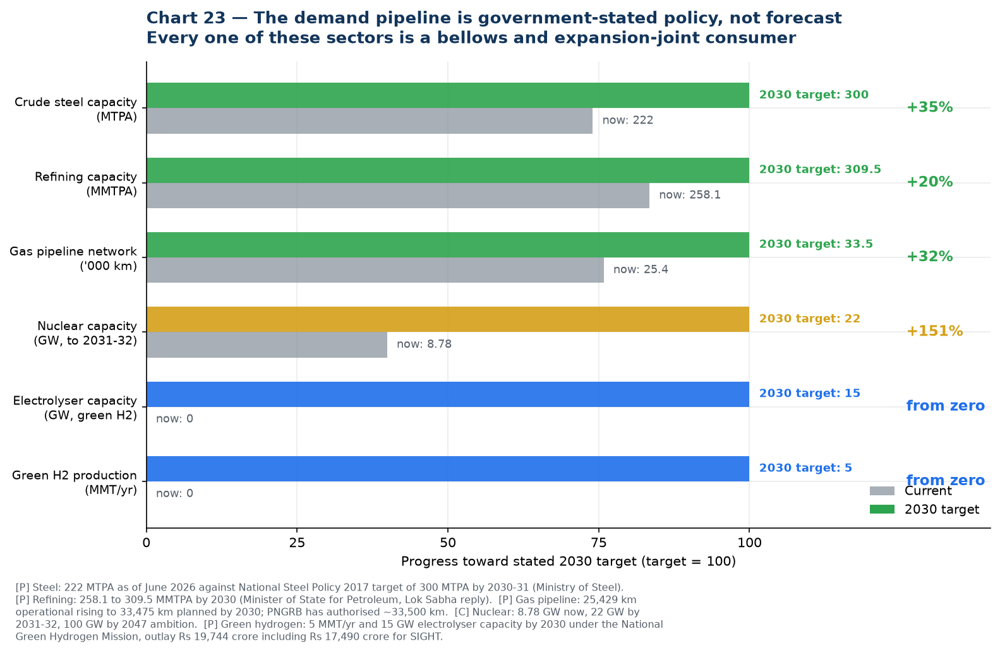
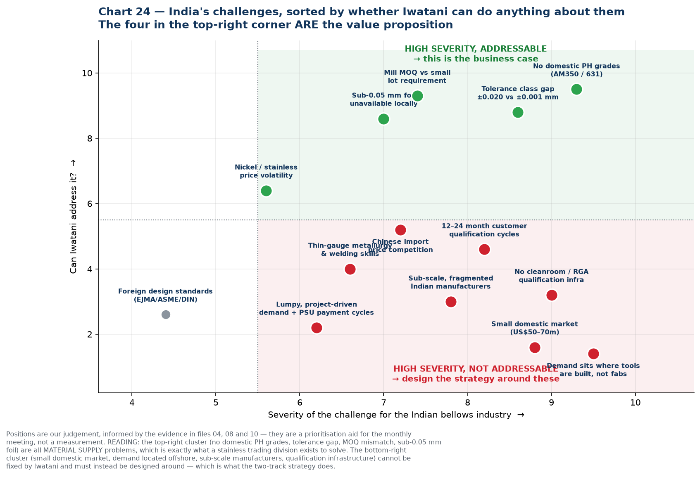

# 12 — India Growth Drivers and Challenges

Companion to [`10-india-market-data.md`](10-india-market-data.md). Drivers ranked by the strength of the evidence behind them, then challenges sorted by whether Iwatani can actually do anything about them.

---

## First, a note on the 4.18% figure

The 4.18% CAGR is **IMARC's** estimate, and two things about it are worth knowing before it becomes the planning assumption:

1. **It is for expansion joints, not metal bellows.** IMARC does not publish an India bellows number.
2. **It is the lowest of the available estimates by a wide margin.**

| Source | Scope | CAGR |
| --- | --- | --- |
| **IMARC** | India expansion joints, 2025–33 | **4.18%** ← the low end |
| Future Market Insights | India mechanical shaft seals | 5.5% |
| 6Wresearch | India metal bellows, to 2036 | ~6.9% |
| Persistence Market Research | India expansion joints, 2026–33 | **8.1%** |
| Research and Markets | India expansion joints, 2024–31 | **8.3%** |
| Observed, FY24→FY25 | Indian bellows makers, revenue-weighted | **6.5%** |
| Observed, FY24→FY25 | Indian *precision* bellows makers | **+23% to +37%** |

The revenue-weighted **6.5%** actually observed in company filings is the most defensible single figure, and it sits half again above IMARC. If the business case is built on 4.18%, it is being built on the most pessimistic input available. **Recommend planning on 6–8% for the market and noting that the precision segment is growing far faster.**

---

## Part 1 — Growth drivers

### Tier 1: Backed by stated government policy with hard numbers

These are not forecasts. They are published targets with capital already committed, and every one of these sectors consumes bellows and expansion joints.

**1. Refinery and petrochemical expansion — the single biggest driver**

India's refining capacity is set to rise from **258.1 MMTPA to 309.5 MMTPA by 2030**, a 20% increase, and the Petrochemical Intensity Index of public-sector refineries is expected to rise from 4.1 to about 9.3 as refining and petrochemicals integrate more deeply ([Minister of State for Petroleum, Lok Sabha reply](https://swarajyamag.com/infrastructure/indias-refining-capacity-expected-to-expand-to-3095-million-metric-tonne-per-annum-by-2030-petroleum-mos-suresh-gopi) **[C]**; [Invest India](https://www.investindia.gov.in/sector/oil-and-gas) **[P]**).

Why it matters most: refineries are the densest consumers of both **expansion joints** (high-temperature piping, heat exchangers, flare lines, ducting) and **mechanical seal bellows** (every pump and compressor). And they generate **recurring replacement demand at turnaround**, not just one-time fitment. This is rung 1 of the entry ladder, and it is the largest and most certain piece of demand in the whole picture.

**2. Steel capacity expansion**

Crude steel capacity has reached **~222 MTPA as of June 2026** against a National Steel Policy target of **300 MTPA by 2030-31** — a further 78 MTPA to build — with a stated longer-term ambition of **500 MT by 2047**. Crude steel production was **168 MTPA in FY2025-26** ([Ministry of Steel via ETInfra](https://infra.economictimes.indiatimes.com/news/construction/indias-steelmaking-capacity-reaches-222-mtpa-nears-300-mtpa-target/132602720) **[C]**; [PIB](https://www.pib.gov.in/PressReleasePage.aspx?lang=1&PRID=2258028&reg=3) **[P]**; [National Steel Policy 2017](https://steel.gov.in/national-steel-policy-nsp-2017) **[P]**).

Steel plants consume large-bore expansion joints in hot blast, flue gas and ducting service — MB Metallic Bellows' and Flexpert's core market.

**3. Gas pipeline and city gas distribution build-out**

The natural gas pipeline network goes from **25,429 km operational to 33,475 km planned by 2030**; PNGRB has authorised **~33,500 km** in total. **307 geographical areas** are authorised for city gas distribution, with commitments to **120 million piped gas connections and 17,500 CNG stations by 2030**. Notably, the IEA calculates that PNG rollout must accelerate **more than ten-fold to nearly 18 million connections per year** between 2025 and 2030 to hit those targets ([PNGRB](https://pngrb.gov.in/pdf/CaseStudies/20250609_CSR.pdf) **[P]**; [IEA India Gas Market Report](https://iea.blob.core.windows.net/assets/ef262e8d-239f-4cfc-8f8c-4d75ac887a0f/IndiaGasMarketReport.pdf) **[P]**).

**4. Green hydrogen — the highest-fit driver for Iwatani specifically**

The National Green Hydrogen Mission carries an outlay of **₹19,744 crore** (₹17,490 crore for SIGHT, split ₹4,440 crore for electrolyser manufacturing and ₹13,050 crore for production incentives, plus ₹1,466 crore pilots and ₹400 crore R&D). Targets: **5 MMT of green hydrogen per year by 2030**, **15 GW of electrolyser capacity**, **125 GW of additional renewable capacity**, and projected investment **above ₹8 lakh crore** ([MNRE](https://mnre.gov.in/en/national-green-) **[P]**; [PIB](https://static.pib.gov.in/WriteReadData/specificdocs/documents/2024/jun/doc2024623343401.pdf) **[P]**; [Mission document](https://psa.gov.in/CMS/web/sites/default/files/publication/Green%20Hydrogen%20Mission_Jan%202023%20by%20MNRE.pdf) **[P]**). Contracts for **3 GW/yr of electrolyser manufacturing** have already been awarded under SIGHT ([JMK Research](https://jmkresearch.com/seci-concludes-the-rs-4440-crore-electrolyser-manufacturing-component-of-its-sight-program/) **[C]**).

**This is the driver where Iwatani's position is strongest**, because electrolysers, hydrogen compressors, valve skids and storage skids all need bellows in SS316L, Inconel and Hastelloy with embrittlement resistance and stringent weld quality — and Iwatani's stainless line already carries **hydrogen-resistant stainless steel** and **hydrogen-refuelling-station materials** as named products, with hydrogen as the group's flagship business. See [`07`](07-research-reconciliation.md) §5.

**5. Semiconductor — Semicon 2.0**

**₹1,27,500 crore** approved 15 July 2026, with a dedicated pillar for semiconductor equipment, materials, chemicals and gases carrying a flat incentive of **up to 30% of project cost**. Twelve projects worth **₹1.64 lakh crore** already approved under phase 1, three in commercial production. Strategically the most attractive segment; commercially the smallest today.

### Tier 2: Real but less quantified

**6. Nuclear power.** Capacity of **8.78 GW** today, targeted at **22 GW by 2031-32** and **100 GW by 2047**, with the SHANTI Act 2025 opening the sector to private participation. Nuclear demands the highest bellows qualification standards outside aerospace — and Fluidyne and Metallic Bellows already hold NPCIL and BARC references, so the supply chain exists.

**7. Water infrastructure.** The Jal Jeevan Mission's pump infrastructure programme across 600,000+ villages is cited as a driver of Indian mechanical seal demand ([Persistence Market Research](https://www.persistencemarketresearch.com/market-research/mechanical-seals-market.asp) **[S]**). Pumps mean seals; seals mean seal bellows.

**8. Import substitution and China+1.** Indian bellows makers are positioning explicitly on this — Well Tech's own marketing reads "far more better quality than China, no quantity restrictions as well, immediate delivery." India's metal bellows imports are concentrated (high HHI) among China, Vietnam, Germany, South Korea and the USA, which is exactly the profile that invites localisation.

**9. Aerospace, space and defence indigenisation.** Fluidyne cites BARC, the Navy and DRDO among its customers and has delivered 100+ aerospace-grade components; Metallic Bellows holds AS9100. Defence indigenisation lists and ISRO's expanding programme both pull in this direction.

**10. Automotive and e-mobility.** The largest unit-volume application. Witzenmann India alone has produced 10 million-plus exhaust decouplers, and EV thermal management is an emerging bellows application. Large but low value per piece and well defended.

### Ranked summary

| # | Driver | Evidence | Fit with Iwatani |
| --- | --- | --- | --- |
| 1 | Refinery / petrochemical expansion | **[C/P]** 258→309.5 MMTPA | **High** — rung 1 |
| 2 | Green hydrogen | **[P]** ₹19,744 cr, 5 MMT, 15 GW | **Highest** — rung 2, unique credibility |
| 3 | Steel capacity | **[P/C]** 222→300 MTPA | Medium — large-bore, commodity |
| 4 | Gas pipeline / CGD | **[P]** 25,429→33,475 km | High — rung 1 |
| 5 | Semicon 2.0 | **[C]** ₹1,27,500 cr, 30% capex | **Strategic** — rung 3, small today |
| 6 | Nuclear | **[C]** 8.78→22 GW | Medium — high-spec, low volume |
| 7 | Water / Jal Jeevan | **[S]** | Medium — seal bellows volume |
| 8 | Import substitution | **[S/U]** | High — this is the wedge |
| 9 | Aerospace / defence / space | **[C/P]** | Medium — qualification-heavy |
| 10 | Automotive / EV | **[C]** | Low — defended, low margin |

---

## Part 2 — Challenges

The useful way to sort these is not by size but by **whether Iwatani can do anything about them.** Four sit in the top-right quadrant, and those four *are* the value proposition.

### Group A — High severity, and Iwatani can address them

**A1. No precipitation-hardening grades made in India.** Not one Indian mill publishes AM350/AISI 633, 631/17-7PH, Inconel, Hastelloy or titanium strip. These are the defining materials for high-cycle, semiconductor and aerospace bellows. Every kilogram is imported. *This is the single clearest gap in the Indian supply chain and the most direct thing a Japanese trading house can fix.*

**A2. Tolerance class gap.** The only published Indian thickness tolerance at 0.10 mm gauge is **±0.020 mm** (Quality Foils) — ±20% of thickness. Alleima publishes **±0.001 mm**. For a diaphragm that must survive millions of flex cycles, thickness scatter drives fatigue life directly. IUP Jindal has automatic gauge control fitted and claims "closest thickness tolerances" but publishes no figure.

**A3. Minimum order quantity versus actual requirement.** Chinese mills advertise 3-tonne minimums on bellows strip. An Indian maker running 0.05 mm AM350 may need **tens to low hundreds of kilograms** of a given specification per year. Breaking bulk, holding stock and giving small buyers access to mill-quality material is a textbook trading-house function — and it needs no new manufacturing.

**A4. Sub-0.05 mm foil unavailable domestically.** Indian minimum is 0.03 mm on paper (IUP Jindal) but effectively 0.10 mm for most work. Iwatani handles stainless foil down to **8 µm**.

> These four are all **material supply** problems. That is precisely what a stainless trading division exists to solve, which is why the business case rests here rather than on manufacturing.

### Group B — High severity, and Iwatani cannot fix them

These must be designed around, not solved. The two-track strategy exists because of this group.

**B1. Demand sits where tools are built, not where fabs are.** The structural constraint on the whole semiconductor thesis. China, Taiwan and Korea account for **79% of global semiconductor equipment spend**; India sits inside a US$5.23bn "Rest of World" bucket. India is acquiring fabs, not wafer-fab-equipment OEMs.

**B2. The domestic market is small.** US$50–70m for bellows and expansion joints, of which Iwatani's material slice is roughly **US$3–9m/year**. Real for a trading division; nowhere near enough to justify a plant on Indian demand alone.

**B3. No qualification infrastructure.** No Indian ISO Class 5/6 cleanroom dedicated to bellows welding and assembly, no RGA certification capability found, limited high-cycle fatigue testing. KSM operates the world's largest ISO 6 cleanroom for this purpose; India has nothing comparable. Iwatani cannot supply this.

**B4. Sub-scale, fragmented manufacturers.** Flexpert ₹4.62 crore, Fluidyne ₹16.3 crore, MB Metallic Bellows ₹10–50 crore. Even the largest, Witzenmann India at ₹249.61 crore, is mostly automotive. These companies cannot fund multi-year qualification programmes or absorb large minimum orders.

**B5. Long qualification cycles.** 12–24 months is normal in semiconductor, against incumbents holding decades of qualification history. Technetics has 60+ years in edge-welded bellows; KSM 40+.

### Group C — Moderate, partially addressable

**C1. Chinese import price competition.** Chinese mills openly market "precision stainless steel strip for vacuum bellows." Competing on price is not winnable; competing on qualification, traceability and non-China sourcing is.

**C2. Thin-gauge metallurgy and precision welding skills.** A real constraint on Indian manufacturers scaling into precision work. Iwatani can contribute specification and metallurgical support but cannot train an industry.

**C3. Nickel and stainless price volatility.** Squeezes thin-margin fabricators. Trading houses are structurally good at managing this through inventory and hedging — a genuine service Iwatani can offer.

**C4. Lumpy, project-driven demand and PSU payment cycles.** Refinery and power orders are episodic, and public-sector receivables are slow. This is why Indian bellows makers stay small and cash-constrained.

**C5. Dependence on foreign design standards.** EJMA, ASME and DIN govern bellows design; there is no indigenous Indian standard. Low severity but it reinforces dependence on foreign engineering norms.

### One data-quality challenge worth flagging separately

**Indian bellows import data is thin and volatile.** 6Wresearch reports an import CAGR of **20.72% from 2020 to 2024** but a **−50.82% collapse from 2023 to 2024**. At these volumes a single large shipment can move the series by half. **Do not build a trend argument on Indian import statistics without buying the underlying shipment records** — the method is in [`08`](08-supply-chain-sourcing.md) §4.

---

## What this means in one paragraph

India's bellows demand drivers are unusually well documented because they are government targets rather than analyst forecasts: refining up 20% to 2030, steel up 35%, gas pipelines up 32%, plus a ₹19,744 crore hydrogen mission and a ₹1,27,500 crore semiconductor mission with a 30% capex incentive for materials suppliers. That is a genuine and quantified demand pull. But India's constraints divide sharply: the material-supply problems — no PH grades, loose tolerance class, MOQ mismatch, no ultra-thin foil — are exactly what Iwatani can solve and are worth solving; while the structural problems — a small domestic market, demand physically located offshore, absent qualification infrastructure and sub-scale customers — cannot be solved by any supplier and have to be designed around. **The drivers justify entering. The challenges dictate that you enter as a material supplier to the global chain first, with India as the option.**

### New sources introduced in this file

| Source | URL | Grade |
| --- | --- | --- |
| National Green Hydrogen Mission — MNRE | https://mnre.gov.in/en/national-green- | **[P]** |
| NGHM — PIB fact sheet (5 MMT, ₹19,744 cr, ₹8 lakh cr investment) | https://static.pib.gov.in/WriteReadData/specificdocs/documents/2024/jun/doc2024623343401.pdf | **[P]** |
| NGHM — Mission document, PSA | https://psa.gov.in/CMS/web/sites/default/files/publication/Green%20Hydrogen%20Mission_Jan%202023%20by%20MNRE.pdf | **[P]** |
| Green Hydrogen Organisation — India (15 GW electrolysers) | https://gh2.org/countries/india | **[C]** |
| JMK Research — SIGHT Component I concluded, 3 GW/yr | https://jmkresearch.com/seci-concludes-the-rs-4440-crore-electrolyser-manufacturing-component-of-its-sight-program/ | **[C]** |
| Invest India — Oil & Gas (258.1 MMTPA, 23 refineries, CGD) | https://www.investindia.gov.in/sector/oil-and-gas | **[P]** |
| Refining capacity to 309.5 MMTPA by 2030 — Lok Sabha reply | https://swarajyamag.com/infrastructure/indias-refining-capacity-expected-to-expand-to-3095-million-metric-tonne-per-annum-by-2030-petroleum-mos-suresh-gopi | **[C]** |
| PNGRB — Natural Gas Projections 2030 Base Case | https://pngrb.gov.in/pdf/CaseStudies/20250609_CSR.pdf | **[P]** |
| IEA — India Gas Market Report: Outlook to 2030 | https://iea.blob.core.windows.net/assets/ef262e8d-239f-4cfc-8f8c-4d75ac887a0f/IndiaGasMarketReport.pdf | **[P]** |
| Ministry of Steel — National Steel Policy 2017 | https://steel.gov.in/national-steel-policy-nsp-2017 | **[P]** |
| Ministry of Steel — Annual Report 2025-26 | https://steel.gov.in/sites/default/files/2026-04/Final%20Annual%20Report%202025-26%20%28English%20Version%29.pdf | **[P]** |
| PIB — steel capacity, 500 MT by 2047 ambition | https://www.pib.gov.in/PressReleasePage.aspx?lang=1&PRID=2258028&reg=3 | **[P]** |
| ETInfra — steel capacity 222 MTPA as of June 2026 | https://infra.economictimes.indiatimes.com/news/construction/indias-steelmaking-capacity-reaches-222-mtpa-nears-300-mtpa-target/132602720 | **[C]** |

### Chart index

| Chart | File | Purpose |
| --- | --- | --- |
| 23 | `23-india-demand-pipeline.png` | Current vs stated 2030 targets across five sectors |
| 24 | `24-india-challenges.png` | Challenges by severity against Iwatani's ability to address them |

Generated by [`charts/make_driver_charts.py`](charts/make_driver_charts.py).
