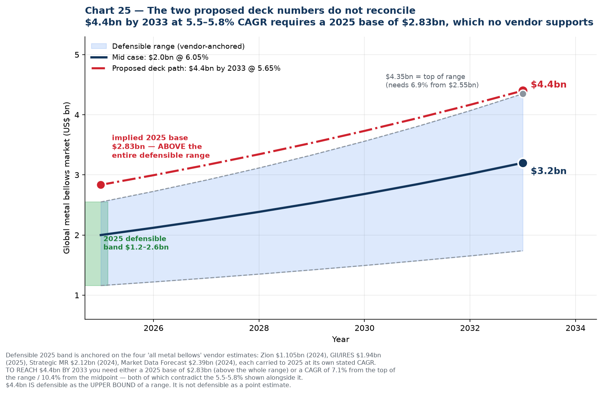
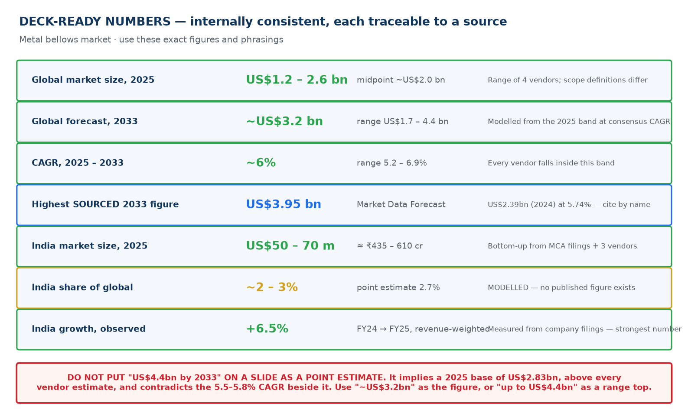

# 13 — Deck Number Check

Verification of four figures proposed for a client deck.

## Verdict at a glance

| Proposed figure | Verdict |
| --- | --- |
| **Global metal bellows, 2025** — *(left blank)* | Use **US$1.2–2.6 bn, midpoint ~US$2.0 bn** |
| **Forecast 2033: ~US$4.4 bn** | ❌ **Do not use as a point estimate.** Defensible only as the top of a range |
| **CAGR 2025–33: ~5.5–5.8%** | ✅ **Confirmed.** Well supported — this is the modal cluster |
| **India global share: ~2.7%** | ✅ **Confirmed as an estimate.** Must be labelled modelled; no published figure exists |

**The core problem: the two numbers you have contradict each other.**

---

## 1. Why US$4.4 bn by 2033 fails

If 2033 is US$4.4 bn and the CAGR is 5.5–5.8%, then working backwards the **2025 base must be US$2.80–2.87 bn.**

That is above *every* vendor estimate for the global metal bellows market:

| Vendor | Base-year value | Carried to 2025 at its own CAGR |
| --- | --- | --- |
| Zion Market Research | US$1.105 bn (2024) | US$1.16 bn |
| GII / IRES | US$1.94 bn (2025) | US$1.94 bn |
| Strategic Market Research | US$2.12 bn (2024) | US$2.27 bn |
| Market Data Forecast | US$2.39 bn (2024) | US$2.53 bn |
| **Defensible 2025 band** | | **US$1.16 – 2.55 bn** |

US$2.83 bn sits **11% above the top of the range and 42% above the midpoint.**

### Put the other way: what CAGR would you need to reach US$4.4 bn?

| Starting from 2025 base of… | Required CAGR to 2033 |
| --- | --- |
| US$1.16 bn (low) | **18.1%** |
| US$2.00 bn (mid) | **10.4%** |
| US$2.39 bn | **7.9%** |
| US$2.55 bn (high) | **7.1%** |

Every one of those exceeds the 5.5–5.8% written beside it. **You cannot hold both numbers at once.**

### What US$4.4 bn *is* defensible as

The top of the range. From the highest defensible 2025 base (US$2.55 bn) at the highest vendor CAGR (6.90%), 2033 comes out at **US$4.35 bn ≈ US$4.4 bn**. So this phrasing works:

> "The global metal bellows market is estimated at US$1.2–2.6 bn in 2025, growing at 5–7% a year to somewhere between **US$1.7 bn and US$4.4 bn by 2033**."

What does not work is "the market will reach US$4.4 bn by 2033," because that presents the most optimistic corner of a wide band as a central case, and it can be dismantled by anyone who divides one number by the other.

---

## 2. CAGR 5.5–5.8% — confirmed

This is the strongest of the four figures. It is not just inside the consensus band, it is the **modal cluster** of published estimates:

| Vendor | CAGR |
| --- | --- |
| Zion Market Research | 5.19% |
| Market Research Future | 5.60% |
| **Market Data Forecast** | **5.74%** |
| **GII / IRES** | **5.79%** |
| Expert Market Research | 5.90% |
| Dataintelo (welded) | 6.20% |
| Dataintelo (hydroformed) | 6.80% |
| Strategic MR / SkyQuest | 6.90% |

Five of eight land between 5.19% and 5.90%. **5.5–5.8% is well chosen.** If anything it is slightly conservative; ~6% is the true midpoint. Either is defensible.

---

## 3. India share ~2.7% — confirmed, with a labelling requirement

Correct as an estimate, and it is our figure. Two conditions on using it:

1. **Label it as an estimate.** No research vendor publishes an India bellows market share. Phrase it as "estimated at approximately 2–3%" rather than stating 2.7% as fact.
2. **It only reconciles with a ~US$2.0 bn global base.** Cross-check: 2.7% of US$2.0 bn = **US$54 m**, which sits inside our independently derived India estimate of US$50–70 m. But 2.7% of US$2.83 bn (the base implied by your US$4.4 bn figure) = **US$76 m**, which falls *outside* that range. The inflated global number breaks the India number downstream too.

This is worth noting because it shows the error compounds: one over-stated figure makes two other slides inconsistent.

---

## 4. If you need a single citable source with a name on it

For a deck, a named source often beats a modelled range. The highest **sourced** 2033 figure for the all-metal-bellows scope is:

> **Market Data Forecast: US$2.39 bn (2024) → US$3.95 bn (2033), implied CAGR 5.74%**

That gives you a 2033 number close to US$4 bn, a CAGR inside your 5.5–5.8% target, and an attributable source. If the deck needs one line with a citation, use this and name the firm — adding that other estimates range from US$1.1 bn to US$2.4 bn for the base year because scope definitions differ.

---

## 5. Deck-ready numbers

| Metric | Use this | Range | Basis |
| --- | --- | --- | --- |
| Global market size, 2025 | **US$1.2 – 2.6 bn** | midpoint ~US$2.0 bn | Four vendors; scope definitions differ |
| Global forecast, 2033 | **~US$3.2 bn** | US$1.7 – 4.4 bn | Modelled from the 2025 band at consensus CAGR |
| CAGR, 2025–33 | **~6%** | 5.2 – 6.9% | Every vendor falls inside this band |
| Highest *sourced* 2033 figure | **US$3.95 bn** | — | Market Data Forecast, cite by name |
| India market size, 2025 | **US$50 – 70 m** | ≈ ₹435 – 610 cr | Bottom-up from MCA filings + three vendors |
| India share of global | **~2 – 3%** | point estimate 2.7% | **Modelled** — no published figure exists |
| India growth, observed | **+6.5%** | FY24 → FY25, revenue-weighted | Measured from company filings |

### Suggested slide wording

> **Global metal bellows market**
> US$1.2–2.6 bn (2025) · growing ~6% p.a. · ~US$3.2 bn by 2033
> *Estimates vary by scope; range reflects four independent vendors*
>
> **India**
> US$50–70 m (2025) · ~2–3% of global · +6.5% observed FY24→FY25
> *India share is our estimate; no published figure exists*

Both lines survive scrutiny, and the caveats are short enough to sit in a footnote.

---

## 6. Two other figures to keep off the deck

Carried forward from earlier corrections in this pack, in case they are still circulating:

| Figure | Status |
| --- | --- |
| "India holds 5–10% of the global expansion joints market" | **Withdrawn.** Implies a global market of US$0.7–1.4 bn against four vendors at US$3.7–7.2 bn. See [`11`](11-share-reconciliation.md) |
| "India bellows CAGR ~6.9% (6Wresearch)" | **Withdrawn.** 6Wresearch publishes no market CAGR. See [`10`](10-india-market-data.md) §10 |
| "North American semiconductor bellows market US$1.2 bn" | **Never use.** Exceeds half the global all-industry market |
| "48% semiconductor + 56% aerospace of US demand" | **Never use.** Sums to 104% |

---

## 7. The check to run on any future number

Before a figure goes on a slide, do the one-line reconciliation: **divide the forecast by the base and see whether the implied CAGR matches the CAGR you are quoting.** If they disagree, one of the three numbers is wrong.

That single division would have caught the US$4.4 bn figure, the 5–10% expansion joints claim and the 104% end-use split. It takes ten seconds and it is the difference between a number that holds up in a partner meeting and one that does not.

### Chart index

| Chart | File | Purpose |
| --- | --- | --- |
| 25 | `25-deck-number-check.png` | Why US$4.4 bn and 5.5–5.8% cannot both hold |
| 26 | `26-deck-card.png` | Deck-ready figures, internally consistent |

Generated by [`charts/make_deck_card.py`](charts/make_deck_card.py).
