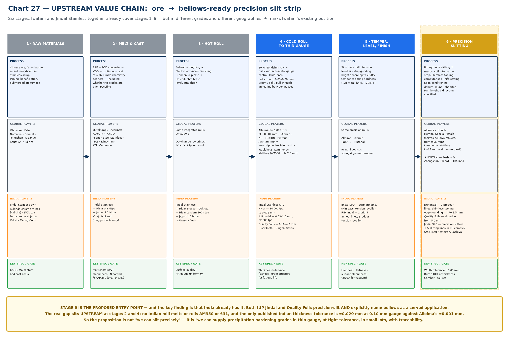
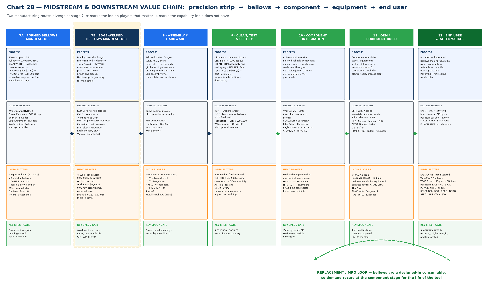
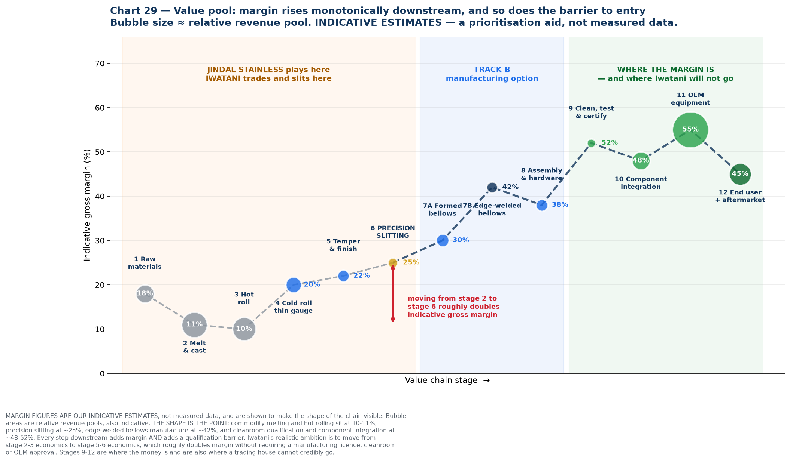

# 14 — Metal Bellows Value Chain: Exhaustive Upstream-to-Downstream Map

Twelve stages from chrome ore to a replacement bellows fitted in a running fab. At each stage: what physically happens, who plays globally, who plays in India, and what the technical gate is.

---

## 1. The map — upstream

## 2. The map — midstream and downstream

## 3. Where the value sits

---

## 4. Detailed process flow

```mermaid
flowchart TD
    subgraph UP["UPSTREAM — material"]
        A1["<b>1 RAW MATERIALS</b><br/>Chrome ore · ferrochrome<br/>Ni · Mo · stainless scrap<br/><i>Glencore, Vale, Tsingshan<br/>India: Jindal Sukinda mines</i>"]
        A2["<b>2 MELT & CAST</b><br/>EAF → AOD → VOD →<br/>continuous cast to slab<br/><i>Outokumpu, Acerinox, POSCO<br/>India: Jindal Stainless 3.0 Mtpa</i>"]
        A3["<b>3 HOT ROLL</b><br/>Reheat → rough → finish →<br/>anneal & pickle → HR coil<br/><i>India: Hisar Steckel 720k tpa<br/>Jajpur tandem 1.0 Mtpa</i>"]
        A4["<b>4 COLD ROLL TO THIN GAUGE</b><br/>20-Hi Sendzimir with AGC<br/>to 0.03–0.20 mm<br/><i>Alleima 0.015mm ±0.001mm<br/>TOKKIN · Ulbrich · Matthey<br/>India: Jindal SPD 0.076mm ·<br/>IUP Jindal 0.03mm · Quality Foils</i>"]
        A5["<b>5 TEMPER & FINISH</b><br/>Skin pass · tension level ·<br/>strip grind · bright anneal 2R<br/>temper to HV530+"]
        A6["<b>6 PRECISION SLITTING</b><br/>Rotary knife · shimless tooling<br/>deburr / round / chamfer edge<br/>burr ≤10% of thickness<br/><i>★ Iwatani: Suzhou, Zhongshan<br/>India: IUP Jindal, Quality Foils</i>"]
    end

    A1 --> A2 --> A3 --> A4 --> A5 --> A6

    A6 --> R1
    A6 --> R2

    subgraph MID["MIDSTREAM — bellows manufacture"]
        R1["<b>7A FORMED / CONVOLUTED</b><br/>shear → roll to cylinder →<br/><b>longitudinal seam weld</b> →<br/>clean & inspect → telescope<br/>plies 2–20 → <b>hydroform</b><br/>15–20k psi or mandrel form<br/><i>Witzenmann · Senior · BOA<br/>India: Flexpert · MB · Metallic</i>"]
        R2["<b>7B EDGE-WELDED</b><br/>blank diaphragm rings →<br/>deburr → stack & nest →<br/><b>ID weld</b> → <b>OD weld</b><br/>laser / micro-plasma / EB<br/><i>KSM · Technetics · Irie Koken<br/>India: ★ Well Tech · ★ Fluidyne</i>"]
        R3["<b>8 ASSEMBLY & HARDWARE</b><br/>end plates · CF/KF/ISO flanges<br/>liners · covers · tie rods ·<br/>gimbal/hinge · braiding<br/><i>India: Fourvac · HHV · APT</i>"]
        R4["<b>9 CLEAN, TEST & CERTIFY</b><br/>UHV clean & bake →<br/><b>ISO Class 5/6 cleanroom</b> →<br/><b>helium leak test</b> <1e-9 →<br/>RGA cert → cycle test<br/><i>⚠ NO Indian capability found</i>"]
    end

    R1 --> R3
    R2 --> R3
    R3 --> R4

    subgraph DOWN["DOWNSTREAM — integration to end use"]
        D1["<b>10 COMPONENT INTEGRATION</b><br/>vacuum valves · mechanical seals<br/>feedthroughs · expansion joints<br/>MFCs · gas panels · accumulators<br/><i>VAT · SMC · EagleBurgmann ·<br/>John Crane · MIRAPRO</i>"]
        D2["<b>11 OEM / EQUIPMENT BUILD</b><br/>wafer fab tools · aero systems<br/>pumps · compressors · vehicles<br/>electrolysers · process plant<br/><i>AMAT · Lam · TEL · ASML<br/>India: ★ KASFAB Tools</i>"]
        D3["<b>12 END USER</b><br/>fabs · refineries · power ·<br/>steel · space · defence · H2<br/><i>India: Micron Sanand · Tata<br/>Dholera · TSAT Assam · IOCL ·<br/>NTPC · NPCIL · ISRO</i>"]
    end

    R4 --> D1 --> D2 --> D3
    D3 -.->|"<b>MRO / REPLACEMENT LOOP</b><br/>3M cycle service life ·<br/>user-replaceable · recurring<br/>for the life of the tool"| D1

    style A6 fill:#ffe08a,stroke:#b8860b,stroke-width:3px
    style R2 fill:#cfe8ff,stroke:#1f6feb,stroke-width:3px
    style R4 fill:#ffd7d7,stroke:#cf222e,stroke-width:2px
    style D1 fill:#d7f5d7,stroke:#2da44e
    style D2 fill:#d7f5d7,stroke:#2da44e
    style D3 fill:#d7f5d7,stroke:#2da44e
```

---

## 5. Stage-by-stage reference table

| # | Stage | Process | Global players | India players | Technical gate |
| --- | --- | --- | --- | --- | --- |
| **1** | Raw materials | Chrome ore, ferrochrome, Ni, Mo, scrap; mining, beneficiation, submerged arc furnace | Glencore, Vale, Nornickel, Eramet, Tsingshan, South32, Yildirim | **Jindal Stainless owns Sukinda chrome mines (Odisha)**, 250k tpa ferrochrome at Jajpur; Odisha Mining Corp | Cr/Ni/Mo content and cost basis |
| **2** | Melt & cast | EAF → AOD converter → VOD → continuous cast to slab. **Grade chemistry is fixed here — including whether PH grades are possible at all** | Outokumpu, Acerinox, Aperam, POSCO, Nippon Steel Stainless, NAS, Tsingshan, ATI, Carpenter | **Jindal Stainless** — Hisar 0.8 Mtpa + Jajpur 2.2 Mtpa; Viraj; Mukand (long products only) | Melt chemistry, cleanliness, N control for AM350 (0.07–0.13%) |
| **3** | Hot roll | Reheat → roughing → Steckel or tandem finishing → anneal & pickle → HR coil | Same integrated mills | Jindal Stainless — Hisar Steckel 720k tpa, Hisar tandem 300k tpa, Jajpur 1.0 Mtpa (Siemens VAI) | Surface quality, HR gauge uniformity |
| **4** | **Cold roll to thin gauge** | 20-Hi Sendzimir and 4-Hi mills with AGC; multi-pass reduction to 0.03–0.20 mm; bright/bell/pull-through annealing between passes | **Alleima** (to 0.015 mm at ±0.001 mm), Ulbrich, ATI, **TOKKIN**, Proterial, Aperam Imphy, voestalpine, Waelzholz, **Lamineries Matthey** (AM350 from 0.010 mm) | **Jindal Stainless SPD** 84,000 tpa to 0.076 mm; **IUP Jindal** 0.03–1.5 mm, 22,000 tpa; **Quality Foils** 0.10–4.0 mm; Hisar Metal; Singhal Strips | Thickness tolerance, flatness, grain structure for fatigue life |
| **5** | Temper & finish | Skin pass mill, tension leveller, strip grinding, bright annealing to 2R/BA, temper to spring hardness (¼H to full hard, HV530+) | Same precision mills; Iwatani sources spring and gasket tempers | Jindal SPD (strip grinding, skin pass, tension leveller); IUP Jindal (2 bright anneal lines, Brodeur leveller) | Hardness, flatness, surface cleanliness (2R/BA for vacuum) |
| **6** | **PRECISION SLITTING** | Rotary knife slitting of master coil to narrow strip; shimless tooling, computerised knife setting; edge conditioning — deburr, round, chamfer; burr height and direction specified | Alleima, Ulbrich, **Hempel Special Metals** (serves bellows makers, from 0.05 mm), Lamineries Matthey (±0.1 mm width on request). **★ Iwatani — Suzhou, Zhongshan, Thailand** | **IUP Jindal** — 3 Brodeur lines, shimless tooling, edge rounding, slit to 3.5 mm; **Quality Foils** — slit edge from 5.0 mm; **Jindal SPD** — precision slitters + 5 slitting lines in the CR complex; stockists Aesteiron, Sachiya | Width tolerance ±0.05 mm, burr ≤10% of thickness, camber, coil set |
| **7A** | **Formed / convoluted bellows** | Shear → roll to cylinder → **longitudinal seam weld** (TIG/plasma) → clean & inspect → telescope plies (2–20) → **hydroform** at 15–20k psi or mechanical/mandrel form → neck weld, reinforcing rings | Witzenmann (HYDRA), Senior Flexonics, BOA Group, Belman, Flexider, EagleBurgmann, Hyspan, Penflex, Triad, Macoga, Comflex | Flexpert Bellows (2–20 ply), MB Metallic Bellows (100 NB to 8 m dia), Metallic Bellows (India), Witzenmann India, Fluidyne, Bhastrik, Triveni, Scutes India | Seam weld integrity, thinning control, EJMA / ASME VIII |
| **7B** | **Edge-welded bellows** | Blank/press diaphragm rings from foil → deburr → stack and nest → **ID weld** → **OD weld** (laser, micro-plasma, EB, TIG) → attach end pieces; nesting-ripple geometry for maximum stroke | **KSM Corp** (world's largest, ISO 6 cleanroom), Technetics BELFAB, MW Components/Servometer, Metal-Flex, Witzenmann, Irie Koken, MIRAPRO, Eagle Industry EKK, Valqua, BellowsTech | **★ Well Tech (Vasai)** 0.05–0.2 mm, AM350, He leak tested; **★ Fluidyne (Mysuru)** 0.05 mm diaphragms, racetrack UHV; Bhastrik 0.127–0.30 mm micro-plasma | Weld bead <0.1 mm, spring rate, cycle life 3M–10M cycles |
| **8** | Assembly & hardware | End plates, CF/KF/ISO flanges, liners, external covers, tie rods, gimbal and hinge hardware, braiding; sub-assembly into manipulators and translators | Bellows makers plus MW Components, Huntington, Nor-Cal, MDC Vacuum, Kurt J. Lesker | **Fourvac** (XYZ manipulators, UHV valves, drives), **HHV** (Bengaluru), **APT** (UHV chambers, leak test to 1e-12 Torr·l/s), Metallic Bellows (India) | Dimensional accuracy, assembly cleanliness |
| **9** | **Clean, test & certify** | Ultrasonic and solvent clean → UHV bake → **ISO Class 5/6 cleanroom** assembly and packaging → **helium leak test** <1e-9 mbar·l/s → RGA certificate → fatigue/cycle testing → double-bag | KSM (world's largest ISO 6 bellows cleanroom, ISO 5 final pack), Technetics (Class 100/1000), Witzenmann (UHV/UHP with optional RGA cert) | **⚠ No Indian facility found** with an ISO Class 5/6 bellows cleanroom or RGA capability. APT leak-tests to 1e-12 Torr·l/s; KASFAB has cleanrooms and precision welding | **★ This is the real barrier to semiconductor entry** |
| **10** | Component integration | Bellows built into the finished sellable component: vacuum valves, mechanical seals, feedthroughs, expansion joints, dampers, accumulators, MFCs, gas panels | **Valves:** VAT, SMC, Irie Koken, Ferrotec, Pfeiffer. **Seals:** EagleBurgmann, John Crane, Flowserve, Eagle Industry, Chesterton. **Chambers:** MIRAPRO | Well Tech supplies Indian mechanical seal makers; Fourvac (UHV valves); HHV, APT (chambers); EPC and piping contractors for expansion joints | Valve cycle life 3M+, leak rate, particle generation |
| **11** | OEM / equipment build | Component goes into capital equipment: wafer fab tools, aero systems, pumps and compressors, vehicles, electrolysers, process plant | **Semi WFE:** Applied Materials, Lam Research, Tokyo Electron, ASML, KLA, Screen, Kokusai, YES. **Aero:** Boeing, Airbus, GE, Safran. **Pumps:** KSB, Sulzer, Grundfos | **★ KASFAB Tools (Doddaballapur)** — India's first semiconductor equipment contract manufacturer, for AMAT, Lam, TEL, YES; AMAT India (Bengaluru); HAL, BHEL, Kirloskar | Tool qualification, OEM approved-vendor-list entry (12–24 months) |
| **12** | End user & aftermarket | Installed and operated; bellows then **re-ordered as a consumable** — 3M cycle service life, user-replaceable; recurring MRO revenue for decades | **Fabs:** TSMC, Samsung, Intel, Micron, SK Hynix. **Refineries:** Shell, Exxon. **Space:** NASA, ESA, JAXA. **Fusion:** ITER, accelerators | **Fabs/OSAT:** Micron Sanand, Tata-PSMC Dholera, TSAT Assam, Kaynes, CG Semi. **Refinery:** IOCL, RIL, BPCL. **Power:** NTPC, NPCIL. **Space/defence:** ISRO, BARC, DRDO. **Steel:** SAIL, Tata, JSW | **★ Aftermarket is recurring, higher margin, and fab-located** |

---

## 6. Five things the map makes visible

**1. Iwatani and Jindal together already span stages 1 to 6 — but not in the same grades or the same places.** Jindal covers 1–5 in India in austenitic, ferritic, martensitic and duplex. Iwatani covers 5–6 in Japan, China and Thailand, in spring, gasket and ultrathin grades down to 8 µm including 631. The combination is genuinely complementary. What neither covers is **AM350 melted anywhere**, which sits at stage 2.

**2. The proposed entry point at stage 6 is already occupied in India.** Both IUP Jindal and Quality Foils precision-slit *and* explicitly name bellows as a served application. So "we can slit precisely" is not a differentiated pitch. The gap sits **upstream at stages 2 and 4** — grade availability and tolerance class — which is a more defensible position anyway, because it is harder to replicate.

**3. Stage 9 is the real barrier to semiconductor entry, and it is not a materials problem.** Cleanroom assembly, helium leak certification and RGA capability are what separate an Indian bellows maker from a semiconductor-qualified one. No Indian facility was found with it. **Iwatani cannot supply this**, which is precisely why the strategy stops at material supply rather than promising a semiconductor components business.

**4. Margin rises monotonically downstream — and so does the entry barrier.** Commodity melting and hot rolling at 10–11% indicative gross margin; precision slitting ~25%; edge-welded manufacture ~42%; cleanroom qualification and component integration ~48–52%. Moving from stage 2–3 economics to stage 5–6 economics roughly **doubles margin without requiring a manufacturing licence, a cleanroom, or OEM approval.** That is the realistic ambition. Stages 9–12 are where the money is and where a trading house cannot credibly go.

**5. The MRO loop is the most under-appreciated feature of the chain.** Bellows are a designed-in consumable — SMC and VAT both rate their valves at 3 million cycles with user-replaceable bellows, and Irie Koken quotes 10,000 to 10 million cycles. So demand re-enters at stage 10 for the life of every tool ever installed. That replacement stream is recurring, higher-margin, and located **at the fab** rather than at the tool builder — which is the one part of the semiconductor opportunity that India's fab build-out actually does create.

---

## 7. How to use these charts

| Audience | Use |
| --- | --- |
| **Internal Iwatani approval** | Chart 29 alone. It shows in one image why the Stainless Steel Division should move from stage 2–3 economics to stage 5–6, and it does so without over-promising a components business |
| **Jindal Stainless discussion** | Charts 27 and 29. Positions Jindal at stages 1–5, identifies the missing grade at stage 2, and shows what the joint position could be worth |
| **Indian bellows maker (Well Tech, Fluidyne)** | Chart 28. Puts them at stage 7B, shows what they must import, and frames Iwatani as the fix for stage 4–6 rather than a competitor |
| **Monthly internal meeting** | All three, as the standing industry-structure reference. Update the India player boxes as the customer discovery in [`08`](08-supply-chain-sourcing.md) confirms or removes names |

**Caveat to state whenever chart 29 is shown:** the margin percentages are our indicative estimates, not measured data. The *shape* of the curve is well supported by the structure of the industry; the specific numbers are a prioritisation aid. Anyone asking for the source of "42%" should be told it is a judgement, not a citation.

### Chart index

| Chart | File | Purpose |
| --- | --- | --- |
| 27 | `27-valuechain-upstream.png` | Stages 1–6, ore to precision slit strip, with players and gates |
| 28 | `28-valuechain-downstream.png` | Stages 7–12, bellows manufacture to end user and MRO loop |
| 29 | `29-value-pool.png` | Indicative margin by stage, with Iwatani and Jindal positions marked |

Generated by [`charts/make_valuechain_charts.py`](charts/make_valuechain_charts.py). Player lists are drawn from the sources in [`06-source-register.md`](06-source-register.md), [`08-supply-chain-sourcing.md`](08-supply-chain-sourcing.md) and [`07-research-reconciliation.md`](07-research-reconciliation.md).
