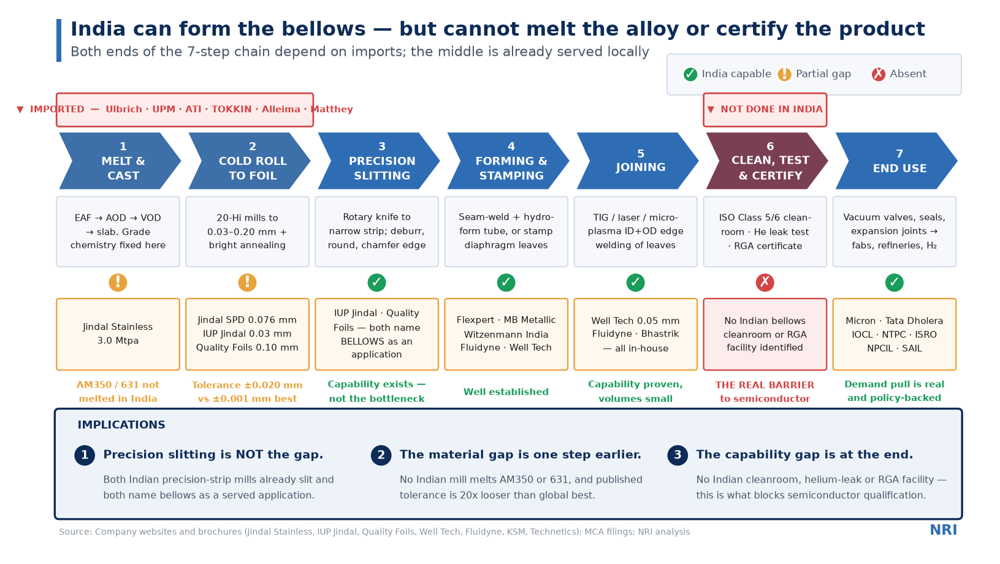
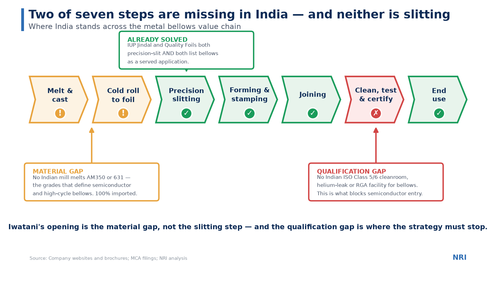

# 15 — Redesigning the Supply Chain Map Slide

Critique and redesign of the client-facing "Manufacturing process & supply chain map" slide.

---

## ⚠️ Fix these two facts before anything else

The design problems are fixable in an hour. These two are not cosmetic, and Iwatani's Metals Department will catch them — they are the No.1 Japanese stainless trading house and they know the Indian stainless industry.

**1. "Virami Alloys" (presumably Viraj) does not slit coil — or make flat products at all.**
Viraj Profiles is a **long products** manufacturer: wire rods, wires, welding wires, fasteners, bright bars, profiles, flanges. Its own site describes the business as exactly that, and its Section Rolling Mill in Tarapur makes angles, flats and profiles — structural sections, not cold-rolled coil. There is no flat-rolling or slitting operation ([viraj.com](https://www.viraj.com/), [profiles division](https://www.viraj.com/stainless-steel-profiles/)) **[P]**. Naming Viraj as a coil slitter is a factual error on the one topic the client knows best.

**2. "Jainex Steel" is a two-person trading company, not a slitting service provider.**
Jainex Steel & Metal, Mumbai, is registered as **"Trader – Wholesaler/Distributor"** and describes itself as an "importer, stockiest & supplier" of stainless and nickel alloy sheet, strip, foil, coil and shims. Its address is a shop in Khetwadi Lane, Girgaon — a trading office. LinkedIn lists **2 employees** ([stainlesssteelcoils.in](https://www.stainlesssteelcoils.in/), [LinkedIn](https://in.linkedin.com/company/jainex-steel-and-metal)) **[U]**.

It *is* interesting for other reasons — it serves gaskets, filters, hypodermic and capillary tubes, and **flexible hoses**, so it is plausibly already in this supply chain as an importer. But it belongs in an "importers and stockists" box, not a "slitting service providers" box.

There is also a name-collision risk: **Jainex Aamcol Ltd** is a separate BSE-listed company making gear hobs and cutting tools. Anyone who Googles "Jainex" during the meeting may land on the wrong company.

### Use these names instead

| Role | Correct Indian names |
| --- | --- |
| **Precision strip mills that slit AND serve bellows** | **IUP Jindal Metals & Alloys** (Ghaziabad; 0.03–1.5 mm; 22,000 tpa; three Brodeur slitting lines with shimless tooling; edge-rounding machine; application list includes *"Flexi metal tubes / bellows"*) · **Quality Foils (India)** (Hisar; 0.10–4.00 mm; slit edge from 5.0 mm; product listing includes *"Metallic Bellows"* and *"Bellows for precision measuring instruments"*) |
| Other Hisar-cluster strip mills | Jindal Stainless SPD (84,000 tpa, to 0.076 mm, precision slitters) · Hisar Metal Industries · Singhal Strips |
| Importers and stockists | Aesteiron (lists AM350/S35000 strip) · Sachiya Steel · Jainex Steel & Metal · Riddhi Siddhi Impex |
| **Not relevant to flat/slitting** | ~~Viraj~~ (long products) · ~~Mukand~~ (bars, wire rod) |

**And the framing needs a small but important correction.** The slide says Indian bellows makers either outsource slitting to third parties *or* import pre-slit material. Both happen — but the sharper truth is that **imports are driven by grade, not by slitting.** Austenitic 304/316/321 at 0.10 mm and up is bought locally. AM350, 631, Inconel, Hastelloy and sub-0.05 mm foil are imported because **no Indian mill melts or rolls them at all.**

---

## What is structurally wrong with the slide

| # | Issue | Why it matters |
| --- | --- | --- |
| 1 | **"Bellow manufacturer" is a chevron.** | It is an *actor*, not a process step. The sequence reads Forming → Joining → Finishing → …Manufacturer, which breaks the logic. |
| 2 | **The chain stops at the factory gate.** | No customers, no applications, no demand. For a market-entry deck the "so what" is missing entirely — the client cannot see where money is made. |
| 3 | **No action title.** | "Manufacturing process & supply chain map" labels the slide instead of stating its conclusion. The consulting standard is a title that carries the message. |
| 4 | **The key insight is buried in body copy.** | The most valuable line on the slide — no Indian bellows maker slits in-house — sits in small underlined text inside a box. It should be the headline. |
| 5 | **Underlined text and em-dash prose inside boxes.** | Underlining reads as a hyperlink or a typo. The box reads as a paragraph, not slide copy. |
| 6 | **Orphan legend.** | "Imports supplementing domestic supply" with a diamond marker, but no diamonds appear anywhere on the slide. |
| 7 | **Inconsistent grid.** | Two chevrons in row 1, four in row 2. Some columns have two boxes, one has a single box. There is no consistent row meaning, so the eye has nothing to scan along. |
| 8 | **Nothing is visually prioritised.** | Every box is the same blue and white. With no colour encoding, the audience does not know where to look and the insight does not land. |
| 9 | **Upstream/downstream split is arbitrary.** | Slitting is "upstream" and forming "downstream", but both are manufacturing. The meaningful distinction is material → component → application. |

---

## The redesign

### What changed and why

| Change | Reason |
| --- | --- |
| **Action title states the conclusion** — *"India can form the bellows — but cannot melt the alloy or certify the product"* | The audience gets the message in three seconds. Everything below is now evidence rather than information. |
| **One continuous 7-step row, no upstream/downstream split** | A single left-to-right read. Seven is at the upper limit of what a slide can hold, but it keeps the chain intact from melt to end use. |
| **Chain extended to END USE** | Answers "who pays". Names Micron, Tata Dholera, IOCL, NTPC, ISRO, NPCIL, SAIL — which also makes the slide relevant to the demand case. |
| **Strict three-row matrix under every chevron** — process, India players, so-what | The eye can scan horizontally along any row. Consistency is what makes a dense slide feel simple. |
| **Traffic-light status per step** (✓ capable / ! partial / ✗ absent) | This is the single biggest improvement. The audience sees two amber and one red before reading a word. The insight is now carried by *colour*, not text. |
| **Import dependency shown as a red band above the affected steps only** | Makes the orphan legend meaningful and puts the import story where it belongs — attached to specific steps, naming the actual suppliers. |
| **"Bellow manufacturer" removed as a step** | Replaced with the real remaining stages: clean/test/certify, then end use. |
| **Bottom "Implications" band with three numbered points** | Consulting convention: the reader should be able to take away the slide's argument without studying the matrix. |
| **Highlighted the one step that is the real barrier** | Step 6 is coloured differently in the chevron itself, so the eye lands there. |

---

## Simpler alternative for an executive audience

If the slide is for a steering committee or the first five minutes of a readout, strip it back to one bar and three callouts:

Same message, roughly one-fifth of the ink. The rule of thumb: **the detailed version is a working document for the project team, the simple version is for the decision-maker.** Most decks need both, on consecutive slides — the exec version first, the detail as backup.

---

## Six rules this redesign follows

Worth applying to the rest of the deck.

1. **The title is the conclusion, not the topic.** If the title could sit unchanged on someone else's slide about a different industry, it is a label, not a title.
2. **Encode the insight in colour or position, not in body text.** If your key finding is only discoverable by reading, most of the room will miss it.
3. **Keep the grid strict.** Every column gets the same rows. Consistency is what lets a dense slide read as simple.
4. **End the chain where the money is.** A process map that stops at the factory gate answers "how is it made" when the client asked "should we enter".
5. **One highlight per slide.** Three highlights is zero highlights. Here it is step 6.
6. **Never name a company you have not verified.** A single wrong company name in front of a client who knows the industry costs more credibility than a whole slide of good analysis earns.

---

## Reusable assets

| Asset | File |
| --- | --- |
| Redesigned detailed slide | `charts/30-slide-redesign.png` |
| Executive version | `charts/31-slide-exec-version.png` |
| Editable source | [`charts/make_slide_redesign.py`](charts/make_slide_redesign.py) |
| Fuller 12-stage version, if more detail is ever needed | [`14-value-chain-map.md`](14-value-chain-map.md) |

Both slides are rendered at 13.33 × 7.5 inches, which is native PowerPoint 16:9 — they can be dropped in full-bleed, or the structure rebuilt natively in PowerPoint using the same layout. Rebuilding natively is worth the hour if the slide will be edited during the engagement.

### Sources for the fact corrections

| Source | URL | Grade |
| --- | --- | --- |
| Viraj Profiles — company site (long products only) | https://www.viraj.com/ | **[P]** |
| Viraj Profiles — profiles division | https://www.viraj.com/stainless-steel-profiles/ | **[P]** |
| Viraj — Section Rolling Mill (angles, flats, profiles) | https://www.viraj.com/section-rolling-mill/ | **[P]** |
| Jainex Steel & Metal — trader/distributor | https://www.stainlesssteelcoils.in/ | **[U]** |
| Jainex Steel & Metal — LinkedIn (2 employees, importer/stockist) | https://in.linkedin.com/company/jainex-steel-and-metal | **[U]** |
| Jainex Aamcol Ltd — separate listed company, gear hobs | https://www.jainexaamcol.com/history.htm | **[P]** |
| IUP Jindal — brochure ("Flexi metal tubes / bellows") | https://jindalmetal.com/images/iup-brochure.pdf | **[P]** |
| Quality Foils — products and bellows listing | https://www.qualitygroup.in/qualityfoils/products/ · https://www.kompass.com/z/ww/c/quality-foils-india-private-limited/in756895/ | **[P]** |
