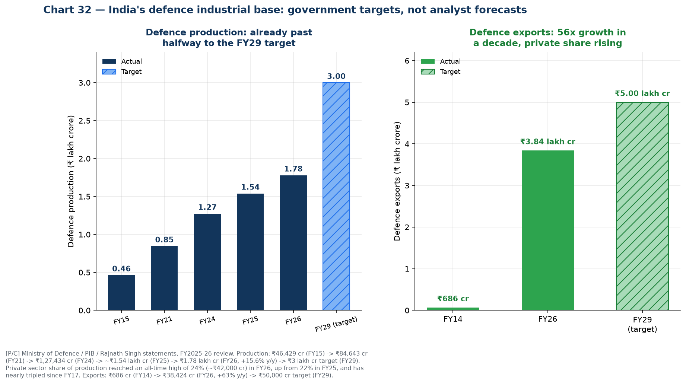
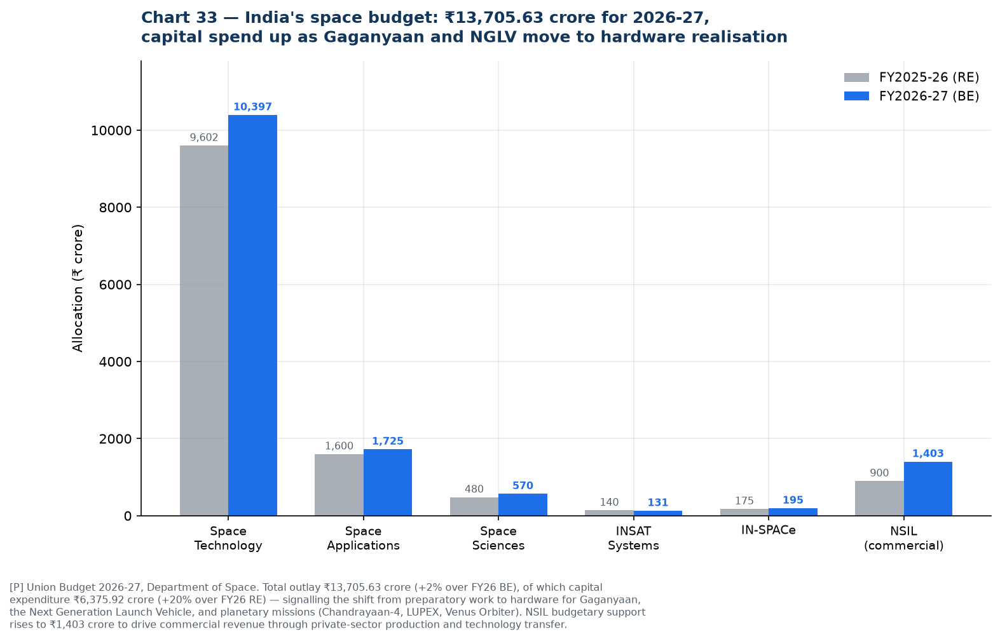
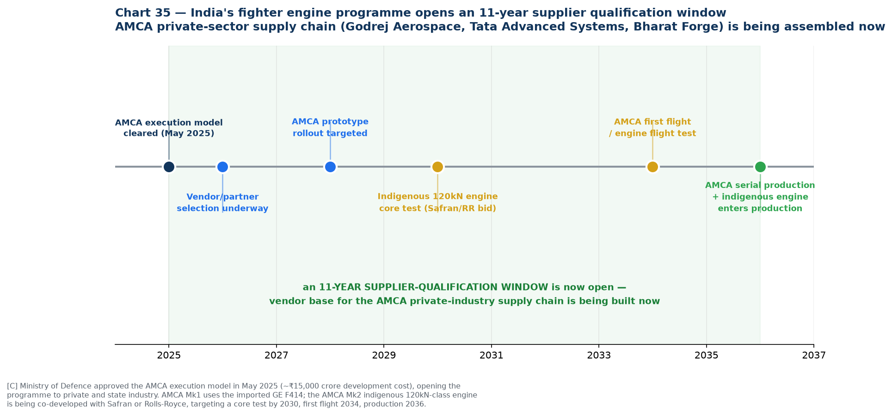
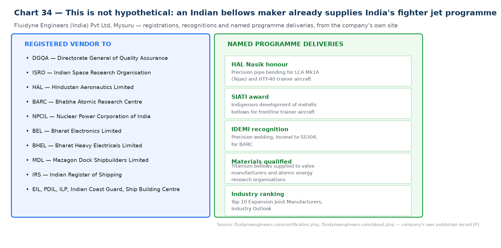

# 16 — Reframed Growth Driver: Aerospace, Space & Defence Indigenisation

In [`12-india-drivers-challenges.md`](12-india-drivers-challenges.md), this was driver #9 out of 10 — one line, "Medium" fit, ranked below steel and nuclear. That ranking undersold it. On closer research it deserves to sit near the top, for a reason the earlier version missed entirely: **this is the one driver where an Indian bellows maker has an already-documented, named track record of supplying a flagship national programme.** Every other driver in this pack is inferred from policy. This one has a receipt.

---

## The one-paragraph reframe

India's defence production has grown 15.6% year-on-year to ₹1.78 lakh crore in FY26 — already past the halfway mark of a ₹3 lakh crore target for FY29 — while defence exports have grown 56x in a decade to ₹38,424 crore. Space gets a steadily rising ₹13,706 crore budget now shifting into hardware realisation for Gaganyaan and a new heavy-lift launch vehicle. And the indigenous fighter engine programme — India's most demanding metallurgical qualification challenge outside semiconductors — has just opened an eleven-year supplier-development window as private industry is brought into the AMCA programme for the first time. All three verticals demand exactly the property set Iwatani already trades: thin-gauge, high-fatigue, corrosion-resistant stainless and nickel-alloy strip. And unlike every other driver in this pack, this one is not hypothetical: **Fluidyne Engineers of Mysuru is a registered vendor to ISRO, HAL, BARC, DRDO, NPCIL, BEL, BHEL and the Navy, and has been publicly honoured by HAL Nasik for supplying the LCA Tejas Mk1A programme.**

---

## 1. Defence: government targets, already half-achieved

| Metric | FY2015 | FY2024 | FY2026 | FY2029 target |
| --- | --- | --- | --- | --- |
| **Defence production** | ₹46,429 cr | ₹1,27,434 cr | **₹1.78 lakh cr** (+15.6% y/y) | ₹3 lakh cr |
| **Defence exports** | ₹686 cr (FY14) | — | **₹38,424 cr** (+63% y/y) | ₹50,000 cr |

Sources: [Ministry of Defence FY26 review via Rediff](https://www.rediff.com/business/report/indias-defence-output-hits-new-high/20260618.htm) **[C]**; [PIB — Make in India Powers Defence Growth](https://static.pib.gov.in/WriteReadData/specificdocs/documents/2025/apr/doc202543531401.pdf) **[P]**; [The Policy Edge — 12-year MoD review](https://www.policyedge.in/p/how-indias-defence-sector-changed-between-2014-and-2026) **[C]**; [Rajnath Singh statement via SSBCrack](https://www.ssbcrack.com/2026/07/defence-production-target-of-rs-3-lakh-crore-by-2029-rajnath-singh-highlights-indias-defence-transformation-after-operation-sindoor.html) **[C]**.

**Three details that matter more than the headline number:**

- **Production has already crossed the halfway mark to the FY29 target**, two-plus years early. This is not an aspirational plan; it is a programme ahead of schedule.
- **The private sector's share of defence production reached an all-time high of 24% (~₹42,000 crore) in FY26**, up from 22% in FY25, and **private-sector output has nearly tripled since FY17** while total domestic production is up 140% over the same period. The growth is disproportionately private, which is exactly the part of the supply chain a trading house can reach — DPSUs run closed internal supply chains; private primes and Tier-1s build open vendor bases.
- **Positive Indigenisation Lists** now cover **5,012 items** across five lists from Defence PSUs plus 509 items across five lists from the Armed Forces directly, with **more than 3,000 items already indigenised** and a sixth list "soon to be notified." A Positive Indigenisation List is a government notification that a category of component **must be sourced domestically after a stated date** — this is the regulatory mechanism that converts "aerospace demand" from a vague driver into named, dated, mandatory local-sourcing categories. **Finding out which PIL categories include bellows-adjacent items (seals, expansion joints, flexible couplings, actuator components) is a concrete, high-value research action.**

---

## 2. Space: modest budget, but the capital mix is turning to hardware

The Department of Space received **₹13,705.63 crore for 2026-27**, a modest 2% increase in total, but with **capital expenditure up 20% to ₹6,375.92 crore** ([Union Budget 2026-27 via The Hindu](https://www.thehindu.com/sci-tech/science/union-budget-space-programme-budget-allocation-isro/article70577352.ece), [CNBC-TV18](https://www.cnbctv18.com/budget/indias-space-budget-inches-up-in-2026-27-capital-spend-rises-but-ambition-outpaces-funding-19838009.htm), [Times of India](https://timesofindia.indiatimes.com/business/india-business/budget-2026-space-department-allocation-rises-to-rs-13706-crore-capital-spend-gains-pace/articleshow/127838489.cms) **[P/C]**).

**Why the capex shift matters more than the topline:** officials describe this explicitly as the programme moving "from preparatory work to hardware realisation" for the **Gaganyaan** human spaceflight programme, the **Next Generation Launch Vehicle (NGLV)**, and planetary missions (**Chandrayaan-4, LUPEX, Venus Orbiter**). Hardware realisation means fabrication contracts — cryogenic engine components, propellant feed lines, actuator bellows, and gimbal assemblies — moving from design to procurement.

**NSIL (ISRO's commercial arm) support rises to ₹1,403 crore**, explicitly to "drive commercial revenue through private-sector production and technology transfer." NSIL has already demonstrated the anchor-customer model: it is paying **₹3,000 crore** for the GSAT-7B communication satellite and using the **HAL–L&T consortium** to build PSLVs on a public-private-partnership basis ([Anatomy of India's 2026-27 Space Budget](https://orrery.ashwinprasadrao.com/p/anatomy-of-indias-2026-27-space-budget) **[C]**). That is the structural sign of a maturing procurement model — government demand that private industry can build a balance sheet against.

**Private space is also live independently of the budget.** Agnikul Cosmos achieved India's first successful hot-fire test of a clustered configuration of three 3D-printed semi-cryogenic engines ([search summary](https://www.19fortyfive.com/2026/06/india-has-30-brand-new-fighters-it-cant-fly-and-its-promising-a-stealth-jet-by-2035/) context) **[C]** — and cryogenic/semi-cryogenic engines are a canonical bellows application (propellant feed line flex joints, gimbal actuator bellows), so a growing set of *private* Indian launch vehicle companies is now a second potential customer category alongside ISRO itself.

---

## 3. The fighter engine programme: an 11-year supplier-qualification window just opened

This is the single most technically demanding — and most overlooked — item in the whole India driver set, because engine-grade bellows and flexible couplings sit at the extreme end of the material specification this entire pack is built around.

**The programme in outline:**

- **May 2025:** the Ministry of Defence cleared the **AMCA (Advanced Medium Combat Aircraft) execution model**, opening India's fifth-generation stealth fighter to private industry for the first time — HAL is *not* leading it. Development cost is estimated at **~₹15,000 crore** ([19FortyFive](https://www.19fortyfive.com/2026/06/india-has-30-brand-new-fighters-it-cant-fly-and-its-promising-a-stealth-jet-by-2035/) **[C]**).
- **Private industry partners being positioned** under the Development-cum-Production Partner framework include **Godrej Aerospace, Tata Advanced Systems, and Bharat Forge** ([search synthesis](https://theprint.in/defence/engine-core-by-2030-test-flight-by-2034-production-by-2036-rolls-royce-makes-final-pitch-to-power-amca/2967532/) **[C]**).
- **AMCA Mk1** will fly on the imported GE F414 (a fresh **$1 billion, 113-engine deal** with GE was signed in November 2025, delivering 2027–2032) ([19FortyFive](https://www.19fortyfive.com/2026/06/india-has-30-brand-new-fighters-it-cant-fly-and-its-promising-a-stealth-jet-by-2035/) **[C]**).
- **AMCA Mk2** requires a new **110–120 kN-class indigenous engine**, being co-developed with either **Safran** (France, full technology transfer under discussion) or **Rolls-Royce** (final offer submitted: engine core test by 2030, first flight 2034, production 2036, under an **80% technology-transfer** structure similar to the existing GE-HAL F414 arrangement) ([Rolls-Royce pitch, ThePrint](https://theprint.in/defence/engine-core-by-2030-test-flight-by-2034-production-by-2036-rolls-royce-makes-final-pitch-to-power-amca/2967532/) **[C]**; [DRDO/GTRE timeline](https://www.thedefensenews.com/DRDO-Says-AMCA-Mk-2-Engine-Could-Be-Ready-by-203536-If-CCS-Clears-Project-This-Year/) **[C]**).

**Why this is directly relevant to bellows.** A jet engine's fuel and hydraulic systems, actuator feedback linkages, bleed-air ducting and afterburner nozzle actuation all use precision metal bellows and flexible couplings, typically in Inconel or precipitation-hardening stainless for high-temperature fatigue resistance — the exact material class covered in [`01-technical-primer.md`](01-technical-primer.md). Whichever OEM wins the AMCA Mk2 engine, a **technology-transfer structure with an Indian manufacturing partner is now the explicit government requirement**, which means an Indian supply chain for engine-grade components is being built from a standing start, on a clear multi-year timeline.

**The commercially useful fact is the timeline itself.** Core test 2030, first flight 2034, production 2036 is not a near-term order book — it is an **eleven-year window in which the private-industry vendor base for this programme is being assembled.** Qualification cycles for flight-critical components run for years; the vendors who begin qualification conversations now will be positioned when volume production starts. This is a "get in line early" opportunity, not a "there is an order today" one.

---

## 4. The proof point: Fluidyne is not a hypothetical customer

Every other driver in this file describes a policy tailwind and infers that it should help Indian bellows makers. This one does not need to infer anything, because **Fluidyne Engineers (India) Pvt Ltd, Mysuru** — already identified in this pack as a Track A customer (see [`07`](07-research-reconciliation.md) and [`10`](10-india-market-data.md)) — publishes its own strategic-sector record:

**Registered vendor to:** DGQA, **ISRO**, **HAL**, **BARC**, **NPCIL**, BEL, BHEL, MDL, IRS, EIL, PDIL, ILP, Indian Coast Guard, Ship Building Centre Visakhapatnam ([Fluidyne certifications page](https://www.fluidyneengineers.com/certification.php) **[P]**).

**Named, dated programme deliveries:**

| Recognition | What it actually was |
| --- | --- |
| **Honoured by HAL Nasik** | Precision pipe bending for **LCA Mk1A (Tejas)** and **HTT-40** trainer aircraft — HAL's own flagship fighter and trainer programmes |
| **SIATI award** | For indigenous development of **metallic bellows for frontline trainer aircraft** — a direct, named bellows application in a military aircraft programme |
| **IDEMI recognition** | Precision welding of Inconel to SS304 for **BARC** — nuclear-grade dissimilar-metal joining |
| Materials qualification | **Titanium bellows** supplied to valve manufacturers and atomic energy research organisations |

Source: [Fluidyne certifications and recognitions](https://www.fluidyneengineers.com/certification.php) **[P]** — the company's own published record. This has not been independently verified beyond the company's self-disclosure, and as with other Fluidyne claims in this pack, a site visit would confirm scale and current activity. But it is a materially stronger evidence base than a policy inference: **it names a specific aircraft type, a specific plant (HAL Nasik), and a specific award citation for bellows specifically.**

**Why this matters for the strategy.** This is direct evidence that the qualification pathway from "Indian precision bellows maker" to "flagship aerospace programme supplier" **has already been walked once**, by a company already on Iwatani's target customer list for entirely separate reasons (UHV, 0.05mm diaphragms — see [`04`](04-competitive-benchmarking.md)). If Fluidyne's aerospace bellows business is growing — and Fluidyne's overall revenue grew **+37% FY24→FY25** (see [`10-india-market-data.md`](10-india-market-data.md) §6) — then supplying its material inputs is a doubly-motivated customer relationship: it serves both the rung-1 mechanical-seal/industrial thesis and this aerospace/defence thread simultaneously.

---

## 5. What this means for the driver ranking

| | Original treatment (file 12) | Reframed |
| --- | --- | --- |
| Position in ranking | #9 of 10, "Medium" fit | **Should move to top 4**, alongside refining, hydrogen and Semicon 2.0 |
| Evidence type | Generic reference to indigenisation lists and BARC/Navy/DRDO customer mentions | **Quantified government targets** (₹3 lakh cr production, ₹50,000 cr exports, both already 50%+ achieved) **+ a named, dated company case study** |
| Iwatani relevance | Stated as "qualification-heavy" | **Correct, but now specific**: the AMCA engine timeline (2026–2036) is a defined qualification window, not a vague future opportunity |
| Actionability | None specified | **Concrete**: (1) identify which Positive Indigenisation List categories cover bellows/seals/couplings, (2) approach Fluidyne specifically citing its own HAL/BARC/ISRO record, (3) track AMCA Mk2 engine partner announcement for the Indian Tier-1 name to approach |

---

## 6. Three actions this reframing generates

1. **Pull the actual Positive Indigenisation List text** (available from the Ministry of Defence / Department of Defence Production) and search for aerospace bellows-adjacent categories: seals, gaskets, expansion joints, flexible couplings, actuator sub-assemblies, hydraulic/pneumatic line components. This converts "defence indigenisation is a driver" into a named list of mandatory-local-source part categories — the single most concrete piece of evidence this pack could still add.
2. **Approach Fluidyne with its own case study**, not a generic pitch. A conversation that opens with "we understand you supplied bellows for the HTT-40 and Tejas Mk1A programmes recognised by HAL Nasik and SIATI" is a materially stronger opening than a cold material-supply pitch, because it demonstrates Iwatani has done the work to understand the customer's actual, differentiated business.
3. **Track the AMCA Mk2 engine partner decision** (Safran vs Rolls-Royce, expected before end-2026 per the Rolls-Royce final-offer timeline). Whichever OEM wins will name an Indian manufacturing and technology-transfer partner, and that partner will need to build an engine-grade component supply chain from very close to zero — this is the single highest-value name to identify and approach early in the whole India driver set.

---

### New sources introduced in this file

| Source | URL | Grade |
| --- | --- | --- |
| PIB — Make in India Powers Defence Growth | https://static.pib.gov.in/WriteReadData/specificdocs/documents/2025/apr/doc202543531401.pdf | **[P]** |
| Rediff — India's defence output hits new high (FY26 review) | https://www.rediff.com/business/report/indias-defence-output-hits-new-high/20260618.htm | **[C]** |
| The Policy Edge — 12-year MoD review 2014-2026 | https://www.policyedge.in/p/how-indias-defence-sector-changed-between-2014-and-2026 | **[C]** |
| SSBCrack — Rajnath Singh, ₹3 lakh crore target, PILs | https://www.ssbcrack.com/2026/07/defence-production-target-of-rs-3-lakh-crore-by-2029-rajnath-singh-highlights-indias-defence-transformation-after-operation-sindoor.html | **[C]** |
| Fortune India — defence Aatmanirbhar push | https://www.fortuneindia.com/economy/defence-aatmanirbhar-push-centre-plans-indigenous-production-worth-3-lakh-cr-50000-crore-exports-by-2029/128330 | **[C]** |
| The Hindu — Union Budget 2026, space programme | https://www.thehindu.com/sci-tech/science/union-budget-space-programme-budget-allocation-isro/article70577352.ece | **[P/C]** |
| CNBC-TV18 — India's space budget 2026-27 | https://www.cnbctv18.com/budget/indias-space-budget-inches-up-in-2026-27-capital-spend-rises-but-ambition-outpaces-funding-19838009.htm | **[C]** |
| Times of India — Budget 2026 space allocation | https://timesofindia.indiatimes.com/business/india-business/budget-2026-space-department-allocation-rises-to-rs-13706-crore-capital-spend-gains-pace/articleshow/127838489.cms | **[C]** |
| SatNews — India private space budget triggers | https://satnews.com/2026/02/01/indias-private-space-industry-sector-finds-indirect-growth-triggers-in-union-budget-2026-27/ | **[C]** |
| Anatomy of India's 2026-27 Space Budget (NSIL, anchor-customer model) | https://orrery.ashwinprasadrao.com/p/anatomy-of-indias-2026-27-space-budget | **[C]** |
| The Diplomat — AMCA engine ecosystem | https://thediplomat.com/2026/06/why-the-heart-of-indias-indigenous-fighter-ecosystem-will-be-american-for-several-decades-to-come/ | **[C]** |
| ORF — IAF fighter engine conundrum | https://www.orfonline.org/research/addressing-the-iaf-s-fighter-engine-conundrum | **[C]** |
| 19FortyFive — AMCA programme, F404 deal, execution model | https://www.19fortyfive.com/2026/06/india-has-30-brand-new-fighters-it-cant-fly-and-its-promising-a-stealth-jet-by-2035/ | **[C]** |
| ThePrint — Rolls-Royce AMCA engine pitch | https://theprint.in/defence/engine-core-by-2030-test-flight-by-2034-production-by-2036-rolls-royce-makes-final-pitch-to-power-amca/2967532/ | **[C]** |
| The Defense News — DRDO/GTRE AMCA Mk2 engine timeline | https://www.thedefensenews.com/DRDO-Says-AMCA-Mk-2-Engine-Could-Be-Ready-by-203536-If-CCS-Clears-Project-This-Year/ | **[C]** |
| **Fluidyne Engineers — certifications and recognitions (HAL, SIATI, IDEMI)** | https://www.fluidyneengineers.com/certification.php | **[P]** — company's own published record |
| Fluidyne Engineers — about (aerospace facility, 100+ components delivered) | https://www.fluidyneengineers.com/about.php | **[P]** |
| Fluidyne Engineers India — profile (industries served) | https://www.fluidyneengineersindia.com/profile.html | **[P]** |
| Industry Outlook — Fluidyne interview (materials, BARC/Navy/DRDO supply) | https://www.theindustryoutlook.com/manufacturing/vendor/fluidyne-engineers-offering-qualitydriven-custom-built-precision-metal-bellows-cid-2238.html | **[C]** |

### Chart index

| Chart | File | Purpose |
| --- | --- | --- |
| 32 | `32-defence-production-exports.png` | Defence production and export trajectory, actual vs FY29 target |
| 33 | `33-space-budget.png` | Space budget by head, FY26 vs FY27, capex shift to hardware |
| 34 | `34-fluidyne-proof-point.png` | Fluidyne's documented strategic-sector vendor status and named deliveries |
| 35 | `35-amca-timeline.png` | AMCA engine programme timeline and the 11-year supplier window |

Generated by [`charts/make_defence_charts.py`](charts/make_defence_charts.py).
